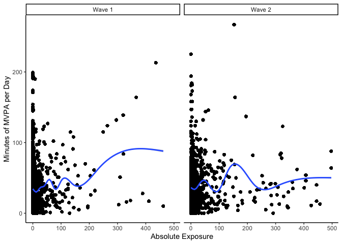
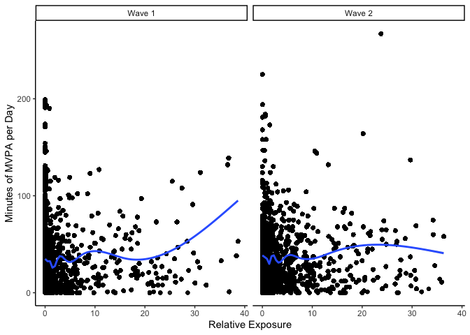

## Libraries


```r
library(lme4)
```

```
## Loading required package: Matrix
```

```r
library(tidyverse)
```

```
## ── Attaching packages ─────────────────────────────────────── tidyverse 1.3.1 ──
```

```
## ✓ ggplot2 3.3.3     ✓ purrr   0.3.4
## ✓ tibble  3.1.2     ✓ dplyr   1.0.6
## ✓ tidyr   1.1.3     ✓ stringr 1.4.0
## ✓ readr   1.4.0     ✓ forcats 0.5.1
```

```
## ── Conflicts ────────────────────────────────────────── tidyverse_conflicts() ──
## x tidyr::expand() masks Matrix::expand()
## x dplyr::filter() masks stats::filter()
## x dplyr::lag()    masks stats::lag()
## x tidyr::pack()   masks Matrix::pack()
## x tidyr::unpack() masks Matrix::unpack()
```

```r
library(gtools)
library(lubridate)
```

```
## 
## Attaching package: 'lubridate'
```

```
## The following objects are masked from 'package:base':
## 
##     date, intersect, setdiff, union
```

```r
library(DRDID)
library(did)
```

```
## Registered S3 methods overwritten by 'car':
##   method                          from
##   influence.merMod                lme4
##   cooks.distance.influence.merMod lme4
##   dfbeta.influence.merMod         lme4
##   dfbetas.influence.merMod        lme4
```

```r
library(modelsummary)
library(broom.mixed)
library(rstatix)
```

```
## 
## Attaching package: 'rstatix'
```

```
## The following object is masked from 'package:stats':
## 
##     filter
```


## Analysis plan

1. Descriptive statistics outcome and exposure
2. Merge in demographic and weather variables 
3. Regression outcome and exposure (as per change discussions)
4. Sensitivity analysis (exposure changes)

### Read in data


```r
data <- read_csv("/Users/dfuller/Documents/INTERACT/data/sensors/sd_data_exposure.csv")
```

```
## 
## ── Column specification ────────────────────────────────────────────────────────
## cols(
##   .default = col_double(),
##   utcdate = col_datetime(format = ""),
##   zone = col_character(),
##   activity_levels = col_character(),
##   gender = col_character(),
##   income = col_character(),
##   education = col_logical(),
##   city_id = col_character(),
##   date = col_date(format = "")
## )
## ℹ Use `spec()` for the full column specifications.
```

```
## Warning: 550640 parsing failures.
##    row       col           expected            actual                                                                  file
## 708730 education 1/0/T/F/TRUE/FALSE University degree '/Users/dfuller/Documents/INTERACT/data/sensors/sd_data_exposure.csv'
## 708731 education 1/0/T/F/TRUE/FALSE University degree '/Users/dfuller/Documents/INTERACT/data/sensors/sd_data_exposure.csv'
## 708732 education 1/0/T/F/TRUE/FALSE University degree '/Users/dfuller/Documents/INTERACT/data/sensors/sd_data_exposure.csv'
## 708733 education 1/0/T/F/TRUE/FALSE University degree '/Users/dfuller/Documents/INTERACT/data/sensors/sd_data_exposure.csv'
## 708734 education 1/0/T/F/TRUE/FALSE University degree '/Users/dfuller/Documents/INTERACT/data/sensors/sd_data_exposure.csv'
## ...... ......... .................. ................. .....................................................................
## See problems(...) for more details.
```

## Demographic data and weather

### Merging demographics


```r
health_data <- read_csv("/Users/dfuller/Documents/INTERACT/data/health_clean.csv")
```

```
## 
## ── Column specification ────────────────────────────────────────────────────────
## cols(
##   .default = col_double(),
##   city_id = col_character(),
##   questionnaire_lang.x = col_character(),
##   date_of_survey = col_date(format = ""),
##   mode_used = col_character(),
##   mode_used_txt = col_character(),
##   cars_access_outside = col_character(),
##   cars_access_outside_txt = col_character(),
##   bike_access_options = col_character(),
##   bike_access_options_txt = col_character(),
##   tracking1_txt = col_character(),
##   house_tenure_txt = col_character(),
##   dwelling_type_txt = col_character(),
##   residence = col_date(format = ""),
##   gender_txt = col_character(),
##   sex_txt = col_logical(),
##   living_arrange = col_character(),
##   living_arrange_txt = col_character(),
##   group_id_mtl = col_character(),
##   group_id_mtl_txt = col_character(),
##   employment_txt = col_character()
##   # ... with 204 more columns
## )
## ℹ Use `spec()` for the full column specifications.
```

```
## Warning: 35032 parsing failures.
##  row            col           expected actual                                                      file
## 1156 sask_bus_pass  1/0/T/F/TRUE/FALSE     2  '/Users/dfuller/Documents/INTERACT/data/health_clean.csv'
## 1156 bus_safe       1/0/T/F/TRUE/FALSE     2  '/Users/dfuller/Documents/INTERACT/data/health_clean.csv'
## 1156 bus_reliable   1/0/T/F/TRUE/FALSE     2  '/Users/dfuller/Documents/INTERACT/data/health_clean.csv'
## 1156 bus_convenient 1/0/T/F/TRUE/FALSE     2  '/Users/dfuller/Documents/INTERACT/data/health_clean.csv'
## 1156 bus_freq_a     1/0/T/F/TRUE/FALSE     91 '/Users/dfuller/Documents/INTERACT/data/health_clean.csv'
## .... .............. .................. ...... .........................................................
## See problems(...) for more details.
```

```r
health_data <- health_data %>%
                  select(education_recode, gender_recode2, income_recode, age_recode, white, asian, indigenous, black, latin_american, 
                         middle_eastern, other_ethnicity, interact_id)

data <- left_join(data, health_data, by = c("interact_id"))
```

### Merging weather


```r
weather_data <- read_csv("/Users/dfuller/Documents/INTERACT/data/weather/2016_2020_weather_vic_van_sask_mtl.csv")
```

```
## 
## ── Column specification ────────────────────────────────────────────────────────
## cols(
##   .default = col_character(),
##   lon = col_double(),
##   lat = col_double(),
##   climate_id = col_double(),
##   date_time = col_date(format = ""),
##   year = col_double(),
##   data_quality = col_logical(),
##   max_temp_c = col_double(),
##   min_temp_c = col_double(),
##   mean_temp_c = col_double(),
##   heat_days_c = col_double(),
##   cool_days_c = col_double(),
##   total_rain_mm = col_double(),
##   total_snow_mm = col_double(),
##   total_precip_mm = col_double(),
##   snow_ground_cm = col_double(),
##   snow_ground_flag = col_logical(),
##   dir_gust_10s_deg = col_double()
## )
## ℹ Use `spec()` for the full column specifications.
```

```
## Warning: 1835 parsing failures.
##  row              col           expected actual                                                                                    file
## 1135 snow_ground_flag 1/0/T/F/TRUE/FALSE      E '/Users/dfuller/Documents/INTERACT/data/weather/2016_2020_weather_vic_van_sask_mtl.csv'
## 1473 snow_ground_flag 1/0/T/F/TRUE/FALSE      E '/Users/dfuller/Documents/INTERACT/data/weather/2016_2020_weather_vic_van_sask_mtl.csv'
## 1817 snow_ground_flag 1/0/T/F/TRUE/FALSE      E '/Users/dfuller/Documents/INTERACT/data/weather/2016_2020_weather_vic_van_sask_mtl.csv'
## 2964 snow_ground_flag 1/0/T/F/TRUE/FALSE      E '/Users/dfuller/Documents/INTERACT/data/weather/2016_2020_weather_vic_van_sask_mtl.csv'
## 2968 snow_ground_flag 1/0/T/F/TRUE/FALSE      E '/Users/dfuller/Documents/INTERACT/data/weather/2016_2020_weather_vic_van_sask_mtl.csv'
## .... ................ .................. ...... .......................................................................................
## See problems(...) for more details.
```

```r
weather_data <- weather_data %>% dplyr::select(date_time, city_id, max_temp_c, min_temp_c, mean_temp_c, total_rain_mm, total_snow_mm, total_precip_mm, snow_ground_cm, speed_gust_km_h)

weather_data$date <- ymd(weather_data$date_time)

weather_data <- weather_data %>% filter(city_id == "Victoria")

weather_data <- arrange(weather_data, date)
data <- arrange(data, date)

data <- left_join(data, weather_data, by = c("date"))
```

### Exposure over time 


```r
## Overall 
table(data$wave_id, data$exposed_70)
```

```
##    
##          0      1
##   1 690274  18455
##   2 519463  35876
```

```r
## Individual level
data_exposure <- data %>%
                  group_by(interact_id, wave_id, date) %>%
                    summarise(
                      sum_exp_70 = sum(exposed_70), 
                      sum_exp_50 = sum(exposed_50), 
                      sum_exp_100 = sum(exposed_100), 
                      mvpa = first(total_mvpa_minutes),
                      sed = first(total_sed_minutes),
                      light = first(total_light_pa_minutes),
                      rel_exp_70 = sum(exposed_70)/n()*100,
                      rel_exp_50 = sum(exposed_50)/n()*100,
                      rel_exp_100 = sum(exposed_100)/n()*100,
                      minutes = first(minutes_id_date),
                      mean_temp_c = first(mean_temp_c),
                      total_precip_mm = first(total_precip_mm),
                      snow_ground_cm = first(snow_ground_cm),
                      speed_gust_km_h = first(speed_gust_km_h),
                      education_recode = first(education_recode),
                      gender_recode2 = first(gender_recode2),
                      income_recode = first(income_recode),
                      age_recode = first(age_recode),
                      white = first(white),
                      asian = first(asian),
                      indigenous = first(indigenous),
                      black = first(black),
                      latin_american = first(latin_american),
                      middle_eastern = first(middle_eastern),
                      other_ethnicity - first(other_ethnicity)
                    )
```

```
## `summarise()` has grouped output by 'interact_id', 'wave_id', 'date'. You can override using the `.groups` argument.
```

```r
data_exposure$date_time <- as.factor(data_exposure$date)

data_exposure$speed_gust_km_h <- as.numeric(data_exposure$speed_gust_km_h)
```

```
## Warning: NAs introduced by coercion
```

### Histograms of absolute exposure (Total number of minutes)


```r
summary(data_exposure$sum_exp_70)
```

```
##    Min. 1st Qu.  Median    Mean 3rd Qu.    Max. 
##    0.00    0.00    2.00   24.37   13.00  652.00
```

```r
### Removing participants with more than 500 minutes of exposure
data_exposure$sum_exp_70 <- if_else(data_exposure$sum_exp_70 > 500, NA_real_, data_exposure$sum_exp_70) #1264068
data_exposure$sum_exp_50 <- if_else(data_exposure$sum_exp_50 > 500, NA_real_, data_exposure$sum_exp_50)
data_exposure$sum_exp_100 <- if_else(data_exposure$sum_exp_100 > 500, NA_real_, data_exposure$sum_exp_100)

data_exposure <- data_exposure %>% 
                    mutate(
                      sum_exp_70_quint = ntile(sum_exp_70, 5),
                      sum_exp_50_quint = ntile(sum_exp_50, 5),
                      sum_exp_100_quint = ntile(sum_exp_100, 5)
                      )

data_exposure$sum_exp_70_quint <- as.factor(data_exposure$sum_exp_70_quint)
data_exposure$sum_exp_50_quint <- as.factor(data_exposure$sum_exp_50_quint)
data_exposure$sum_exp_100_quint <- as.factor(data_exposure$sum_exp_100_quint)

table(data_exposure$sum_exp_70_quint)
```

```
## 
##      1      2      3      4      5 
## 252741 252150 251586 251090 250472
```

```r
table(data_exposure$sum_exp_100_quint)
```

```
## 
##      1      2      3      4      5 
## 252227 251638 251075 250579 249961
```

```r
summary(data_exposure$sum_exp_70)
```

```
##    Min. 1st Qu.  Median    Mean 3rd Qu.    Max.    NA's 
##    0.00    0.00    2.00   21.72   13.00  497.00    6029
```

```r
data_exposure %>%
      group_by(wave_id) %>%
        get_summary_stats(sum_exp_70)
```

```
## # A tibble: 2 x 14
##   wave_id variable      n   min   max median    q1    q3   iqr   mad  mean    sd
##     <dbl> <chr>     <dbl> <dbl> <dbl>  <dbl> <dbl> <dbl> <dbl> <dbl> <dbl> <dbl>
## 1       1 sum_exp… 708729     0   462      0     0     6     6   0    14.5  48.4
## 2       2 sum_exp… 549310     0   497      7     2    21    19  10.4  31.0  72.8
## # … with 2 more variables: se <dbl>, ci <dbl>
```

```r
summary(data_exposure$sum_exp_50)
```

```
##    Min. 1st Qu.  Median    Mean 3rd Qu.    Max.    NA's 
##    0.00    0.00    2.00   19.33   10.00  494.00     664
```

```r
summary(data_exposure$sum_exp_100)
```

```
##    Min. 1st Qu.  Median    Mean 3rd Qu.    Max.    NA's 
##    0.00    0.00    3.00   25.94   18.00  495.00    8588
```


```r
abs_exposure_histo <- ggplot(data_exposure, aes(sum_exp_70)) + 
  geom_histogram() + 
  facet_wrap(~ wave_id) + 
  theme_classic()

plot(abs_exposure_histo)
```

```
## `stat_bin()` using `bins = 30`. Pick better value with `binwidth`.
```

```
## Warning: Removed 6029 rows containing non-finite values (stat_bin).
```

<!-- -->

### Histograms of relative exposure (% of total minutes exposed)


```r
summary(data_exposure$rel_exp_70)
```

```
##     Min.  1st Qu.   Median     Mean  3rd Qu.     Max. 
##   0.0000   0.0000   0.4057   4.2981   2.3684 100.0000
```

```r
### Removing participants with more than 40% exposure
data_exposure$rel_exp_70 <- if_else(data_exposure$rel_exp_70 > 40, NA_real_, data_exposure$rel_exp_70)
data_exposure$rel_exp_50 <- if_else(data_exposure$rel_exp_50 > 40, NA_real_, data_exposure$rel_exp_50)
data_exposure$rel_exp_100 <- if_else(data_exposure$rel_exp_100 > 40, NA_real_, data_exposure$rel_exp_100)

data_exposure <- data_exposure %>% 
                    mutate(
                      rel_exp_70_quint = ntile(rel_exp_70, 5),
                      rel_exp_50_quint = ntile(rel_exp_50, 5),
                      rel_exp_100_quint = ntile(rel_exp_100, 5)
                      )
data_exposure$rel_exp_70_quint <- as.factor(data_exposure$rel_exp_70_quint)
data_exposure$rel_exp_50_quint <- as.factor(data_exposure$rel_exp_50_quint)
data_exposure$rel_exp_100_quint <- as.factor(data_exposure$rel_exp_100_quint)

table(data_exposure$rel_exp_70_quint)
```

```
## 
##      1      2      3      4      5 
## 245996 245424 244873 244391 243790
```

```r
table(data_exposure$rel_exp_100_quint)
```

```
## 
##      1      2      3      4      5 
## 244839 244273 243726 243248 242649
```

```r
summary(data_exposure$rel_exp_70)
```

```
##    Min. 1st Qu.  Median    Mean 3rd Qu.    Max.    NA's 
##    0.00    0.00    0.35    2.53    2.05   38.65   39594
```

```r
data_exposure %>%
      group_by(wave_id) %>%
        get_summary_stats(rel_exp_70)
```

```
## # A tibble: 2 x 14
##   wave_id variable      n   min   max median    q1    q3   iqr   mad  mean    sd
##     <dbl> <chr>     <dbl> <dbl> <dbl>  <dbl> <dbl> <dbl> <dbl> <dbl> <dbl> <dbl>
## 1       1 rel_exp… 699417     0  38.6   0    0     0.962 0.962  0     1.92  5.23
## 2       2 rel_exp… 525057     0  36.3   1.21 0.252 3.14  2.88   1.79  3.35  5.76
## # … with 2 more variables: se <dbl>, ci <dbl>
```

```r
summary(data_exposure$rel_exp_50)
```

```
##    Min. 1st Qu.  Median    Mean 3rd Qu.    Max.    NA's 
##   0.000   0.000   0.271   2.250   1.689  39.041   29598
```

```r
summary(data_exposure$rel_exp_100)
```

```
##    Min. 1st Qu.  Median    Mean 3rd Qu.    Max.    NA's 
##    0.00    0.00    0.53    3.25    2.87   40.00   45333
```

### Creating a days variable 

```r
data_exposure <- data_exposure[order(data_exposure$date, data_exposure$interact_id), ]

data_exposure$time_seq <- as.numeric(data_exposure$date_time)
```

### Recoding wave_id for plotting

```r
data_exposure <- data_exposure %>% 
                  mutate(wave = case_when(
                    wave_id == 1 ~ "Wave 1",
                    wave_id == 2 ~ "Wave 2"))
```


```r
rel_exposure_histo <- ggplot(data_exposure, aes(rel_exp_70)) + 
  geom_histogram() + 
  facet_wrap(~ wave) + 
  labs(x = "Relative Exposure") +
  theme_classic()

plot(rel_exposure_histo)
```

```
## `stat_bin()` using `bins = 30`. Pick better value with `binwidth`.
```

```
## Warning: Removed 39594 rows containing non-finite values (stat_bin).
```

<!-- -->

```r
ggsave("rel_exposure_histo.jpg", width = 6, height = 4)
```

```
## `stat_bin()` using `bins = 30`. Pick better value with `binwidth`.
```

```
## Warning: Removed 39594 rows containing non-finite values (stat_bin).
```


```r
abs_exposure_histo <- ggplot(data_exposure, aes(sum_exp_70)) + 
  geom_histogram() + 
  facet_wrap(~ wave) + 
  labs(x = "Asolute Exposure") +
  theme_classic()
plot(abs_exposure_histo)
```

```
## `stat_bin()` using `bins = 30`. Pick better value with `binwidth`.
```

```
## Warning: Removed 6029 rows containing non-finite values (stat_bin).
```

<!-- -->

```r
ggsave("abs_exposure_histo.jpg", width = 6, height = 4)
```

```
## `stat_bin()` using `bins = 30`. Pick better value with `binwidth`.
```

```
## Warning: Removed 6029 rows containing non-finite values (stat_bin).
```

### Histograms of Moderate to vigorous PA 


```r
summary(data_exposure$mvpa)
```

```
##    Min. 1st Qu.  Median    Mean 3rd Qu.    Max. 
##    0.00   11.00   26.00   36.12   51.00  267.00
```

```r
sd(data_exposure$mvpa)
```

```
## [1] 35.15078
```

```r
waves_pa <- data_exposure %>%
              group_by(wave_id) %>%
                get_summary_stats(mvpa, type = "mean_sd")
waves_pa
```

```
## # A tibble: 2 x 5
##   wave_id variable      n  mean    sd
##     <dbl> <chr>     <dbl> <dbl> <dbl>
## 1       1 mvpa     708729  35.1  35.2
## 2       2 mvpa     555339  37.4  35.0
```

```r
pa_histo <- ggplot(data_exposure, aes(mvpa)) + 
  geom_histogram() + 
  labs(x = "Minutes of MVPA per Day" ) +
  facet_wrap(~ wave) + 
  theme_classic()

plot(pa_histo)
```

```
## `stat_bin()` using `bins = 30`. Pick better value with `binwidth`.
```

<!-- -->

```r
ggsave("pa_histo.jpg", width = 6, height = 4)
```

```
## `stat_bin()` using `bins = 30`. Pick better value with `binwidth`.
```

### Histograms of Moderate to vigorous PA 


```r
pa_w1 <- filter(data_exposure, wave_id == 1)
pa_w2 <- filter(data_exposure, wave_id == 2)

### Wave 1 
pa_day_w1 <- ggplot(pa_w1, aes(x = date, y = mvpa)) + 
  geom_point(alpha = 0.005) + 
  geom_smooth() +
  labs(x = "Date", y = "Minutes of MVPA per Day" ) +
  theme_classic()
plot(pa_day_w1)
```

```
## `geom_smooth()` using method = 'gam' and formula 'y ~ s(x, bs = "cs")'
```

<!-- -->

```r
ggsave("pa_day_w1.jpg", width = 6, height = 4)
```

```
## `geom_smooth()` using method = 'gam' and formula 'y ~ s(x, bs = "cs")'
```

```r
### Wave 2
pa_day_w2 <- ggplot(pa_w2, aes(x = date, y = mvpa)) + 
  geom_point(alpha = 0.005) + 
  geom_smooth() +
  labs(x = "Date", y = "Minutes of MVPA per Day" ) +
  theme_classic()
plot(pa_day_w2)
```

```
## `geom_smooth()` using method = 'gam' and formula 'y ~ s(x, bs = "cs")'
```

<!-- -->

```r
ggsave("pa_day_w2.jpg", width = 6, height = 4)
```

```
## `geom_smooth()` using method = 'gam' and formula 'y ~ s(x, bs = "cs")'
```

### Scatterplot Absolute Exposure and Moderate to vigorous PA 


```r
abs_exp_pa_scatter <- ggplot(data_exposure, aes(x = sum_exp_70, y = mvpa)) + 
                geom_point(alpha = 0.005) +
                geom_smooth() +
                labs(x = "Absolute Exposure", y = "Minutes of MVPA per Day" ) +
                facet_wrap(~ wave) +
                theme_classic()

plot(abs_exp_pa_scatter)
```

```
## `geom_smooth()` using method = 'gam' and formula 'y ~ s(x, bs = "cs")'
```

```
## Warning: Removed 6029 rows containing non-finite values (stat_smooth).
```

```
## Warning: Removed 6029 rows containing missing values (geom_point).
```

<!-- -->

```r
ggsave("abs_exp_pa_scatter.jpg", width = 6, height = 4)
```

```
## `geom_smooth()` using method = 'gam' and formula 'y ~ s(x, bs = "cs")'
```

```
## Warning: Removed 6029 rows containing non-finite values (stat_smooth).

## Warning: Removed 6029 rows containing missing values (geom_point).
```

### Scatterplot Relative Exposure and Moderate to vigorous PA 


```r
rel_exp_pa_scatter <- ggplot(data_exposure, aes(x = rel_exp_70, y = mvpa)) + 
  geom_point(alpha = 0.005) +
  geom_smooth() +
  labs(x = "Relative Exposure", y = "Minutes of MVPA per Day" ) +
  facet_wrap(~ wave) + 
  theme_classic()

plot(rel_exp_pa_scatter)
```

```
## `geom_smooth()` using method = 'gam' and formula 'y ~ s(x, bs = "cs")'
```

```
## Warning: Removed 39594 rows containing non-finite values (stat_smooth).
```

```
## Warning: Removed 39594 rows containing missing values (geom_point).
```

<!-- -->

```r
ggsave("rel_exp_pa_scatter.jpg", width = 6, height = 4)
```

```
## `geom_smooth()` using method = 'gam' and formula 'y ~ s(x, bs = "cs")'
```

```
## Warning: Removed 39594 rows containing non-finite values (stat_smooth).

## Warning: Removed 39594 rows containing missing values (geom_point).
```

# Table 2: Model 1

### Linear regression


```r
lm_models <- list(
  "Absolute Exposure" = lm(mvpa ~ sum_exp_70*factor(wave_id) + mean_temp_c + total_precip_mm + speed_gust_km_h + gender_recode2 + income_recode + age_recode, data = data_exposure),
  "Relative Exposure" = lm(mvpa ~ rel_exp_70*factor(wave_id) + mean_temp_c + total_precip_mm + speed_gust_km_h + gender_recode2 + income_recode + age_recode, data = data_exposure)
)

modelsummary(lm_models, fmt = "%.2f", statistic = 'conf.int')
```

<table class="table" style="width: auto !important; margin-left: auto; margin-right: auto;">
 <thead>
  <tr>
   <th style="text-align:left;">   </th>
   <th style="text-align:center;"> Absolute Exposure </th>
   <th style="text-align:center;"> Relative Exposure </th>
  </tr>
 </thead>
<tbody>
  <tr>
   <td style="text-align:left;"> (Intercept) </td>
   <td style="text-align:center;"> 29.86 </td>
   <td style="text-align:center;"> 28.16 </td>
  </tr>
  <tr>
   <td style="text-align:left;">  </td>
   <td style="text-align:center;"> [29.24, 30.49] </td>
   <td style="text-align:center;"> [27.53, 28.80] </td>
  </tr>
  <tr>
   <td style="text-align:left;"> sum_exp_70 </td>
   <td style="text-align:center;"> 0.03 </td>
   <td style="text-align:center;">  </td>
  </tr>
  <tr>
   <td style="text-align:left;">  </td>
   <td style="text-align:center;"> [0.03, 0.03] </td>
   <td style="text-align:center;">  </td>
  </tr>
  <tr>
   <td style="text-align:left;"> factor(wave_id)2 </td>
   <td style="text-align:center;"> 4.72 </td>
   <td style="text-align:center;"> 4.40 </td>
  </tr>
  <tr>
   <td style="text-align:left;">  </td>
   <td style="text-align:center;"> [4.48, 4.97] </td>
   <td style="text-align:center;"> [4.13, 4.66] </td>
  </tr>
  <tr>
   <td style="text-align:left;"> mean_temp_c </td>
   <td style="text-align:center;"> -0.17 </td>
   <td style="text-align:center;"> -0.13 </td>
  </tr>
  <tr>
   <td style="text-align:left;">  </td>
   <td style="text-align:center;"> [-0.19, -0.15] </td>
   <td style="text-align:center;"> [-0.15, -0.11] </td>
  </tr>
  <tr>
   <td style="text-align:left;"> total_precip_mm </td>
   <td style="text-align:center;"> -0.05 </td>
   <td style="text-align:center;"> -0.05 </td>
  </tr>
  <tr>
   <td style="text-align:left;">  </td>
   <td style="text-align:center;"> [-0.07, -0.03] </td>
   <td style="text-align:center;"> [-0.07, -0.03] </td>
  </tr>
  <tr>
   <td style="text-align:left;"> speed_gust_km_h </td>
   <td style="text-align:center;"> 0.05 </td>
   <td style="text-align:center;"> 0.07 </td>
  </tr>
  <tr>
   <td style="text-align:left;">  </td>
   <td style="text-align:center;"> [0.04, 0.05] </td>
   <td style="text-align:center;"> [0.07, 0.08] </td>
  </tr>
  <tr>
   <td style="text-align:left;"> gender_recode2Transgender </td>
   <td style="text-align:center;"> -14.50 </td>
   <td style="text-align:center;"> -14.44 </td>
  </tr>
  <tr>
   <td style="text-align:left;">  </td>
   <td style="text-align:center;"> [-15.07, -13.93] </td>
   <td style="text-align:center;"> [-15.00, -13.87] </td>
  </tr>
  <tr>
   <td style="text-align:left;"> gender_recode2Woman </td>
   <td style="text-align:center;"> -5.06 </td>
   <td style="text-align:center;"> -5.30 </td>
  </tr>
  <tr>
   <td style="text-align:left;">  </td>
   <td style="text-align:center;"> [-5.22, -4.89] </td>
   <td style="text-align:center;"> [-5.47, -5.14] </td>
  </tr>
  <tr>
   <td style="text-align:left;"> income_recode100_200 </td>
   <td style="text-align:center;"> 6.83 </td>
   <td style="text-align:center;"> 6.58 </td>
  </tr>
  <tr>
   <td style="text-align:left;">  </td>
   <td style="text-align:center;"> [6.40, 7.27] </td>
   <td style="text-align:center;"> [6.14, 7.02] </td>
  </tr>
  <tr>
   <td style="text-align:left;"> income_recode20_49 999 </td>
   <td style="text-align:center;"> 18.41 </td>
   <td style="text-align:center;"> 18.33 </td>
  </tr>
  <tr>
   <td style="text-align:left;">  </td>
   <td style="text-align:center;"> [17.96, 18.86] </td>
   <td style="text-align:center;"> [17.88, 18.78] </td>
  </tr>
  <tr>
   <td style="text-align:left;"> income_recode200+ </td>
   <td style="text-align:center;"> 22.12 </td>
   <td style="text-align:center;"> 22.18 </td>
  </tr>
  <tr>
   <td style="text-align:left;">  </td>
   <td style="text-align:center;"> [21.11, 23.12] </td>
   <td style="text-align:center;"> [21.17, 23.19] </td>
  </tr>
  <tr>
   <td style="text-align:left;"> income_recode50_99 999 </td>
   <td style="text-align:center;"> 6.62 </td>
   <td style="text-align:center;"> 6.65 </td>
  </tr>
  <tr>
   <td style="text-align:left;">  </td>
   <td style="text-align:center;"> [6.19, 7.04] </td>
   <td style="text-align:center;"> [6.22, 7.08] </td>
  </tr>
  <tr>
   <td style="text-align:left;"> income_recodeDon't know/prefer no answer </td>
   <td style="text-align:center;"> 13.04 </td>
   <td style="text-align:center;"> 12.93 </td>
  </tr>
  <tr>
   <td style="text-align:left;">  </td>
   <td style="text-align:center;"> [12.52, 13.56] </td>
   <td style="text-align:center;"> [12.41, 13.45] </td>
  </tr>
  <tr>
   <td style="text-align:left;"> age_recode30_39 </td>
   <td style="text-align:center;"> -0.65 </td>
   <td style="text-align:center;"> -0.25 </td>
  </tr>
  <tr>
   <td style="text-align:left;">  </td>
   <td style="text-align:center;"> [-0.92, -0.39] </td>
   <td style="text-align:center;"> [-0.51, 0.02] </td>
  </tr>
  <tr>
   <td style="text-align:left;"> age_recode40_49 </td>
   <td style="text-align:center;"> 1.66 </td>
   <td style="text-align:center;"> 2.20 </td>
  </tr>
  <tr>
   <td style="text-align:left;">  </td>
   <td style="text-align:center;"> [1.38, 1.94] </td>
   <td style="text-align:center;"> [1.91, 2.48] </td>
  </tr>
  <tr>
   <td style="text-align:left;"> age_recode50_64 </td>
   <td style="text-align:center;"> -4.57 </td>
   <td style="text-align:center;"> -4.05 </td>
  </tr>
  <tr>
   <td style="text-align:left;">  </td>
   <td style="text-align:center;"> [-4.87, -4.27] </td>
   <td style="text-align:center;"> [-4.35, -3.75] </td>
  </tr>
  <tr>
   <td style="text-align:left;"> age_recode65+ </td>
   <td style="text-align:center;"> -10.03 </td>
   <td style="text-align:center;"> -9.71 </td>
  </tr>
  <tr>
   <td style="text-align:left;">  </td>
   <td style="text-align:center;"> [-10.32, -9.74] </td>
   <td style="text-align:center;"> [-10.01, -9.41] </td>
  </tr>
  <tr>
   <td style="text-align:left;"> sum_exp_70 × factor(wave_id)2 </td>
   <td style="text-align:center;"> -0.01 </td>
   <td style="text-align:center;">  </td>
  </tr>
  <tr>
   <td style="text-align:left;">  </td>
   <td style="text-align:center;"> [-0.02, -0.01] </td>
   <td style="text-align:center;">  </td>
  </tr>
  <tr>
   <td style="text-align:left;"> rel_exp_70 </td>
   <td style="text-align:center;">  </td>
   <td style="text-align:center;"> 0.27 </td>
  </tr>
  <tr>
   <td style="text-align:left;">  </td>
   <td style="text-align:center;">  </td>
   <td style="text-align:center;"> [0.25, 0.29] </td>
  </tr>
  <tr>
   <td style="text-align:left;"> rel_exp_70 × factor(wave_id)2 </td>
   <td style="text-align:center;">  </td>
   <td style="text-align:center;"> -0.06 </td>
  </tr>
  <tr>
   <td style="text-align:left;box-shadow: 0px 1px">  </td>
   <td style="text-align:center;box-shadow: 0px 1px">  </td>
   <td style="text-align:center;box-shadow: 0px 1px"> [-0.10, -0.03] </td>
  </tr>
  <tr>
   <td style="text-align:left;"> Num.Obs. </td>
   <td style="text-align:center;"> 704845 </td>
   <td style="text-align:center;"> 690856 </td>
  </tr>
  <tr>
   <td style="text-align:left;"> R2 </td>
   <td style="text-align:center;"> 0.037 </td>
   <td style="text-align:center;"> 0.037 </td>
  </tr>
  <tr>
   <td style="text-align:left;"> R2 Adj. </td>
   <td style="text-align:center;"> 0.037 </td>
   <td style="text-align:center;"> 0.037 </td>
  </tr>
  <tr>
   <td style="text-align:left;"> AIC </td>
   <td style="text-align:center;"> 6907852.6 </td>
   <td style="text-align:center;"> 6774088.8 </td>
  </tr>
  <tr>
   <td style="text-align:left;"> BIC </td>
   <td style="text-align:center;"> 6908070.5 </td>
   <td style="text-align:center;"> 6774306.3 </td>
  </tr>
  <tr>
   <td style="text-align:left;"> Log.Lik. </td>
   <td style="text-align:center;"> -3453907.314 </td>
   <td style="text-align:center;"> -3387025.397 </td>
  </tr>
  <tr>
   <td style="text-align:left;"> F </td>
   <td style="text-align:center;"> 1577.070 </td>
   <td style="text-align:center;"> 1550.759 </td>
  </tr>
</tbody>
</table>

## Multilevel models 

MLM models with person level random intercepts using the lmer package

### Absolute exposure with a 70 meter buffer and no covariates


```r
### Null Model
lmer_null_exp70_ln <- lmer(mvpa ~ 1 + (1 | time_seq) + (1 | interact_id), data = data_exposure)
summary(lmer_null_exp70_ln)
```

```
## Linear mixed model fit by REML ['lmerMod']
## Formula: mvpa ~ 1 + (1 | time_seq) + (1 | interact_id)
##    Data: data_exposure
## 
## REML criterion at convergence: 11793864
## 
## Scaled residuals: 
##     Min      1Q  Median      3Q     Max 
## -5.5956 -0.6201 -0.0680  0.4895  5.3456 
## 
## Random effects:
##  Groups      Name        Variance Std.Dev.
##  time_seq    (Intercept) 387.4    19.68   
##  interact_id (Intercept) 601.8    24.53   
##  Residual                657.8    25.65   
## Number of obs: 1264068, groups:  time_seq, 345; interact_id, 210
## 
## Fixed effects:
##             Estimate Std. Error t value
## (Intercept)   31.268      1.998   15.65
```

```r
broom.mixed::glance(lmer_null_exp70_ln)
```

```
## # A tibble: 1 x 6
##   sigma    logLik       AIC       BIC  REMLcrit df.residual
##   <dbl>     <dbl>     <dbl>     <dbl>     <dbl>       <int>
## 1  25.6 -5896932. 11793872. 11793920. 11793864.     1264064
```

```r
### Model with no covariates
lmer_abs_exp70_ln <- lmer(mvpa ~ sum_exp_70*factor(wave_id) + (1 | time_seq) + (1 | interact_id), data = data_exposure)
summary(lmer_abs_exp70_ln)
```

```
## Linear mixed model fit by REML ['lmerMod']
## Formula: 
## mvpa ~ sum_exp_70 * factor(wave_id) + (1 | time_seq) + (1 | interact_id)
##    Data: data_exposure
## 
## REML criterion at convergence: 11693416
## 
## Scaled residuals: 
##     Min      1Q  Median      3Q     Max 
## -5.6239 -0.6205 -0.0685  0.4924  5.3155 
## 
## Random effects:
##  Groups      Name        Variance Std.Dev.
##  time_seq    (Intercept) 368.4    19.19   
##  interact_id (Intercept) 578.7    24.06   
##  Residual                635.0    25.20   
## Number of obs: 1258039, groups:  time_seq, 345; interact_id, 210
## 
## Fixed effects:
##                              Estimate Std. Error t value
## (Intercept)                 34.060751   2.193767  15.526
## sum_exp_70                   0.112015   0.001121  99.880
## factor(wave_id)2            -9.383978   2.080304  -4.511
## sum_exp_70:factor(wave_id)2 -0.067613   0.001295 -52.191
## 
## Correlation of Fixed Effects:
##             (Intr) sm__70 fc(_)2
## sum_exp_70  -0.007              
## fctr(wv_d)2 -0.452  0.004       
## sm__70:(_)2  0.005 -0.854 -0.007
```

```r
broom.mixed::glance(lmer_abs_exp70_ln)
```

```
## # A tibble: 1 x 6
##   sigma    logLik       AIC       BIC  REMLcrit df.residual
##   <dbl>     <dbl>     <dbl>     <dbl>     <dbl>       <int>
## 1  25.2 -5846708. 11693430. 11693514. 11693416.     1258032
```

# Table 2: Model 2

### Absolute exposure with a 70 meter buffer and covariates - Random intercepts

```r
### Absolute Model Continuous
lmer_abs_exp70_ln_cov <- lmer(mvpa ~ sum_exp_70*factor(wave_id) + mean_temp_c + total_precip_mm + speed_gust_km_h + gender_recode2 + income_recode + age_recode + (1 | time_seq) + (1 | interact_id), data = data_exposure)
summary(lmer_abs_exp70_ln_cov)
```

```
## Linear mixed model fit by REML ['lmerMod']
## Formula: mvpa ~ sum_exp_70 * factor(wave_id) + mean_temp_c + total_precip_mm +  
##     speed_gust_km_h + gender_recode2 + income_recode + age_recode +  
##     (1 | time_seq) + (1 | interact_id)
##    Data: data_exposure
## 
## REML criterion at convergence: 6453454
## 
## Scaled residuals: 
##     Min      1Q  Median      3Q     Max 
## -3.9465 -0.5699 -0.0554  0.5054  5.3845 
## 
## Random effects:
##  Groups      Name        Variance Std.Dev.
##  time_seq    (Intercept) 326.9    18.08   
##  interact_id (Intercept) 494.3    22.23   
##  Residual                552.4    23.50   
## Number of obs: 704845, groups:  time_seq, 225; interact_id, 134
## 
## Fixed effects:
##                                            Estimate Std. Error t value
## (Intercept)                               31.505701  12.321418   2.557
## sum_exp_70                                 0.115439   0.001296  89.041
## factor(wave_id)2                           0.932910   3.185072   0.293
## mean_temp_c                               -0.544184   0.301103  -1.807
## total_precip_mm                           -0.013153   0.255324  -0.052
## speed_gust_km_h                            0.070658   0.136200   0.519
## gender_recode2Transgender                -22.910528  16.214843  -1.413
## gender_recode2Woman                       -9.002616   4.034207  -2.232
## income_recode100_200                      -0.043974  11.056684  -0.004
## income_recode20_49 999                    12.140214  11.492284   1.056
## income_recode200+                         19.114407  24.883114   0.768
## income_recode50_99 999                    -0.448352  10.735386  -0.042
## income_recodeDon't know/prefer no answer   4.633076  12.895924   0.359
## age_recode30_39                            7.741094   6.329549   1.223
## age_recode40_49                            9.105662   6.714631   1.356
## age_recode50_64                            8.883314   7.574730   1.173
## age_recode65+                             -0.334705   7.983107  -0.042
## sum_exp_70:factor(wave_id)2               -0.157591   0.001728 -91.194
```

```
## 
## Correlation matrix not shown by default, as p = 18 > 12.
## Use print(x, correlation=TRUE)  or
##     vcov(x)        if you need it
```

```r
confint.merMod(lmer_abs_exp70_ln_cov)
```

```
## Computing profile confidence intervals ...
```

```
##                                                2.5 %      97.5 %
## .sig01                                    16.3586099 19.70978672
## .sig02                                    18.9250478 24.06003184
## .sigma                                    23.4642380 23.54185914
## (Intercept)                                8.0899947 54.91238649
## sum_exp_70                                 0.1128907  0.11797280
## factor(wave_id)2                          -5.2762227  7.14130614
## mean_temp_c                               -1.1309338  0.04299357
## total_precip_mm                           -0.5108664  0.48455512
## speed_gust_km_h                           -0.1948404  0.33615706
## gender_recode2Transgender                -53.4858433  7.66727836
## gender_recode2Woman                      -16.6096169 -1.39473351
## income_recode100_200                     -20.8935318 20.80595917
## income_recode20_49 999                    -9.5310693 33.81118953
## income_recode200+                        -27.8086705 66.03640748
## income_recode50_99 999                   -20.6921333 19.79557306
## income_recodeDon't know/prefer no answer -19.6851952 28.95088118
## age_recode30_39                           -4.1950741 19.67659189
## age_recode40_49                           -3.5560170 21.76787258
## age_recode50_64                           -5.4010251 23.16659050
## age_recode65+                            -15.3882638 14.71964410
## sum_exp_70:factor(wave_id)2               -0.1609702 -0.15419636
```

```r
broom.mixed::glance(lmer_abs_exp70_ln_cov)
```

```
## # A tibble: 1 x 6
##   sigma    logLik      AIC      BIC REMLcrit df.residual
##   <dbl>     <dbl>    <dbl>    <dbl>    <dbl>       <int>
## 1  23.5 -3226727. 6453496. 6453736. 6453454.      704824
```

# Table 2: Model 3

### Absolute exposure with a 70 meter buffer and covariates - Random slopes

```r
### Absolute Model Continuous
#lmer_abs_exp70_ln_cov_rs <- lmer(mvpa ~ sum_exp_70*factor(wave_id) + mean_temp_c + total_precip_mm + speed_gust_km_h + gender_recode2 + income_recode + age_recode + (time_seq | interact_id) + (1 | interact_id), data = data_exposure, control = lmerControl(optimizer = "nlminbwrap"))
#summary(lmer_abs_exp70_ln_cov_rs)
#confint.merMod(lmer_abs_exp70_ln_cov_rs)
#broom.mixed::glance(lmer_abs_exp70_ln_cov_rs)
```

# Table 2: Model 4


```r
### Absolute Model Quintiles
lmer_abs_exp70_q_cov <- lmer(mvpa ~ sum_exp_70_quint*factor(wave_id) + mean_temp_c + total_precip_mm + speed_gust_km_h + gender_recode2 + income_recode + age_recode + (1 | time_seq) + (1 | interact_id), data = data_exposure)
summary(lmer_abs_exp70_q_cov)
```

```
## Linear mixed model fit by REML ['lmerMod']
## Formula: 
## mvpa ~ sum_exp_70_quint * factor(wave_id) + mean_temp_c + total_precip_mm +  
##     speed_gust_km_h + gender_recode2 + income_recode + age_recode +  
##     (1 | time_seq) + (1 | interact_id)
##    Data: data_exposure
## 
## REML criterion at convergence: 6462817
## 
## Scaled residuals: 
##     Min      1Q  Median      3Q     Max 
## -3.9786 -0.5564 -0.0447  0.4969  5.3555 
## 
## Random effects:
##  Groups      Name        Variance Std.Dev.
##  time_seq    (Intercept) 324.5    18.01   
##  interact_id (Intercept) 474.0    21.77   
##  Residual                559.8    23.66   
## Number of obs: 704845, groups:  time_seq, 225; interact_id, 134
## 
## Fixed effects:
##                                            Estimate Std. Error t value
## (Intercept)                               32.230502  12.128291   2.657
## sum_exp_70_quint2                          0.010197   0.097314   0.105
## sum_exp_70_quint3                          0.018344   0.097369   0.188
## sum_exp_70_quint4                          0.029048   0.097419   0.298
## sum_exp_70_quint5                          0.036122   0.097481   0.371
## factor(wave_id)2                          -1.700241   3.176742  -0.535
## mean_temp_c                               -0.505224   0.300002  -1.684
## total_precip_mm                           -0.017584   0.254380  -0.069
## speed_gust_km_h                            0.047873   0.135696   0.353
## gender_recode2Transgender                -22.086227  15.878538  -1.391
## gender_recode2Woman                       -8.393268   3.950564  -2.125
## income_recode100_200                      -0.480690  10.827364  -0.044
## income_recode20_49 999                    12.874443  11.253915   1.144
## income_recode200+                         17.045033  24.367068   0.700
## income_recode50_99 999                     0.262062  10.512714   0.025
## income_recodeDon't know/prefer no answer   4.264155  12.628462   0.338
## age_recode30_39                            8.184408   6.198307   1.320
## age_recode40_49                            9.797109   6.575330   1.490
## age_recode50_64                            8.758135   7.417638   1.181
## age_recode65+                             -0.606259   7.817579  -0.078
## sum_exp_70_quint2:factor(wave_id)2         0.003353   0.240179   0.014
## sum_exp_70_quint3:factor(wave_id)2         0.007679   0.240338   0.032
## sum_exp_70_quint4:factor(wave_id)2        -0.003539   0.240456  -0.015
## sum_exp_70_quint5:factor(wave_id)2        -0.001609   0.240573  -0.007
```

```
## 
## Correlation matrix not shown by default, as p = 24 > 12.
## Use print(x, correlation=TRUE)  or
##     vcov(x)        if you need it
```

```r
confint.merMod(lmer_abs_exp70_q_cov)
```

```
## Computing profile confidence intervals ...
```

```
##                                                2.5 %      97.5 %
## .sig01                                    16.2982110 19.63599613
## .sig02                                    18.5325473 23.56128124
## .sigma                                    23.6208880 23.69902764
## (Intercept)                                9.1764820 55.27522595
## sum_exp_70_quint2                         -0.1805335  0.20092864
## sum_exp_70_quint3                         -0.1724940  0.20918466
## sum_exp_70_quint4                         -0.1618875  0.21998575
## sum_exp_70_quint5                         -0.1549347  0.22718030
## factor(wave_id)2                          -7.8930500  4.49198405
## mean_temp_c                               -1.0898150  0.07981193
## total_precip_mm                           -0.5134589  0.47827994
## speed_gust_km_h                           -0.2166370  0.31239307
## gender_recode2Transgender                -52.0279311  7.85787360
## gender_recode2Woman                      -15.8427135 -0.94302790
## income_recode100_200                     -20.8981083 19.93722127
## income_recode20_49 999                    -8.3477792 34.09622029
## income_recode200+                        -28.9056113 62.99482910
## income_recode50_99 999                   -19.5621631 20.08642941
## income_recodeDon't know/prefer no answer -19.5501893 28.07799696
## age_recode30_39                           -3.5045067 19.87259627
## age_recode40_49                           -2.6021247 22.19681802
## age_recode50_64                           -5.2302741 22.74536289
## age_recode65+                            -15.3479559 14.13618689
## sum_exp_70_quint2:factor(wave_id)2        -0.4673875  0.47409214
## sum_exp_70_quint3:factor(wave_id)2        -0.4633727  0.47873093
## sum_exp_70_quint4:factor(wave_id)2        -0.4748219  0.46774498
## sum_exp_70_quint5:factor(wave_id)2        -0.4731205  0.46990448
```

```r
broom.mixed::glance(lmer_abs_exp70_q_cov)
```

```
## # A tibble: 1 x 6
##   sigma    logLik      AIC      BIC REMLcrit df.residual
##   <dbl>     <dbl>    <dbl>    <dbl>    <dbl>       <int>
## 1  23.7 -3231409. 6462871. 6463181. 6462817.      704818
```

# Relative Exposure

### Relative exposure with a 70 meter buffer and no covariates


```r
### Linear exposure
lmer_rel_exp_ln <- lmer(mvpa ~ rel_exp_70*factor(wave_id) + (1 | time_seq) + (1 | interact_id), data = data_exposure)
summary(lmer_rel_exp_ln)
```

```
## Linear mixed model fit by REML ['lmerMod']
## Formula: 
## mvpa ~ rel_exp_70 * factor(wave_id) + (1 | time_seq) + (1 | interact_id)
##    Data: data_exposure
## 
## REML criterion at convergence: 11380651
## 
## Scaled residuals: 
##     Min      1Q  Median      3Q     Max 
## -5.5996 -0.6125 -0.0567  0.5016  5.3120 
## 
## Random effects:
##  Groups      Name        Variance Std.Dev.
##  time_seq    (Intercept) 398.7    19.97   
##  interact_id (Intercept) 605.4    24.60   
##  Residual                634.6    25.19   
## Number of obs: 1224474, groups:  time_seq, 345; interact_id, 210
## 
## Fixed effects:
##                               Estimate Std. Error t value
## (Intercept)                  34.469967   2.260092  15.252
## rel_exp_70                    0.401005   0.008087  49.585
## factor(wave_id)2            -11.629958   2.164780  -5.372
## rel_exp_70:factor(wave_id)2   0.289485   0.011075  26.137
## 
## Correlation of Fixed Effects:
##             (Intr) rl__70 fc(_)2
## rel_exp_70  -0.008              
## fctr(wv_d)2 -0.456  0.005       
## rl__70:(_)2  0.004 -0.710 -0.010
```

# Table 3: Model 2

### Relative exposure with a 70 meter buffer and covariates - Random intercepts


```r
### Linear exposure
lmer_rel_exp_ln_cov <- lmer(mvpa ~ rel_exp_70*factor(wave_id) + mean_temp_c + total_precip_mm + speed_gust_km_h + gender_recode2 + income_recode + age_recode + (1 | time_seq) + (1 | interact_id), data = data_exposure)
summary(lmer_rel_exp_ln_cov)
```

```
## Linear mixed model fit by REML ['lmerMod']
## Formula: mvpa ~ rel_exp_70 * factor(wave_id) + mean_temp_c + total_precip_mm +  
##     speed_gust_km_h + gender_recode2 + income_recode + age_recode +  
##     (1 | time_seq) + (1 | interact_id)
##    Data: data_exposure
## 
## REML criterion at convergence: 6332248
## 
## Scaled residuals: 
##     Min      1Q  Median      3Q     Max 
## -3.8824 -0.5607 -0.0441  0.5078  5.3225 
## 
## Random effects:
##  Groups      Name        Variance Std.Dev.
##  time_seq    (Intercept) 332.3    18.23   
##  interact_id (Intercept) 517.7    22.75   
##  Residual                557.9    23.62   
## Number of obs: 690856, groups:  time_seq, 222; interact_id, 134
## 
## Fixed effects:
##                                            Estimate Std. Error t value
## (Intercept)                               32.419049  12.564212   2.580
## rel_exp_70                                 0.460871   0.008572  53.766
## factor(wave_id)2                           1.064848   3.275743   0.325
## mean_temp_c                               -0.657558   0.304750  -2.158
## total_precip_mm                            0.024473   0.257881   0.095
## speed_gust_km_h                            0.097748   0.138122   0.708
## gender_recode2Transgender                -23.739208  16.594549  -1.431
## gender_recode2Woman                       -9.986631   4.128875  -2.419
## income_recode100_200                      -0.967093  11.315568  -0.085
## income_recode20_49 999                    12.759202  11.761301   1.085
## income_recode200+                         19.629923  25.465558   0.771
## income_recode50_99 999                    -0.277290  10.986738  -0.025
## income_recodeDon't know/prefer no answer   4.214822  13.197798   0.319
## age_recode30_39                            8.070241   6.477769   1.246
## age_recode40_49                           11.102231   6.872459   1.615
## age_recode50_64                            9.756712   7.752126   1.259
## age_recode65+                             -0.550469   8.170017  -0.067
## rel_exp_70:factor(wave_id)2               -0.352994   0.016688 -21.152
```

```
## 
## Correlation matrix not shown by default, as p = 18 > 12.
## Use print(x, correlation=TRUE)  or
##     vcov(x)        if you need it
```

```r
confint.merMod(lmer_rel_exp_ln_cov)
```

```
## Computing profile confidence intervals ...
```

```
##                                                2.5 %      97.5 %
## .sig01                                    16.4794344 19.88149358
## .sig02                                    19.3658906 24.62243682
## .sigma                                    23.5805996 23.65939354
## (Intercept)                                8.5461753 56.28012978
## rel_exp_70                                 0.4440526  0.47765378
## factor(wave_id)2                          -5.3210355  7.44910175
## mean_temp_c                               -1.2512946 -0.06323048
## total_precip_mm                           -0.4782011  0.52712017
## speed_gust_km_h                           -0.1714782  0.36697418
## gender_recode2Transgender                -55.0275893  7.55322303
## gender_recode2Woman                      -17.7712780 -2.20038723
## income_recode100_200                     -22.3032333 20.36965036
## income_recode20_49 999                    -9.4178931 34.93584428
## income_recode200+                        -28.3885316 67.64646984
## income_recode50_99 999                   -20.9935998 20.43918068
## income_recodeDon't know/prefer no answer -20.6708586 29.10023645
## age_recode30_39                           -4.1442488 20.28472832
## age_recode40_49                           -1.8563636 24.06111450
## age_recode50_64                           -4.8611011 24.37352742
## age_recode65+                            -15.9549530 14.85573917
## rel_exp_70:factor(wave_id)2               -0.3855688 -0.32014903
```

# Table 3: Model 3

### Relative exposure with a 70 meter buffer and covariates - Random Slopes


```r
### Linear exposure
#lmer_rel_exp_ln_cov_rs <- lmer(mvpa ~ rel_exp_70*factor(wave_id) + mean_temp_c + total_precip_mm + speed_gust_km_h + gender_recode2 + income_recode + age_recode + (time_seq | interact_id) + (1 | interact_id), data = data_exposure, control = lmerControl(optimizer ="Nelder_Mead"))
#summary(lmer_rel_exp_ln_cov_rs)
#confint.merMod(lmer_rel_exp_ln_cov_rs)
```

# Table 3: Model 4


```r
### Quintiles of exposure
lmer_rel_exp_q_cov <- lmer(mvpa ~ rel_exp_70_quint*factor(wave_id) + mean_temp_c + total_precip_mm + speed_gust_km_h + gender_recode2 + income_recode + age_recode + (1 | date_time) + (1 | interact_id), data = data_exposure)
summary(lmer_rel_exp_q_cov)
```

```
## Linear mixed model fit by REML ['lmerMod']
## Formula: 
## mvpa ~ rel_exp_70_quint * factor(wave_id) + mean_temp_c + total_precip_mm +  
##     speed_gust_km_h + gender_recode2 + income_recode + age_recode +  
##     (1 | date_time) + (1 | interact_id)
##    Data: data_exposure
## 
## REML criterion at convergence: 6335156
## 
## Scaled residuals: 
##     Min      1Q  Median      3Q     Max 
## -3.9704 -0.5600 -0.0423  0.4976  5.3464 
## 
## Random effects:
##  Groups      Name        Variance Std.Dev.
##  date_time   (Intercept) 324.1    18.00   
##  interact_id (Intercept) 519.5    22.79   
##  Residual                560.3    23.67   
## Number of obs: 690856, groups:  date_time, 222; interact_id, 134
## 
## Fixed effects:
##                                            Estimate Std. Error t value
## (Intercept)                               32.053454  12.535163   2.557
## rel_exp_70_quint2                          0.010354   0.097921   0.106
## rel_exp_70_quint3                          0.017947   0.097976   0.183
## rel_exp_70_quint4                          0.028390   0.098026   0.290
## rel_exp_70_quint5                          0.035381   0.098088   0.361
## factor(wave_id)2                           0.263504   3.238448   0.081
## mean_temp_c                               -0.579268   0.300994  -1.925
## total_precip_mm                            0.004761   0.254677   0.019
## speed_gust_km_h                            0.092489   0.136405   0.678
## gender_recode2Transgender                -23.363715  16.623619  -1.405
## gender_recode2Woman                       -9.238491   4.136081  -2.234
## income_recode100_200                      -0.526550  11.335417  -0.046
## income_recode20_49 999                    12.895443  11.781936   1.095
## income_recode200+                         17.638534  25.510209   0.691
## income_recode50_99 999                     0.138276  11.006010   0.013
## income_recodeDon't know/prefer no answer   3.898057  13.220949   0.295
## age_recode30_39                            8.113319   6.489124   1.250
## age_recode40_49                           10.703042   6.884514   1.555
## age_recode50_64                            8.939917   7.765709   1.151
## age_recode65+                             -0.939608   8.184318  -0.115
## rel_exp_70_quint2:factor(wave_id)2         0.004989   0.247074   0.020
## rel_exp_70_quint3:factor(wave_id)2         0.012424   0.247235   0.050
## rel_exp_70_quint4:factor(wave_id)2         0.001892   0.247359   0.008
## rel_exp_70_quint5:factor(wave_id)2         0.005227   0.247480   0.021
```

```
## 
## Correlation matrix not shown by default, as p = 24 > 12.
## Use print(x, correlation=TRUE)  or
##     vcov(x)        if you need it
```

```r
confint.merMod(lmer_rel_exp_q_cov)
```

```
## Computing profile confidence intervals ...
```

```
##                                                2.5 %       97.5 %
## .sig01                                    16.2746868 19.634390588
## .sig02                                    19.4002250 24.665392948
## .sigma                                    23.6303290 23.709288518
## (Intercept)                                8.2399769 55.856063901
## rel_exp_70_quint2                         -0.1815660  0.202274864
## rel_exp_70_quint3                         -0.1740805  0.209977442
## rel_exp_70_quint4                         -0.1637356  0.220517836
## rel_exp_70_quint5                         -0.1568650  0.227629610
## factor(wave_id)2                          -6.0493924  6.575726213
## mean_temp_c                               -1.1657332  0.007720801
## total_precip_mm                           -0.4916779  0.501180029
## speed_gust_km_h                           -0.1733959  0.358378793
## gender_recode2Transgender                -54.7074845  7.983077354
## gender_recode2Woman                      -17.0369970 -1.438908021
## income_recode100_200                     -21.9002618 20.847564759
## income_recode20_49 999                    -9.3205408 35.111104063
## income_recode200+                        -30.4638738 65.739710181
## income_recode50_99 999                   -20.6142750 20.891265944
## income_recodeDon't know/prefer no answer -21.0314173 28.827088523
## age_recode30_39                           -4.1226919 20.349155738
## age_recode40_49                           -2.2781279 23.684863213
## age_recode50_64                           -5.7035068 23.582404161
## age_recode65+                            -16.3713864 14.493288867
## rel_exp_70_quint2:factor(wave_id)2        -0.4792647  0.489243175
## rel_exp_70_quint3:factor(wave_id)2        -0.4721458  0.496994376
## rel_exp_70_quint4:factor(wave_id)2        -0.4829200  0.486704110
## rel_exp_70_quint5:factor(wave_id)2        -0.4798218  0.490277189
```

# Sensitivity Analysis for different buffers

## 50 Meter Buffer

Absolute Exposure 


```r
### Absolute Model Continuous
lmer_abs_exp50_ln <- lmer(mvpa ~ sum_exp_50*factor(wave_id) + mean_temp_c + total_precip_mm + speed_gust_km_h + gender_recode2 + income_recode + age_recode + (1 | date_time) + (1 | interact_id), data = data_exposure)
summary(lmer_abs_exp50_ln)
```

```
## Linear mixed model fit by REML ['lmerMod']
## Formula: mvpa ~ sum_exp_50 * factor(wave_id) + mean_temp_c + total_precip_mm +  
##     speed_gust_km_h + gender_recode2 + income_recode + age_recode +  
##     (1 | date_time) + (1 | interact_id)
##    Data: data_exposure
## 
## REML criterion at convergence: 6454752
## 
## Scaled residuals: 
##     Min      1Q  Median      3Q     Max 
## -3.9251 -0.5725 -0.0569  0.4999  5.3819 
## 
## Random effects:
##  Groups      Name        Variance Std.Dev.
##  date_time   (Intercept) 328.2    18.12   
##  interact_id (Intercept) 489.8    22.13   
##  Residual                553.4    23.52   
## Number of obs: 704845, groups:  date_time, 225; interact_id, 134
## 
## Fixed effects:
##                                            Estimate Std. Error t value
## (Intercept)                               31.738756  12.289007   2.583
## sum_exp_50                                 0.124723   0.001458  85.522
## factor(wave_id)2                           0.487450   3.191059   0.153
## mean_temp_c                               -0.559755   0.301666  -1.856
## total_precip_mm                           -0.019444   0.255803  -0.076
## speed_gust_km_h                            0.068808   0.136455   0.504
## gender_recode2Transgender                -22.289054  16.141543  -1.381
## gender_recode2Woman                       -8.641914   4.015972  -2.152
## income_recode100_200                      -0.253413  11.006704  -0.023
## income_recode20_49 999                    12.008102  11.440335   1.050
## income_recode200+                         18.385667  24.770641   0.742
## income_recode50_99 999                    -0.563053  10.686860  -0.053
## income_recodeDon't know/prefer no answer   4.615902  12.837631   0.360
## age_recode30_39                            7.881911   6.300952   1.251
## age_recode40_49                            8.932626   6.684284   1.336
## age_recode50_64                            8.766701   7.540494   1.163
## age_recode65+                             -0.142597   7.947031  -0.018
## sum_exp_50:factor(wave_id)2               -0.160722   0.002000 -80.378
```

```
## 
## Correlation matrix not shown by default, as p = 18 > 12.
## Use print(x, correlation=TRUE)  or
##     vcov(x)        if you need it
```

```r
### Absolute Model Quintiles
lmer_abs_exp50_q <- lmer(mvpa ~ sum_exp_50_quint*factor(wave_id) + mean_temp_c + total_precip_mm + speed_gust_km_h + gender_recode2 + income_recode + age_recode + (1 | date_time) + (1 | interact_id), data = data_exposure)
summary(lmer_abs_exp50_q)
```

```
## Linear mixed model fit by REML ['lmerMod']
## Formula: 
## mvpa ~ sum_exp_50_quint * factor(wave_id) + mean_temp_c + total_precip_mm +  
##     speed_gust_km_h + gender_recode2 + income_recode + age_recode +  
##     (1 | date_time) + (1 | interact_id)
##    Data: data_exposure
## 
## REML criterion at convergence: 6462817
## 
## Scaled residuals: 
##     Min      1Q  Median      3Q     Max 
## -3.9786 -0.5564 -0.0447  0.4969  5.3555 
## 
## Random effects:
##  Groups      Name        Variance Std.Dev.
##  date_time   (Intercept) 324.5    18.01   
##  interact_id (Intercept) 474.0    21.77   
##  Residual                559.8    23.66   
## Number of obs: 704845, groups:  date_time, 225; interact_id, 134
## 
## Fixed effects:
##                                            Estimate Std. Error t value
## (Intercept)                               32.230502  12.128291   2.657
## sum_exp_50_quint2                          0.010197   0.097314   0.105
## sum_exp_50_quint3                          0.018344   0.097369   0.188
## sum_exp_50_quint4                          0.029048   0.097419   0.298
## sum_exp_50_quint5                          0.036122   0.097481   0.371
## factor(wave_id)2                          -1.700241   3.176742  -0.535
## mean_temp_c                               -0.505224   0.300002  -1.684
## total_precip_mm                           -0.017584   0.254380  -0.069
## speed_gust_km_h                            0.047873   0.135696   0.353
## gender_recode2Transgender                -22.086227  15.878538  -1.391
## gender_recode2Woman                       -8.393268   3.950564  -2.125
## income_recode100_200                      -0.480690  10.827364  -0.044
## income_recode20_49 999                    12.874443  11.253915   1.144
## income_recode200+                         17.045033  24.367068   0.700
## income_recode50_99 999                     0.262062  10.512714   0.025
## income_recodeDon't know/prefer no answer   4.264155  12.628462   0.338
## age_recode30_39                            8.184408   6.198307   1.320
## age_recode40_49                            9.797109   6.575330   1.490
## age_recode50_64                            8.758135   7.417638   1.181
## age_recode65+                             -0.606259   7.817579  -0.078
## sum_exp_50_quint2:factor(wave_id)2         0.003353   0.240179   0.014
## sum_exp_50_quint3:factor(wave_id)2         0.007679   0.240338   0.032
## sum_exp_50_quint4:factor(wave_id)2        -0.003539   0.240456  -0.015
## sum_exp_50_quint5:factor(wave_id)2        -0.001609   0.240573  -0.007
```

```
## 
## Correlation matrix not shown by default, as p = 24 > 12.
## Use print(x, correlation=TRUE)  or
##     vcov(x)        if you need it
```

### Relative Exposure


```r
### Linear exposure
lmer_rel_exp50_ln <- lmer(mvpa ~ rel_exp_50*factor(wave_id) + mean_temp_c + total_precip_mm + speed_gust_km_h + gender_recode2 + income_recode + age_recode + (1 | date_time) + (1 | interact_id), data = data_exposure)
summary(lmer_rel_exp50_ln)
```

```
## Linear mixed model fit by REML ['lmerMod']
## Formula: mvpa ~ rel_exp_50 * factor(wave_id) + mean_temp_c + total_precip_mm +  
##     speed_gust_km_h + gender_recode2 + income_recode + age_recode +  
##     (1 | date_time) + (1 | interact_id)
##    Data: data_exposure
## 
## REML criterion at convergence: 6371309
## 
## Scaled residuals: 
##     Min      1Q  Median      3Q     Max 
## -3.8864 -0.5704 -0.0536  0.4918  5.3301 
## 
## Random effects:
##  Groups      Name        Variance Std.Dev.
##  date_time   (Intercept) 326.3    18.06   
##  interact_id (Intercept) 484.0    22.00   
##  Residual                559.7    23.66   
## Number of obs: 694873, groups:  date_time, 222; interact_id, 134
## 
## Fixed effects:
##                                            Estimate Std. Error t value
## (Intercept)                               33.063263  12.237120   2.702
## rel_exp_50                                 0.416653   0.009546  43.648
## factor(wave_id)2                           2.521022   3.246172   0.777
## mean_temp_c                               -0.695107   0.302037  -2.301
## total_precip_mm                            0.015844   0.255566   0.062
## speed_gust_km_h                            0.093166   0.136881   0.681
## gender_recode2Transgender                -23.254283  16.045559  -1.449
## gender_recode2Woman                       -9.244116   3.992300  -2.315
## income_recode100_200                      -1.153943  10.941234  -0.105
## income_recode20_49 999                    12.887006  11.372211   1.133
## income_recode200+                         18.430625  24.623188   0.749
## income_recode50_99 999                     0.106433  10.623281   0.010
## income_recodeDon't know/prefer no answer   3.965155  12.761214   0.311
## age_recode30_39                            8.107061   6.263533   1.294
## age_recode40_49                           10.268276   6.645173   1.545
## age_recode50_64                            9.157902   7.495688   1.222
## age_recode65+                             -0.940665   7.899791  -0.119
## rel_exp_50:factor(wave_id)2               -0.897225   0.015808 -56.758
```

```
## 
## Correlation matrix not shown by default, as p = 18 > 12.
## Use print(x, correlation=TRUE)  or
##     vcov(x)        if you need it
```

```r
### Quintiles of exposure
lmer_rel_exp50_q <- lmer(mvpa ~ rel_exp_50_quint*factor(wave_id) + mean_temp_c + total_precip_mm + speed_gust_km_h + gender_recode2 + income_recode + age_recode + (1 | date_time) + (1 | interact_id), data = data_exposure)
```

```
## Warning in checkConv(attr(opt, "derivs"), opt$par, ctrl = control$checkConv, :
## Model failed to converge with max|grad| = 0.00287966 (tol = 0.002, component 1)
```

```r
summary(lmer_rel_exp50_q)
```

```
## Linear mixed model fit by REML ['lmerMod']
## Formula: 
## mvpa ~ rel_exp_50_quint * factor(wave_id) + mean_temp_c + total_precip_mm +  
##     speed_gust_km_h + gender_recode2 + income_recode + age_recode +  
##     (1 | date_time) + (1 | interact_id)
##    Data: data_exposure
## 
## REML criterion at convergence: 6374702
## 
## Scaled residuals: 
##     Min      1Q  Median      3Q     Max 
## -3.9507 -0.5562 -0.0465  0.4960  5.3426 
## 
## Random effects:
##  Groups      Name        Variance Std.Dev.
##  date_time   (Intercept) 319.5    17.88   
##  interact_id (Intercept) 472.7    21.74   
##  Residual                562.5    23.72   
## Number of obs: 694873, groups:  date_time, 222; interact_id, 134
## 
## Fixed effects:
##                                            Estimate Std. Error t value
## (Intercept)                               3.227e+01  1.210e+01   2.667
## rel_exp_50_quint2                         1.036e-02  9.805e-02   0.106
## rel_exp_50_quint3                         1.795e-02  9.810e-02   0.183
## rel_exp_50_quint4                         2.855e-02  9.815e-02   0.291
## rel_exp_50_quint5                         3.570e-02  9.821e-02   0.364
## factor(wave_id)2                          4.369e-01  3.216e+00   0.136
## mean_temp_c                              -6.134e-01  2.989e-01  -2.052
## total_precip_mm                           7.912e-03  2.529e-01   0.031
## speed_gust_km_h                           7.868e-02  1.354e-01   0.581
## gender_recode2Transgender                -2.203e+01  1.586e+01  -1.389
## gender_recode2Woman                      -8.471e+00  3.945e+00  -2.147
## income_recode100_200                     -7.719e-01  1.081e+01  -0.071
## income_recode20_49 999                    1.307e+01  1.124e+01   1.163
## income_recode200+                         1.676e+01  2.433e+01   0.689
## income_recode50_99 999                    2.668e-01  1.050e+01   0.025
## income_recodeDon't know/prefer no answer  4.234e+00  1.261e+01   0.336
## age_recode30_39                           8.345e+00  6.190e+00   1.348
## age_recode40_49                           9.967e+00  6.567e+00   1.518
## age_recode50_64                           8.613e+00  7.408e+00   1.163
## age_recode65+                            -5.687e-01  7.807e+00  -0.073
## rel_exp_50_quint2:factor(wave_id)2        3.471e-03  2.445e-01   0.014
## rel_exp_50_quint3:factor(wave_id)2        8.680e-03  2.447e-01   0.035
## rel_exp_50_quint4:factor(wave_id)2       -2.451e-03  2.448e-01  -0.010
## rel_exp_50_quint5:factor(wave_id)2        7.628e-05  2.449e-01   0.000
```

```
## 
## Correlation matrix not shown by default, as p = 24 > 12.
## Use print(x, correlation=TRUE)  or
##     vcov(x)        if you need it
```

```
## optimizer (nloptwrap) convergence code: 0 (OK)
## Model failed to converge with max|grad| = 0.00287966 (tol = 0.002, component 1)
```

## 100 Meter Buffer

### Absolute Exposure 


```r
### Absolute Model Continuous
lmer_abs_exp100_ln <- lmer(mvpa ~ sum_exp_100*factor(wave_id) + mean_temp_c + total_precip_mm + speed_gust_km_h + gender_recode2 + income_recode + age_recode + (1 | date_time) + (1 | interact_id), data = data_exposure)
summary(lmer_abs_exp100_ln)
```

```
## Linear mixed model fit by REML ['lmerMod']
## Formula: 
## mvpa ~ sum_exp_100 * factor(wave_id) + mean_temp_c + total_precip_mm +  
##     speed_gust_km_h + gender_recode2 + income_recode + age_recode +  
##     (1 | date_time) + (1 | interact_id)
##    Data: data_exposure
## 
## REML criterion at convergence: 6447507
## 
## Scaled residuals: 
##     Min      1Q  Median      3Q     Max 
## -3.9854 -0.5698 -0.0532  0.4993  5.3857 
## 
## Random effects:
##  Groups      Name        Variance Std.Dev.
##  date_time   (Intercept) 325.5    18.04   
##  interact_id (Intercept) 487.8    22.09   
##  Residual                554.0    23.54   
## Number of obs: 703968, groups:  date_time, 225; interact_id, 134
## 
## Fixed effects:
##                                            Estimate Std. Error t value
## (Intercept)                               30.946607  12.256184   2.525
## sum_exp_100                                0.080372   0.001036  77.579
## factor(wave_id)2                           0.917374   3.178330   0.289
## mean_temp_c                               -0.486146   0.300465  -1.618
## total_precip_mm                           -0.002405   0.254779  -0.009
## speed_gust_km_h                            0.063578   0.135909   0.468
## gender_recode2Transgender                -23.303753  16.107521  -1.447
## gender_recode2Woman                       -9.318220   4.007522  -2.325
## income_recode100_200                      -0.023521  10.983500  -0.002
## income_recode20_49 999                    12.559626  11.416209   1.100
## income_recode200+                         18.334517  24.718446   0.742
## income_recode50_99 999                    -0.049581  10.664324  -0.005
## income_recodeDon't know/prefer no answer   4.523239  12.810566   0.353
## age_recode30_39                            7.858217   6.287668   1.250
## age_recode40_49                            9.400469   6.670181   1.409
## age_recode50_64                            9.088549   7.524594   1.208
## age_recode65+                             -0.578877   7.930277  -0.073
## sum_exp_100:factor(wave_id)2              -0.120275   0.001483 -81.087
```

```
## 
## Correlation matrix not shown by default, as p = 18 > 12.
## Use print(x, correlation=TRUE)  or
##     vcov(x)        if you need it
```

```r
### Absolute Model Quintiles
lmer_abs_exp100_q <- lmer(mvpa ~ sum_exp_100_quint*factor(wave_id) + mean_temp_c + total_precip_mm + speed_gust_km_h + gender_recode2 + income_recode + age_recode + (1 | date_time) + (1 | interact_id), data = data_exposure)
summary(lmer_abs_exp100_q)
```

```
## Linear mixed model fit by REML ['lmerMod']
## Formula: 
## mvpa ~ sum_exp_100_quint * factor(wave_id) + mean_temp_c + total_precip_mm +  
##     speed_gust_km_h + gender_recode2 + income_recode + age_recode +  
##     (1 | date_time) + (1 | interact_id)
##    Data: data_exposure
## 
## REML criterion at convergence: 6455042
## 
## Scaled residuals: 
##     Min      1Q  Median      3Q     Max 
## -3.9778 -0.5559 -0.0455  0.4954  5.3547 
## 
## Random effects:
##  Groups      Name        Variance Std.Dev.
##  date_time   (Intercept) 325.8    18.05   
##  interact_id (Intercept) 475.6    21.81   
##  Residual                560.0    23.66   
## Number of obs: 703968, groups:  date_time, 225; interact_id, 134
## 
## Fixed effects:
##                                            Estimate Std. Error t value
## (Intercept)                               32.372442  12.149765   2.664
## sum_exp_100_quint2                         0.010145   0.097405   0.104
## sum_exp_100_quint3                         0.018407   0.097460   0.189
## sum_exp_100_quint4                         0.029116   0.097510   0.299
## sum_exp_100_quint5                         0.036053   0.097571   0.370
## factor(wave_id)2                          -1.547284   3.183207  -0.486
## mean_temp_c                               -0.517110   0.300610  -1.720
## total_precip_mm                           -0.012413   0.254899  -0.049
## speed_gust_km_h                            0.044902   0.135973   0.330
## gender_recode2Transgender                -22.101876  15.904829  -1.390
## gender_recode2Woman                       -8.414153   3.957103  -2.126
## income_recode100_200                      -0.413831  10.845292  -0.038
## income_recode20_49 999                    12.907918  11.272550   1.145
## income_recode200+                         18.070260  24.407447   0.740
## income_recode50_99 999                     0.301579  10.530121   0.029
## income_recodeDon't know/prefer no answer   4.467728  12.649374   0.353
## age_recode30_39                            8.161109   6.208567   1.314
## age_recode40_49                            9.714441   6.586217   1.475
## age_recode50_64                            8.713526   7.429919   1.173
## age_recode65+                             -0.583077   7.830521  -0.074
## sum_exp_100_quint2:factor(wave_id)2        0.003390   0.240253   0.014
## sum_exp_100_quint3:factor(wave_id)2        0.007585   0.240412   0.032
## sum_exp_100_quint4:factor(wave_id)2       -0.003639   0.240530  -0.015
## sum_exp_100_quint5:factor(wave_id)2       -0.001565   0.240647  -0.007
```

```
## 
## Correlation matrix not shown by default, as p = 24 > 12.
## Use print(x, correlation=TRUE)  or
##     vcov(x)        if you need it
```

### Relative Exposure


```r
### Linear exposure
lmer_rel_exp100_ln <- lmer(mvpa ~ rel_exp_100*factor(wave_id) + mean_temp_c + total_precip_mm + speed_gust_km_h + gender_recode2 + income_recode + age_recode + (1 | date_time) + (1 | interact_id), data = data_exposure)
summary(lmer_rel_exp100_ln)
```

```
## Linear mixed model fit by REML ['lmerMod']
## Formula: 
## mvpa ~ rel_exp_100 * factor(wave_id) + mean_temp_c + total_precip_mm +  
##     speed_gust_km_h + gender_recode2 + income_recode + age_recode +  
##     (1 | date_time) + (1 | interact_id)
##    Data: data_exposure
## 
## REML criterion at convergence: 6296778
## 
## Scaled residuals: 
##     Min      1Q  Median      3Q     Max 
## -3.9038 -0.5634 -0.0480  0.5056  5.2959 
## 
## Random effects:
##  Groups      Name        Variance Std.Dev.
##  date_time   (Intercept) 333.1    18.25   
##  interact_id (Intercept) 536.2    23.16   
##  Residual                558.7    23.64   
## Number of obs: 686873, groups:  date_time, 222; interact_id, 134
## 
## Fixed effects:
##                                            Estimate Std. Error t value
## (Intercept)                               32.946478  12.727340   2.589
## rel_exp_100                                0.392549   0.007519  52.206
## factor(wave_id)2                           2.156057   3.280024   0.657
## mean_temp_c                               -0.692085   0.305143  -2.268
## total_precip_mm                            0.020091   0.258211   0.078
## speed_gust_km_h                            0.096986   0.138297   0.701
## gender_recode2Transgender                -23.873193  16.888620  -1.414
## gender_recode2Woman                      -10.263931   4.202022  -2.443
## income_recode100_200                      -0.420210  11.516067  -0.036
## income_recode20_49 999                    13.086111  11.969699   1.093
## income_recode200+                         21.896066  25.916856   0.845
## income_recode50_99 999                    -0.104844  11.181412  -0.009
## income_recodeDon't know/prefer no answer   4.791792  13.431644   0.357
## age_recode30_39                            7.610151   6.592523   1.154
## age_recode40_49                           10.614692   6.994206   1.518
## age_recode50_64                            9.358905   7.889485   1.186
## age_recode65+                             -1.073730   8.314761  -0.129
## rel_exp_100:factor(wave_id)2              -0.512764   0.014869 -34.486
```

```
## 
## Correlation matrix not shown by default, as p = 18 > 12.
## Use print(x, correlation=TRUE)  or
##     vcov(x)        if you need it
```

```r
### Quintiles of exposure
lmer_rel_exp100_q <- lmer(mvpa ~ rel_exp_100_quint*factor(wave_id) + mean_temp_c + total_precip_mm + speed_gust_km_h + gender_recode2 + income_recode + age_recode + (1 | date_time) + (1 | interact_id), data = data_exposure)
summary(lmer_rel_exp100_q)
```

```
## Linear mixed model fit by REML ['lmerMod']
## Formula: 
## mvpa ~ rel_exp_100_quint * factor(wave_id) + mean_temp_c + total_precip_mm +  
##     speed_gust_km_h + gender_recode2 + income_recode + age_recode +  
##     (1 | date_time) + (1 | interact_id)
##    Data: data_exposure
## 
## REML criterion at convergence: 6299643
## 
## Scaled residuals: 
##     Min      1Q  Median      3Q     Max 
## -3.9670 -0.5606 -0.0478  0.4977  5.3125 
## 
## Random effects:
##  Groups      Name        Variance Std.Dev.
##  date_time   (Intercept) 325.6    18.04   
##  interact_id (Intercept) 525.4    22.92   
##  Residual                561.1    23.69   
## Number of obs: 686873, groups:  date_time, 222; interact_id, 134
## 
## Fixed effects:
##                                            Estimate Std. Error t value
## (Intercept)                               32.236665  12.594107   2.560
## rel_exp_100_quint2                         0.010271   0.098232   0.105
## rel_exp_100_quint3                         0.018011   0.098287   0.183
## rel_exp_100_quint4                         0.028264   0.098337   0.287
## rel_exp_100_quint5                         0.035538   0.098399   0.361
## factor(wave_id)2                           0.418587   3.245949   0.129
## mean_temp_c                               -0.600973   0.301690  -1.992
## total_precip_mm                           -0.004050   0.255267  -0.016
## speed_gust_km_h                            0.089878   0.136720   0.657
## gender_recode2Transgender                -22.727196  16.717578  -1.359
## gender_recode2Woman                       -9.272290   4.159446  -2.229
## income_recode100_200                      -0.238446  11.399459  -0.021
## income_recode20_49 999                    13.012610  11.848498   1.098
## income_recode200+                         19.273148  25.654420   0.751
## income_recode50_99 999                     0.100378  11.068189   0.009
## income_recodeDon't know/prefer no answer   4.444769  13.295649   0.334
## age_recode30_39                            8.087927   6.525780   1.239
## age_recode40_49                           10.368548   6.923407   1.498
## age_recode50_64                            8.802446   7.809585   1.127
## age_recode65+                             -0.930316   8.230549  -0.113
## rel_exp_100_quint2:factor(wave_id)2        0.005568   0.248463   0.022
## rel_exp_100_quint3:factor(wave_id)2        0.013046   0.248627   0.052
## rel_exp_100_quint4:factor(wave_id)2        0.001734   0.248747   0.007
## rel_exp_100_quint5:factor(wave_id)2        0.005153   0.248867   0.021
```

```
## 
## Correlation matrix not shown by default, as p = 24 > 12.
## Use print(x, correlation=TRUE)  or
##     vcov(x)        if you need it
```
