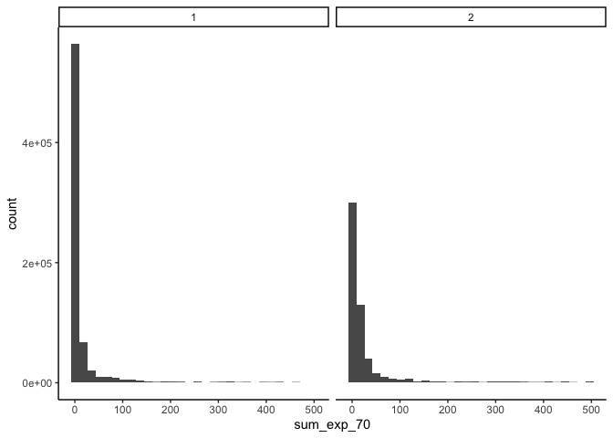
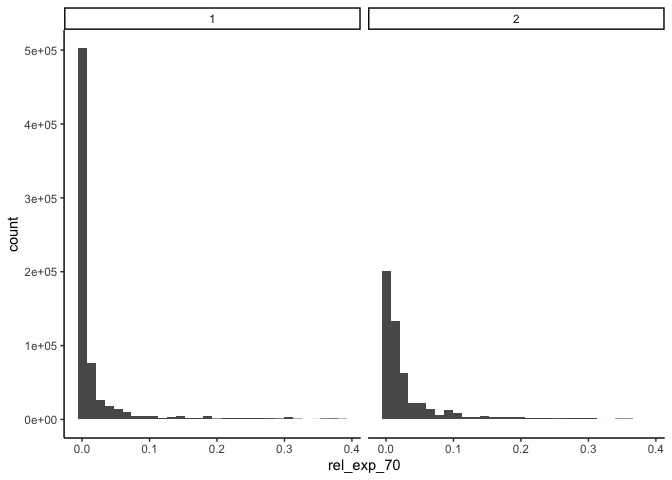
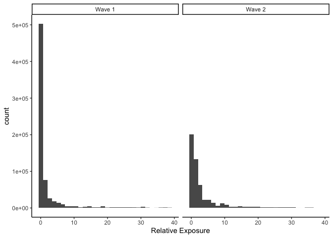
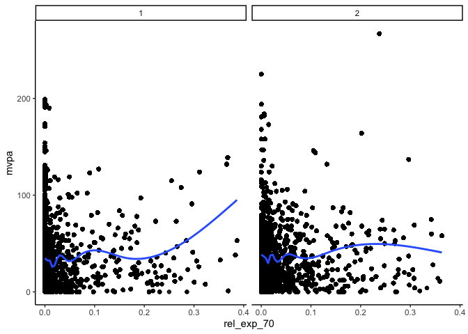

## Libraries


```r
library(lme4)
```

```
## Loading required package: Matrix
```

```r
library(tidyverse)
```

```
## ── Attaching packages ──────────────────────────────────────────────────────────────────────────────────────────────────── tidyverse 1.3.0 ──
```

```
## ✓ ggplot2 3.3.2     ✓ purrr   0.3.4
## ✓ tibble  3.0.3     ✓ dplyr   1.0.2
## ✓ tidyr   1.1.2     ✓ stringr 1.4.0
## ✓ readr   1.3.1     ✓ forcats 0.5.0
```

```
## ── Conflicts ─────────────────────────────────────────────────────────────────────────────────────────────────────── tidyverse_conflicts() ──
## x tidyr::expand() masks Matrix::expand()
## x dplyr::filter() masks stats::filter()
## x dplyr::lag()    masks stats::lag()
## x tidyr::pack()   masks Matrix::pack()
## x tidyr::unpack() masks Matrix::unpack()
```

```r
library(gtools)
library(lubridate)
```

```
## 
## Attaching package: 'lubridate'
```

```
## The following objects are masked from 'package:base':
## 
##     date, intersect, setdiff, union
```

```r
library(DRDID)
library(did)
```

```
## Registered S3 methods overwritten by 'car':
##   method                          from
##   influence.merMod                lme4
##   cooks.distance.influence.merMod lme4
##   dfbeta.influence.merMod         lme4
##   dfbetas.influence.merMod        lme4
```

```r
library(modelsummary)
library(broom.mixed)
```

```
## Registered S3 method overwritten by 'broom.mixed':
##   method      from 
##   tidy.gamlss broom
```


## Analysis plan

1. Descriptive statistics outcome and exposure
2. Merge in demographic and weather variables 
3. Regression outcome and exposure (as per change discussions)
4. Sensitivity analysis (exposure changes)

### Read in data


```r
data <- read_csv("/Users/dfuller/Documents/INTERACT/data/sensors/sd_data_exposure.csv")
```

```
## Parsed with column specification:
## cols(
##   .default = col_double(),
##   utcdate = col_datetime(format = ""),
##   zone = col_character(),
##   activity_levels = col_character(),
##   gender = col_character(),
##   income = col_character(),
##   education = col_logical(),
##   city_id = col_character(),
##   date = col_date(format = "")
## )
```

```
## See spec(...) for full column specifications.
```

```
## Warning: 550640 parsing failures.
##    row       col           expected            actual                                                                  file
## 708730 education 1/0/T/F/TRUE/FALSE University degree '/Users/dfuller/Documents/INTERACT/data/sensors/sd_data_exposure.csv'
## 708731 education 1/0/T/F/TRUE/FALSE University degree '/Users/dfuller/Documents/INTERACT/data/sensors/sd_data_exposure.csv'
## 708732 education 1/0/T/F/TRUE/FALSE University degree '/Users/dfuller/Documents/INTERACT/data/sensors/sd_data_exposure.csv'
## 708733 education 1/0/T/F/TRUE/FALSE University degree '/Users/dfuller/Documents/INTERACT/data/sensors/sd_data_exposure.csv'
## 708734 education 1/0/T/F/TRUE/FALSE University degree '/Users/dfuller/Documents/INTERACT/data/sensors/sd_data_exposure.csv'
## ...... ......... .................. ................. .....................................................................
## See problems(...) for more details.
```

## Demographic data and weather

### Merging demographics


```r
health_data <- read_csv("/Users/dfuller/Documents/INTERACT/data/health_clean.csv")
```

```
## Parsed with column specification:
## cols(
##   .default = col_double(),
##   city_id = col_character(),
##   questionnaire_lang.x = col_character(),
##   date_of_survey = col_date(format = ""),
##   mode_used = col_character(),
##   mode_used_txt = col_character(),
##   cars_access_outside = col_character(),
##   cars_access_outside_txt = col_character(),
##   bike_access_options = col_character(),
##   bike_access_options_txt = col_character(),
##   tracking1_txt = col_character(),
##   house_tenure_txt = col_character(),
##   dwelling_type_txt = col_character(),
##   residence = col_date(format = ""),
##   gender_txt = col_character(),
##   sex_txt = col_logical(),
##   living_arrange = col_character(),
##   living_arrange_txt = col_character(),
##   group_id_mtl = col_character(),
##   group_id_mtl_txt = col_character(),
##   employment_txt = col_character()
##   # ... with 204 more columns
## )
```

```
## See spec(...) for full column specifications.
```

```
## Warning: 35032 parsing failures.
##  row            col           expected actual                                                      file
## 1156 sask_bus_pass  1/0/T/F/TRUE/FALSE     2  '/Users/dfuller/Documents/INTERACT/data/health_clean.csv'
## 1156 bus_safe       1/0/T/F/TRUE/FALSE     2  '/Users/dfuller/Documents/INTERACT/data/health_clean.csv'
## 1156 bus_reliable   1/0/T/F/TRUE/FALSE     2  '/Users/dfuller/Documents/INTERACT/data/health_clean.csv'
## 1156 bus_convenient 1/0/T/F/TRUE/FALSE     2  '/Users/dfuller/Documents/INTERACT/data/health_clean.csv'
## 1156 bus_freq_a     1/0/T/F/TRUE/FALSE     91 '/Users/dfuller/Documents/INTERACT/data/health_clean.csv'
## .... .............. .................. ...... .........................................................
## See problems(...) for more details.
```

```r
glimpse(health_data)
```

```
## Rows: 2,086
## Columns: 488
## $ interact_id                  <dbl> 401310688, 401591631, 401243995, 4015715…
## $ treksoft_id.x                <dbl> 1976, 886, 766, 2406, 1361, 748, 1411, 9…
## $ city_id                      <chr> "Montréal", "Montréal", "Montréal", "Mon…
## $ wave_id.x                    <dbl> 1, 1, 1, 1, 1, 1, 1, 1, 1, 1, 1, 1, 1, 1…
## $ questionnaire_lang.x         <chr> "fr", "fr", "fr", "en", "fr", "fr", "fr"…
## $ date_of_survey               <date> 2018-08-18, 2018-07-15, 2018-07-15, 201…
## $ age                          <dbl> 33, 48, 58, 45, 57, 30, 69, 60, 54, 46, …
## $ mode_used                    <chr> "[1, 4]", "[4, 5, 6, 3, 1, 2]", "[1, 3, …
## $ mode_used_txt                <chr> NA, NA, NA, NA, NA, NA, NA, NA, NA, NA, …
## $ mode_used_1                  <dbl> 1, 1, 1, 1, 1, 1, 1, 1, 1, 1, 1, 1, 1, 1…
## $ mode_used_2                  <dbl> 0, 1, 0, 0, 1, 1, 1, 0, 1, 0, 1, 1, 1, 1…
## $ mode_used_3                  <dbl> 0, 1, 1, 1, 1, 1, 1, 1, 1, 1, 1, 1, 1, 1…
## $ mode_used_4                  <dbl> 1, 1, 1, 1, 1, 1, 1, 1, 1, 1, 1, 1, 1, 1…
## $ mode_used_5                  <dbl> 0, 1, 0, 0, 0, 0, 0, 0, 0, 0, 0, 0, 0, 0…
## $ mode_used_6                  <dbl> 0, 1, 0, 0, 1, 0, 1, 1, 0, 1, 0, 1, 1, 1…
## $ mode_used_7                  <dbl> 0, 0, 0, 0, 0, 1, 0, 0, 0, 0, 0, 0, 1, 1…
## $ mode_used_8                  <dbl> 0, 0, 0, 0, 0, 0, 0, 0, 0, 0, 0, 0, 0, 0…
## $ perception_cycling_a         <dbl> 2, 2, 4, 2, 2, 2, 2, 4, 3, 1, 1, 3, 3, 2…
## $ perception_cycling_b         <dbl> 3, 2, 2, 1, 2, 2, 1, 2, 3, 1, 1, 1, 2, 2…
## $ perception_cycling_c         <dbl> 4, 4, 2, 1, 1, 2, 1, 2, 3, 1, 1, 1, 1, 1…
## $ perception_cycling_d         <dbl> 2, 4, 3, 1, 1, 2, 1, 2, 3, 1, 2, 1, 1, 2…
## $ perception_cycling_e         <dbl> 1, 2, 1, 77, 1, 2, 1, 1, 2, 1, 1, 1, 1, …
## $ perception_driving_a         <dbl> 2, 2, 1, 1, 2, 1, 1, 1, 2, 2, 1, 3, 3, 2…
## $ perception_driving_b         <dbl> 1, 4, 2, 1, 2, 2, 1, 3, 2, 1, 2, 3, 4, 2…
## $ perception_driving_c         <dbl> 1, 1, 1, 1, 3, 4, 1, 4, 2, 1, 2, 3, 4, 2…
## $ perception_driving_d         <dbl> 3, 2, 2, 1, 3, 3, 1, 4, 3, 2, 2, 3, 4, 3…
## $ perception_driving_e         <dbl> 3, 2, 4, 1, 3, 3, 2, 4, 2, 3, 2, 3, 4, 4…
## $ perception_walking_a         <dbl> 2, 2, 1, 1, 1, 2, 1, 2, 3, 1, 1, 1, 2, 3…
## $ perception_walking_b         <dbl> 1, 2, 1, 1, 2, 1, 1, 1, 3, 1, 1, 1, 2, 2…
## $ perception_walking_c         <dbl> 3, 1, 1, 1, 1, 1, 1, 1, 3, 1, 1, 1, 2, 2…
## $ perception_walking_d         <dbl> 2, 1, 1, 1, 1, 1, 1, 2, 3, 1, 1, 1, 2, 2…
## $ perception_walking_e         <dbl> 1, 1, 1, 1, 1, 1, 1, 1, 3, 1, 1, 1, 1, 1…
## $ perception_transit_a         <dbl> 1, 2, 1, 2, 1, 1, 1, 2, 2, 1, 2, 1, 2, 2…
## $ perception_transit_b         <dbl> 3, 4, 1, 3, 2, 2, 3, 2, 3, 1, 3, 3, 2, 3…
## $ perception_transit_c         <dbl> 4, 1, 1, 1, 1, 1, 1, 1, 3, 1, 3, 2, 2, 2…
## $ perception_transit_d         <dbl> 4, 4, 2, 3, 2, 1, 2, 2, 3, 1, 3, 2, 2, 2…
## $ perception_transit_e         <dbl> 2, 1, 1, 3, 2, 1, 1, 1, 3, 1, 4, 2, 2, 3…
## $ bike_freq_a                  <dbl> -7, 13, -7, -7, 65, 3, 6, -7, 6, -7, 26,…
## $ bike_freq_b                  <dbl> -7, 0, -7, -7, 0, 0, 0, -7, 0, -7, 0, 0,…
## $ bike_freq_c                  <dbl> -7, 26, -7, -7, 65, 3, 6, -7, 6, -7, 26,…
## $ bike_freq_d                  <dbl> -7, 52, -7, -7, 91, 6, 6, -7, 15, -7, 65…
## $ car_freq_a                   <dbl> 91, 91, 91, 91, 26, 3, 65, 39, 91, 26, 1…
## $ car_freq_b                   <dbl> 91, 91, 78, 91, 26, 3, 65, 39, 91, 52, 2…
## $ car_freq_c                   <dbl> 91, 91, 91, 91, 26, 3, 65, 39, 91, 39, 2…
## $ car_freq_d                   <dbl> 91, 91, 91, 91, 13, 3, 65, 13, 78, 26, 0…
## $ walk_freq_a                  <dbl> 39, 91, 91, 52, 39, 26, 65, 26, 6, 91, 5…
## $ walk_freq_b                  <dbl> 0, 65, 91, 13, 91, 26, 65, 26, 3, 91, 52…
## $ walk_freq_c                  <dbl> 26, 91, 91, 65, 39, 26, 65, 52, 6, 91, 5…
## $ walk_freq_d                  <dbl> 52, 91, 91, 65, 39, 39, 65, 52, 15, 91, …
## $ transit_freq_a               <dbl> -7, 3, 6, 65, 65, 78, 26, 13, 3, 91, 13,…
## $ transit_freq_b               <dbl> -7, 6, 6, 65, 65, 78, 26, 13, 3, 91, 13,…
## $ transit_freq_c               <dbl> -7, 3, 6, 65, 65, 78, 26, 39, 3, 91, 13,…
## $ transit_freq_d               <dbl> -7, 3, 0, 65, 26, 78, 26, 39, 6, 91, 0, …
## $ cars_household               <dbl> 2, 2, 2, 1, 1, 0, 1, 4, 3, 1, 1, 1, 0, 0…
## $ cars_access_outside          <chr> "[4]", "[4]", "[4]", "[4]", "[4]", "[2]"…
## $ cars_access_outside_txt      <chr> NA, NA, NA, NA, NA, NA, NA, NA, NA, NA, …
## $ cars_access_outside_1        <dbl> 0, 0, 0, 0, 0, 0, 0, 0, 0, 0, 1, 0, 1, 0…
## $ cars_access_outside_2        <dbl> 0, 0, 0, 0, 0, 1, 0, 0, 0, 0, 0, 0, 1, 1…
## $ cars_access_outside_3        <dbl> 0, 0, 0, 0, 0, 0, 0, 0, 0, 0, 0, 0, 0, 0…
## $ cars_access_outside_4        <dbl> 1, 1, 1, 1, 1, 0, 1, 1, 1, 1, 0, 1, 0, 0…
## $ license                      <dbl> 1, 1, 1, 1, 1, 1, 1, 1, 1, 2, 1, 1, 1, 1…
## $ bike_access_options          <chr> "[2]", "[2]", "[1]", "[2]", "[2]", "[2]"…
## $ bike_access_options_txt      <chr> NA, NA, NA, NA, NA, NA, NA, NA, NA, NA, …
## $ bike_access_options_1        <dbl> 0, 0, 1, 0, 0, 0, 0, 0, 0, 1, 0, 0, 0, 0…
## $ bike_access_options_2        <dbl> 1, 1, 0, 1, 1, 1, 1, 1, 1, 0, 1, 1, 1, 1…
## $ bike_access_options_3        <dbl> 0, 0, 0, 0, 0, 0, 0, 0, 0, 0, 0, 0, 0, 0…
## $ bike_access_options_4        <dbl> 0, 0, 0, 0, 0, 0, 0, 0, 0, 0, 0, 1, 1, 1…
## $ bike_access_options_5        <dbl> 0, 0, 0, 0, 0, 0, 0, 0, 0, 0, 0, 0, 0, 0…
## $ work_vigpa                   <dbl> 0, 0, 0, 0, 3, 0, 3, 0, 2, 5, 0, 0, 0, 0…
## $ work_vigpa_freq              <dbl> -7, -7, -7, -7, 15, -7, 60, -7, 60, 420,…
## $ work_modpa                   <dbl> 5, 0, 0, 0, 1, 0, 3, 0, 2, 5, 0, 0, 1, 2…
## $ work_modpa_freq              <dbl> 120, -7, -7, -7, 60, -7, 240, -7, 60, 30…
## $ travel_motor                 <dbl> 7, 7, 7, 7, 5, 0, 7, 4, 7, 7, 0, 2, 2, 5…
## $ travel_motor_freq            <dbl> 120, 60, 20, 30, 20, -7, 60, 60, 60, 180…
## $ travel_bike                  <dbl> 0, 1, 0, 0, 3, 0, 0, 0, 0, 0, 0, 6, 7, 0…
## $ travel_bike_freq             <dbl> -7, 60, -7, -7, 60, -7, -7, -7, -7, -7, …
## $ travel_walk                  <dbl> 1, 5, 3, 1, 7, 6, 7, 4, 0, 0, 5, 4, 5, 2…
## $ travel_walk_freq             <dbl> 30, 30, 20, 20, 60, 10, 60, 180, -7, -7,…
## $ leisure_walk                 <dbl> 0, 2, 7, 5, 7, 1, 7, 2, 4, 2, 0, 7, 7, 0…
## $ leisure_walk_freq            <dbl> -7, 15, 30, 60, 60, 20, 120, 45, 60, 180…
## $ leisure_vigpa                <dbl> 0, 2, 2, 2, 2, 0, 0, 3, 4, 2, 4, 4, 1, 0…
## $ leisure_vigpa_freq           <dbl> -7, 45, 45, 60, 30, -7, -7, 40, 120, 60,…
## $ leisure_modpa                <dbl> 0, 2, 0, 5, 2, 0, 4, 2, 4, 0, 2, 2, 1, 0…
## $ leisure_modpa_freq           <dbl> -7, 55, -7, 60, 120, -7, 180, 30, 60, -7…
## $ sit_weekday                  <dbl> 180, 300, 600, 480, 660, 720, 240, 120, …
## $ sit_weekend                  <dbl> 180, 300, 300, 240, 600, 300, 240, 120, …
## $ height                       <dbl> 163, 165, 175, 165, 157, 160, 173, 160, …
## $ weight                       <dbl> 64, 64, 73, 82, 58, 70, 75, 59, 64, 109,…
## $ sf1                          <dbl> 2, 1, 1, 2, 1, 3, 1, 1, 2, 1, 2, 2, 2, 2…
## $ sf2                          <dbl> 3, 3, 3, 3, 3, 3, 3, 3, 3, 3, 3, 3, 3, 3…
## $ sf3                          <dbl> 3, 3, 3, 2, 3, 3, 3, 3, 3, 3, 3, 3, 3, 3…
## $ sf4                          <dbl> 2, 2, 1, 2, 2, 2, 2, 2, 2, 2, 2, 2, 2, 2…
## $ sf5                          <dbl> 2, 2, 1, 2, 2, 2, 2, 2, 2, 2, 2, 2, 2, 2…
## $ sf6                          <dbl> 2, 2, 2, 1, 2, 1, 2, 2, 2, 2, 2, 2, 2, 1…
## $ sf7                          <dbl> 2, 2, 2, 1, 2, 1, 2, 2, 2, 2, 2, 2, 2, 1…
## $ sf8                          <dbl> 1, 2, 3, 2, 1, 1, 1, 1, 1, 1, 1, 1, 1, 1…
## $ sf9                          <dbl> 3, 2, 3, 5, 1, 4, 1, 1, 2, 1, 1, 3, 3, 2…
## $ sf10                         <dbl> 4, 2, 1, 4, 1, 3, 1, 1, 2, 3, 1, 3, 4, 2…
## $ sf11                         <dbl> 4, 5, 4, 2, 6, 4, 6, 5, 6, 6, 5, 5, 5, 5…
## $ sf12                         <dbl> 5, 5, 5, 3, 6, 4, 6, 6, 6, 5, 5, 6, 5, 5…
## $ pwb_a                        <dbl> 8, 7, 9, 3, 10, 8, 10, 10, 8, 10, 8, 8, …
## $ pwb_b                        <dbl> 10, 8, 10, 3, 10, 8, 10, 10, 10, 10, 8, …
## $ pwb_c                        <dbl> 9, 8, 10, 4, 10, 8, 10, 10, 8, 10, 8, 7,…
## $ pwb_d                        <dbl> 10, 8, 8, 3, 10, 8, 10, 10, 7, 10, 8, 6,…
## $ pwb_e                        <dbl> 9, 6, 8, 3, 10, 7, 10, 10, 7, 10, 7, 10,…
## $ pwb_f                        <dbl> 10, 9, 10, 9, 10, 8, 10, 10, 10, 10, 9, …
## $ pwb_g                        <dbl> 7, 8, 10, 6, 10, 8, 10, 10, 10, 10, 8, 9…
## $ pwb_h                        <dbl> 7, 9, 10, 2, 10, 7, 10, 8, 10, 10, 7, 7,…
## $ pwb_i                        <dbl> 9, 7, 10, 10, 10, 8, 10, 9, 10, 6, 9, 7,…
## $ pwb_wellbeing                <dbl> 8.9, 8.0, 9.4, 4.3, 10.0, 7.7, 10.0, 9.7…
## $ gwb_a                        <dbl> 6, 6, 6, 3, 7, 5, 7, 7, 7, 6, 7, 5, 7, 6…
## $ gwb_b                        <dbl> 7, 6, 7, 2, 6, 4, 5, 6, 6, 1, 6, 6, 6, 5…
## $ gwb_c                        <dbl> 7, 3, 7, 2, 7, 3, 6, 6, 6, 6, 6, 5, 6, 5…
## $ gwb_d                        <dbl> 2, 3, 2, 5, 1, 5, 1, 1, 1, 1, 1, 5, 4, 2…
## $ gwb_happiness                <dbl> 6.5, 5.0, 6.5, 2.5, 6.8, 3.8, 6.3, 6.5, …
## $ loneliness_a                 <dbl> 1, 2, 1, 3, 1, 2, 3, 2, 1, 2, 1, 1, 3, 2…
## $ loneliness_b                 <dbl> 1, 1, 1, 3, 1, 2, 1, 1, 1, 1, 1, 2, 2, 1…
## $ loneliness_c                 <dbl> 1, 2, 2, 2, 1, 2, 1, 2, 1, 1, 1, 1, 2, 1…
## $ belonging                    <dbl> 3, 2, 2, 4, 2, 2, 2, 4, 2, 2, 2, 2, NA, …
## $ spat_a                       <dbl> 52, 364, 260, 260, 156, 52, 364, 48, 260…
## $ spat_b                       <dbl> 0, 104, 104, 156, 104, 12, 364, 0, 156, …
## $ spat_c                       <dbl> 12, 12, 0, 5, 0, 0, 208, 2, 52, 0, 36, 1…
## $ spat_d                       <dbl> 0, 0, 0, 2, 0, 0, 0, 0, 0, 0, 6, 0, 0, 0…
## $ spat_e                       <dbl> 0, 12, 0, 2, 2, 0, 24, 0, 52, 0, 12, 36,…
## $ spat_talking_nghb            <dbl> 1, 5, 4, 4, 3, 1, 7, 0, 4, 2, 3, 6, 4, 1…
## $ spat_interact_nghb           <dbl> 0, 0, 0, 0, 0, 0, 1, 0, 1, 0, 0, 0, 0, 0…
## $ spat2_a                      <dbl> 1, 4, 1, 2, 4, 3, 4, 4, 4, 5, 4, 4, 3, 3…
## $ spat2_b                      <dbl> 3, 1, 1, 1, 3, 1, 4, 2, 2, 3, 2, 3, 2, 2…
## $ spat2_c                      <dbl> 1, 4, 4, 4, 3, 3, 4, 4, 5, 5, 4, 5, 4, 4…
## $ spat2_d                      <dbl> 4, 1, 3, 3, 4, 3, 1, 2, 3, 3, 3, 3, 4, 2…
## $ spat2_e                      <dbl> 3, 5, 4, 4, 4, 3, 4, 1, 5, 5, 4, 5, 3, 4…
## $ spat_soc_cohesion            <dbl> 2, 5, 3, 4, 3, 3, 4, 3, 4, 4, 4, 4, 3, 4…
## $ spat3_a                      <dbl> 77, 1, 1, 1, 2, 77, 1, 77, 2, 1, 1, 2, 2…
## $ spat3_b                      <dbl> 3, 2, 3, 3, 2, 77, 77, 3, 2, 2, 3, 77, 2…
## $ neighb_a                     <dbl> 1, 2, 1, 1, 1, 2, 1, 1, 1, 1, 1, 1, 3, 2…
## $ neighb_b                     <dbl> 4, 2, 1, 1, 3, 3, 1, 2, 2, 1, 2, 2, 3, 3…
## $ neighb_c                     <dbl> 4, 2, 3, 3, 3, 2, 1, 2, 1, 3, 3, 3, 2, 3…
## $ neighb_d                     <dbl> 1, 2, 1, 1, 1, 1, 1, 1, 2, 2, 2, 1, 3, 2…
## $ rds_a                        <dbl> 5, 10, 5, 8, 2, 1, 7, 3, 1, 1, 6, 1, 5, …
## $ rds_b                        <dbl> 7, 2, 5, 6, 2, 1, 6, 1, 10, 10, 3, 6, 3,…
## $ rds_c                        <dbl> 7, 7, 5, 5, 5, 1, 7, 2, 2, 6, 6, 3, 7, 3…
## $ pnc_a                        <dbl> 3, 6, 6, 6, 6, 4, 5, 5, 6, 7, 6, 5, 4, 5…
## $ pnc_b                        <dbl> 3, 1, 1, 2, 2, 4, 2, 2, 2, 7, 1, 1, 2, 3…
## $ pnc_c                        <dbl> 1, 7, 4, 4, 4, 4, 6, 4, 6, 5, 6, 7, 6, 3…
## $ pnc_d                        <dbl> 4, 7, 7, 6, 6, 5, 6, 6, 6, 7, 6, 7, 6, 5…
## $ pnc_e                        <dbl> 2, 5, 4, 2, 6, 5, 5, 5, 5, 7, 5, 5, 4, 5…
## $ pnc_f                        <dbl> 2, 5, 4, 2, 4, 5, 4, 5, 5, 7, 5, 5, 5, 5…
## $ pnc_g                        <dbl> 6, 7, 7, 6, 7, 5, 6, 5, 7, 7, 6, 6, 5, 5…
## $ pnc_h                        <dbl> 6, 7, 4, 5, 6, 5, 5, 5, 7, 5, 4, 6, 5, 5…
## $ pnc_i                        <dbl> 4, 6, 1, 7, 2, 3, 1, 2, 1, 3, 3, 4, 5, 4…
## $ sci_a                        <dbl> 5, 4, 5, 5, 5, 5, 5, 5, 5, 5, 4, 5, 4, 4…
## $ sci_b                        <dbl> 5, 4, 5, 4, 5, 5, 4, 5, 5, 5, 4, 5, 4, 4…
## $ sci_c                        <dbl> 2, 4, 3, 4, 4, 5, 5, 3, 5, 5, 4, 3, 3, 4…
## $ sci_d                        <dbl> 2, 4, 3, 4, 5, 4, 5, 3, 5, 5, 4, 5, 3, 4…
## $ sci_e                        <dbl> 2, 2, 3, 2, 4, 4, 4, 2, 5, 5, 3, 4, 3, 3…
## $ sci_f                        <dbl> 2, 4, 3, 3, 3, 3, 3, 4, 3, 5, 4, 3, 3, 4…
## $ sci_g                        <dbl> 2, 4, 5, 3, 5, 5, 5, 5, 5, 5, 4, 3, 3, 4…
## $ sci_h                        <dbl> 3, 5, 4, 4, 5, 4, 5, 2, 5, 5, 4, 3, 3, 2…
## $ change_urbenv                <dbl> 2, 2, 3, 2, 2, 1, 1, 1, 3, 1, 1, 2, 2, 2…
## $ feat_urbenv_a                <dbl> 4, 2, 4, 2, 3, 4, 2, 1, 3, 2, 2, 2, 4, 2…
## $ feat_urbenv_b                <dbl> 2, 2, 1, 1, 1, 1, 3, 4, 2, 1, 1, 3, 2, 2…
## $ feat_urbenv_c                <dbl> 3, 1, 4, 4, 3, 4, 2, 4, 3, 4, 3, 2, 2, 3…
## $ feat_urbenv_d                <dbl> 1, 3, 1, 1, 2, 3, 1, 3, 1, 1, 2, 2, 3, 2…
## $ feat_urbenv_e                <dbl> 4, 3, 4, 2, 3, 1, 4, 3, 3, 3, 4, 1, 4, 2…
## $ feat_urbenv_f                <dbl> 1, 1, 1, 1, 1, 3, 1, 1, 1, 1, 1, 1, 3, 3…
## $ feat_urbenv_g                <dbl> 1, 3, 1, 1, 1, 1, 1, 1, 1, 1, 2, 1, 3, 1…
## $ feat_urbenv_h                <dbl> 1, 1, 1, 1, 1, 2, 1, 1, 1, 1, 2, 1, 2, 1…
## $ feat_urbenv_i                <dbl> 4, 2, 4, 1, 4, 4, 4, 4, 3, 3, 4, 4, 3, 3…
## $ feat_urbenv_j                <dbl> 2, 4, 2, 1, 1, 1, 4, 1, 2, 1, 1, 1, 2, 2…
## $ feat_urbenv_k                <dbl> 3, 3, 4, 4, 3, 2, 4, 2, 4, 4, 2, 3, 3, 3…
## $ feat_urbenv_l                <dbl> 1, 1, 1, 1, 1, 1, 1, 1, 1, 1, 2, 1, 2, 2…
## $ feat_urbenv_m                <dbl> 1, 2, 1, 1, 1, 1, 1, 1, 1, 1, 1, 1, 3, 2…
## $ feat_urbenv_n                <dbl> 4, 3, 4, 3, 4, 3, 3, 2, 3, 2, 3, 3, 3, 2…
## $ feat_urbenv_o                <dbl> 2, 1, 3, 1, 1, 2, 1, 1, 4, 1, 2, 1, 3, 2…
## $ increase_urbenv_a            <dbl> 2, 3, 3, 1, 2, 1, 1, 2, 2, 1, 3, 1, 2, 3…
## $ increase_urbenv_b            <dbl> 2, 4, 3, 4, 2, 1, 1, 1, 2, 1, 2, 1, 2, 3…
## $ increase_urbenv_c            <dbl> 2, 1, 4, 1, 1, 2, 3, 1, 2, 3, 2, 2, 3, 3…
## $ increase_urbenv_d            <dbl> 4, 4, 3, 4, 2, 1, 2, 2, 3, 1, 3, 1, 2, 2…
## $ increase_urbenv_e            <dbl> 3, 2, 1, 1, 1, 1, 1, 1, 2, 1, 2, 1, 2, 2…
## $ increase_urbenv_f            <dbl> 4, 3, 4, 2, 2, 3, 3, 3, 3, 4, 4, 3, 2, 3…
## $ increase_urbenv_g            <dbl> 4, 4, 4, 4, 3, 1, 2, 4, 4, 1, 4, 3, 3, 4…
## $ changeeffects_urbenv_a       <dbl> 2, 4, 77, 1, 2, 1, 1, 1, 1, 1, 2, 1, 2, …
## $ changeeffects_urbenv_b       <dbl> 1, 4, 2, 4, 2, 1, 1, 1, 2, 1, 2, 1, 1, 2…
## $ changeeffects_urbenv_c       <dbl> 2, 1, 3, 2, 2, 1, 1, 1, 2, 1, 2, 3, 2, 2…
## $ changeeffects_urbenv_d       <dbl> 1, 2, 1, 2, 1, 3, 3, 4, 3, 3, 2, 2, 3, 2…
## $ changeeffects_urbenv_e       <dbl> 1, 4, 3, 77, 3, 77, 4, 3, 3, 4, 3, 3, 77…
## $ changeeffects_urbenv_trans_a <dbl> 2, 3, -7, 2, 1, 1, 1, 1, -7, 1, 2, 1, 1,…
## $ changeeffects_urbenv_trans_b <dbl> 2, 3, -7, 2, 1, 1, 1, 2, -7, 2, 2, 1, 1,…
## $ changeeffects_urbenv_trans_c <dbl> 3, 3, -7, 3, 1, 2, 3, 4, -7, 2, 2, 3, 3,…
## $ changeeffects_urbenv_trans_d <dbl> 2, 3, -7, 3, 1, 1, 1, 1, -7, 1, 2, 2, 1,…
## $ neigh_pref_a                 <dbl> 3, 1, 2, 3, 1, 1, 1, 1, 4, 1, 2, 1, 1, 1…
## $ neigh_pref_b                 <dbl> 2, 1, 1, 1, 1, 1, 1, 1, 2, 1, 2, 1, 1, 1…
## $ neigh_pref_c                 <dbl> 2, 1, 2, 2, 2, 1, 1, 2, 2, 1, 2, 2, 2, 1…
## $ neigh_pref_d                 <dbl> 1, 1, 4, 2, 2, 1, 1, 2, 2, 1, 3, 2, 2, 3…
## $ neigh_pref_e                 <dbl> 3, 4, 4, 3, 2, 2, 1, 4, 2, 1, 2, 2, 2, 2…
## $ neigh_pref_f                 <dbl> 4, 4, 4, 4, 3, 1, 1, 4, 3, 1, 2, 3, 2, 3…
## $ neigh_pref_g                 <dbl> 2, 1, 1, 1, 1, 1, 1, 1, 2, 1, 1, 1, 2, 1…
## $ neigh_pref_h                 <dbl> 1, 1, 4, 1, 2, 77, 1, 1, 2, 1, 2, 3, 4, …
## $ neigh_pref_i                 <dbl> 1, 1, 1, 4, 1, 2, 1, 4, 2, 1, 77, 3, 4, …
## $ tracking1_no                 <dbl> 0, 0, 0, 0, 0, 0, 0, 0, 0, 1, 0, 0, 0, 0…
## $ tracking1_no_interest        <dbl> 0, 0, 0, 0, 0, 0, 0, 0, 1, 0, 0, 0, 0, 0…
## $ tracking1_own_1              <dbl> 1, 1, 0, 1, 0, 0, 0, 0, 0, 0, 1, 1, 0, 1…
## $ tracking1_own_2              <dbl> 0, 1, 0, 0, 0, 0, 0, 1, 0, 0, 0, 0, 0, 0…
## $ tracking1_own_3              <dbl> 0, 1, 1, 0, 0, 0, 0, 0, 0, 0, 1, 0, 0, 0…
## $ tracking1_own_4              <dbl> 0, 0, 0, 1, 0, 0, 0, 0, 0, 0, 0, 1, 0, 0…
## $ tracking1_use_1              <dbl> 1, 0, 1, 1, 0, 1, 0, 0, 0, 0, 1, 1, 0, 1…
## $ tracking1_use_2              <dbl> 0, 1, 0, 0, 0, 0, 0, 1, 0, 0, 0, 0, 0, 0…
## $ tracking1_use_3              <dbl> 0, 1, 0, 0, 0, 0, 0, 0, 0, 0, 1, 0, 0, 0…
## $ tracking1_use_4              <dbl> 0, 0, 1, 1, 0, 0, 0, 0, 0, 0, 0, 0, 0, 0…
## $ tracking1_txt                <chr> NA, NA, "Myzone", "My Fitness Pal", NA, …
## $ tracking2                    <dbl> 28, 30, 30, 31, -7, 31, -7, 28, -7, -7, …
## $ tracking3a                   <dbl> -7, -7, -7, -7, -7, -7, -7, -7, -7, -7, …
## $ tracking3b                   <dbl> -7, -7, -7, -7, -7, -7, -7, -7, -7, -7, …
## $ tracking4                    <dbl> -7, -7, -7, -7, -7, -7, -7, -7, -7, -7, …
## $ tracking5                    <dbl> -7, -7, -7, -7, -7, -7, -7, -7, -7, -7, …
## $ house_tenure                 <dbl> 1, 1, 1, 1, 1, 1, 2, 1, 1, 3, 1, 2, 1, 2…
## $ house_tenure_txt             <chr> NA, NA, NA, NA, NA, NA, NA, NA, NA, NA, …
## $ dwelling_type                <dbl> 3, 4, 1, 4, 4, 4, 4, 5, 1, 3, 4, 5, 4, 4…
## $ dwelling_type_txt            <chr> NA, NA, NA, NA, NA, NA, NA, NA, NA, NA, …
## $ residence                    <date> 2012-01-01, 2007-11-01, 1992-07-01, 201…
## $ dog                          <dbl> 2, 1, 2, 2, 2, 2, 2, 2, 2, 2, 2, 1, 1, 2…
## $ dog_walk                     <dbl> -7, 1, -7, -7, -7, -7, -7, -7, -7, -7, -…
## $ dog_walk_freq                <dbl> -7, 30, -7, -7, -7, -7, -7, -7, -7, -7, …
## $ gender                       <dbl> 2, 2, 2, 2, 2, 2, 1, 2, 2, 1, 2, 2, 1, 1…
## $ gender_txt                   <chr> NA, NA, NA, NA, NA, NA, NA, NA, NA, NA, …
## $ sex                          <dbl> 2, 2, 2, 2, 2, 2, 1, 2, 2, 1, 2, 2, 1, 1…
## $ sex_txt                      <lgl> NA, NA, NA, NA, NA, NA, NA, NA, NA, NA, …
## $ marital_status               <dbl> 2, 3, 2, 1, 2, 2, 2, 2, 2, 1, 2, 2, 1, 2…
## $ children                     <dbl> 1, 1, 1, 2, 1, 2, 1, 1, 1, 2, 2, 2, 2, 2…
## $ living_children              <dbl> 2, 2, 2, -7, 2, -7, 2, 2, 2, -7, -7, -7,…
## $ living_arrange               <chr> "[2, 3]", "[3]", "[2]", "[1]", "[2, 3]",…
## $ living_arrange_txt           <chr> NA, NA, NA, NA, NA, NA, NA, NA, NA, NA, …
## $ living_arrange_1             <dbl> 0, 0, 0, 1, 0, 0, 0, 0, 0, 0, 1, 0, 1, 0…
## $ living_arrange_2             <dbl> 1, 0, 1, 0, 1, 1, 0, 1, 1, 0, 0, 1, 0, 1…
## $ living_arrange_3             <dbl> 1, 1, 0, 0, 1, 0, 1, 0, 1, 0, 0, 0, 0, 0…
## $ living_arrange_4             <dbl> 0, 0, 0, 0, 0, 0, 0, 0, 0, 0, 0, 0, 0, 0…
## $ living_arrange_5             <dbl> 0, 0, 0, 0, 0, 0, 0, 0, 0, 1, 0, 0, 0, 0…
## $ living_arrange_6             <dbl> 0, 0, 0, 0, 0, 0, 0, 0, 0, 0, 0, 0, 0, 0…
## $ living_arrange_7             <dbl> 0, 0, 0, 0, 0, 0, 0, 0, 0, 0, 0, 0, 0, 0…
## $ children_household           <dbl> 2, 2, 0, 0, 0, 0, 0, 0, 0, 0, 0, 0, 0, 0…
## $ adults_household             <dbl> 2, 1, 2, 1, 4, 2, 3, 2, 2, 2, 1, 2, 1, 2…
## $ born_can                     <dbl> 1, 1, 1, 1, 1, 1, 1, 1, 1, 1, 1, 1, 1, 1…
## $ move_can                     <dbl> -7, -7, -7, -7, -7, -7, -7, -7, -7, -7, …
## $ group_id_mtl                 <chr> "[2]", "[2]", "[2]", "[2]", "[2]", "[2]"…
## $ group_id_mtl_txt             <chr> NA, NA, NA, NA, NA, NA, NA, NA, NA, NA, …
## $ group_id_mtl_1               <dbl> 0, 0, 0, 0, 0, 0, 0, 0, 0, 0, 0, 0, 0, 0…
## $ group_id_mtl_2               <dbl> 1, 1, 1, 1, 1, 1, 1, 1, 1, 1, 1, 1, 1, 1…
## $ group_id_mtl_3               <dbl> 0, 0, 0, 0, 0, 0, 0, 0, 0, 0, 0, 0, 0, 0…
## $ group_id_mtl_4               <dbl> 0, 0, 0, 0, 0, 0, 0, 0, 0, 0, 0, 0, 0, 0…
## $ group_id_mtl_5               <dbl> 0, 0, 0, 0, 0, 0, 0, 0, 0, 0, 0, 0, 0, 0…
## $ group_id_mtl_6               <dbl> 0, 0, 0, 0, 0, 0, 0, 0, 0, 0, 0, 0, 0, 0…
## $ group_id_mtl_7               <dbl> 0, 0, 0, 0, 0, 0, 0, 0, 0, 0, 0, 0, 0, 0…
## $ group_id_mtl_8               <dbl> 0, 0, 0, 0, 0, 0, 0, 0, 0, 0, 0, 0, 0, 0…
## $ group_id_mtl_9               <dbl> 0, 0, 0, 0, 0, 0, 0, 0, 0, 0, 0, 0, 0, 0…
## $ group_id_mtl_10              <dbl> 0, 0, 0, 0, 0, 0, 0, 0, 0, 0, 0, 0, 0, 0…
## $ group_id_mtl_11              <dbl> 0, 0, 0, 0, 0, 0, 0, 0, 0, 0, 0, 0, 0, 0…
## $ group_id_mtl_12              <dbl> 0, 0, 0, 0, 0, 0, 0, 0, 0, 0, 0, 0, 0, 0…
## $ group_id_mtl_13              <dbl> 0, 0, 0, 0, 0, 0, 0, 0, 0, 0, 0, 0, 1, 0…
## $ group_id_mtl_77              <dbl> 0, 0, 0, 0, 0, 0, 0, 0, 0, 0, 0, 0, 0, 0…
## $ income                       <dbl> 11, 11, 11, 8, 11, 10, 8, 7, 77, 8, 8, 9…
## $ income_needs                 <dbl> 1, 1, 1, 2, 2, 1, 1, 1, 1, 1, 1, 2, 2, 1…
## $ education                    <dbl> 5, 4, 5, 3, 4, 5, 4, 5, 4, 3, 5, 5, 5, 4…
## $ employment                   <dbl> 2, 2, 2, 2, 2, 2, 1, 1, 3, 2, 2, 2, 2, 2…
## $ employment_txt               <chr> NA, NA, NA, NA, NA, NA, NA, NA, NA, NA, …
## $ sask_bus_pass                <lgl> NA, NA, NA, NA, NA, NA, NA, NA, NA, NA, …
## $ bus_safe                     <lgl> NA, NA, NA, NA, NA, NA, NA, NA, NA, NA, …
## $ bus_reliable                 <lgl> NA, NA, NA, NA, NA, NA, NA, NA, NA, NA, …
## $ bus_convenient               <lgl> NA, NA, NA, NA, NA, NA, NA, NA, NA, NA, …
## $ bus_freq_a                   <lgl> NA, NA, NA, NA, NA, NA, NA, NA, NA, NA, …
## $ bus_freq_b                   <lgl> NA, NA, NA, NA, NA, NA, NA, NA, NA, NA, …
## $ bus_freq_c                   <lgl> NA, NA, NA, NA, NA, NA, NA, NA, NA, NA, …
## $ bus_freq_d                   <lgl> NA, NA, NA, NA, NA, NA, NA, NA, NA, NA, …
## $ saskroads_a                  <lgl> NA, NA, NA, NA, NA, NA, NA, NA, NA, NA, …
## $ saskroads_b                  <lgl> NA, NA, NA, NA, NA, NA, NA, NA, NA, NA, …
## $ saskroads_c                  <lgl> NA, NA, NA, NA, NA, NA, NA, NA, NA, NA, …
## $ saskroads_d                  <lgl> NA, NA, NA, NA, NA, NA, NA, NA, NA, NA, …
## $ saskroads_e                  <lgl> NA, NA, NA, NA, NA, NA, NA, NA, NA, NA, …
## $ saskroads_f                  <lgl> NA, NA, NA, NA, NA, NA, NA, NA, NA, NA, …
## $ saskroads_g                  <lgl> NA, NA, NA, NA, NA, NA, NA, NA, NA, NA, …
## $ saskroads_h                  <lgl> NA, NA, NA, NA, NA, NA, NA, NA, NA, NA, …
## $ saskroads_i                  <lgl> NA, NA, NA, NA, NA, NA, NA, NA, NA, NA, …
## $ sask_bus_more                <lgl> NA, NA, NA, NA, NA, NA, NA, NA, NA, NA, …
## $ bus_moti_a                   <lgl> NA, NA, NA, NA, NA, NA, NA, NA, NA, NA, …
## $ bus_moti_b                   <lgl> NA, NA, NA, NA, NA, NA, NA, NA, NA, NA, …
## $ bus_moti_c                   <lgl> NA, NA, NA, NA, NA, NA, NA, NA, NA, NA, …
## $ bus_moti_d                   <lgl> NA, NA, NA, NA, NA, NA, NA, NA, NA, NA, …
## $ bus_moti_e                   <lgl> NA, NA, NA, NA, NA, NA, NA, NA, NA, NA, …
## $ bus_moti_f                   <lgl> NA, NA, NA, NA, NA, NA, NA, NA, NA, NA, …
## $ bus_moti_f_txt               <lgl> NA, NA, NA, NA, NA, NA, NA, NA, NA, NA, …
## $ bus_moti_g                   <lgl> NA, NA, NA, NA, NA, NA, NA, NA, NA, NA, …
## $ bus_moti_g_txt               <lgl> NA, NA, NA, NA, NA, NA, NA, NA, NA, NA, …
## $ bus_moti_rank_a              <lgl> NA, NA, NA, NA, NA, NA, NA, NA, NA, NA, …
## $ bus_moti_rank_b              <lgl> NA, NA, NA, NA, NA, NA, NA, NA, NA, NA, …
## $ bus_moti_rank_c              <lgl> NA, NA, NA, NA, NA, NA, NA, NA, NA, NA, …
## $ bus_moti_rank_d              <lgl> NA, NA, NA, NA, NA, NA, NA, NA, NA, NA, …
## $ bus_moti_rank_e              <lgl> NA, NA, NA, NA, NA, NA, NA, NA, NA, NA, …
## $ bus_moti_rank_f              <lgl> NA, NA, NA, NA, NA, NA, NA, NA, NA, NA, …
## $ bus_moti_rank_f_txt          <lgl> NA, NA, NA, NA, NA, NA, NA, NA, NA, NA, …
## $ bus_moti_rank_g              <lgl> NA, NA, NA, NA, NA, NA, NA, NA, NA, NA, …
## $ bus_moti_rank_g_txt          <lgl> NA, NA, NA, NA, NA, NA, NA, NA, NA, NA, …
## $ bus_moti_slider              <lgl> NA, NA, NA, NA, NA, NA, NA, NA, NA, NA, …
## $ sask_bus_now_a               <lgl> NA, NA, NA, NA, NA, NA, NA, NA, NA, NA, …
## $ sask_bus_now_b               <lgl> NA, NA, NA, NA, NA, NA, NA, NA, NA, NA, …
## $ sask_bus_now_c               <lgl> NA, NA, NA, NA, NA, NA, NA, NA, NA, NA, …
## $ sask_bus_now_d               <lgl> NA, NA, NA, NA, NA, NA, NA, NA, NA, NA, …
## $ sask_bus_now_e               <lgl> NA, NA, NA, NA, NA, NA, NA, NA, NA, NA, …
## $ sask_bus_now_f               <lgl> NA, NA, NA, NA, NA, NA, NA, NA, NA, NA, …
## $ sask_bus_now_g               <lgl> NA, NA, NA, NA, NA, NA, NA, NA, NA, NA, …
## $ sask_bus_now_h               <lgl> NA, NA, NA, NA, NA, NA, NA, NA, NA, NA, …
## $ brt_familiarity              <lgl> NA, NA, NA, NA, NA, NA, NA, NA, NA, NA, …
## $ brt_idea                     <lgl> NA, NA, NA, NA, NA, NA, NA, NA, NA, NA, …
## $ brt_good_a                   <lgl> NA, NA, NA, NA, NA, NA, NA, NA, NA, NA, …
## $ brt_good_b                   <lgl> NA, NA, NA, NA, NA, NA, NA, NA, NA, NA, …
## $ brt_good_c                   <lgl> NA, NA, NA, NA, NA, NA, NA, NA, NA, NA, …
## $ brt_good_d                   <lgl> NA, NA, NA, NA, NA, NA, NA, NA, NA, NA, …
## $ brt_good_e                   <lgl> NA, NA, NA, NA, NA, NA, NA, NA, NA, NA, …
## $ brt_good_f                   <lgl> NA, NA, NA, NA, NA, NA, NA, NA, NA, NA, …
## $ brt_good_g                   <lgl> NA, NA, NA, NA, NA, NA, NA, NA, NA, NA, …
## $ brt_bus_more                 <lgl> NA, NA, NA, NA, NA, NA, NA, NA, NA, NA, …
## $ car_access                   <lgl> NA, NA, NA, NA, NA, NA, NA, NA, NA, NA, …
## $ cars_access_where            <lgl> NA, NA, NA, NA, NA, NA, NA, NA, NA, NA, …
## $ cars_access_where_txt        <lgl> NA, NA, NA, NA, NA, NA, NA, NA, NA, NA, …
## $ cars_access_where_1          <lgl> NA, NA, NA, NA, NA, NA, NA, NA, NA, NA, …
## $ cars_access_where_2          <lgl> NA, NA, NA, NA, NA, NA, NA, NA, NA, NA, …
## $ cars_access_where_3          <lgl> NA, NA, NA, NA, NA, NA, NA, NA, NA, NA, …
## $ cars_access_where_4          <lgl> NA, NA, NA, NA, NA, NA, NA, NA, NA, NA, …
## $ preferred_mode_a             <lgl> NA, NA, NA, NA, NA, NA, NA, NA, NA, NA, …
## $ preferred_mode_b             <lgl> NA, NA, NA, NA, NA, NA, NA, NA, NA, NA, …
## $ preferred_mode_c             <lgl> NA, NA, NA, NA, NA, NA, NA, NA, NA, NA, …
## $ preferred_mode_d             <lgl> NA, NA, NA, NA, NA, NA, NA, NA, NA, NA, …
## $ preferred_mode_e             <lgl> NA, NA, NA, NA, NA, NA, NA, NA, NA, NA, …
## $ preferred_mode_f             <lgl> NA, NA, NA, NA, NA, NA, NA, NA, NA, NA, …
## $ preferred_mode_f_txt         <lgl> NA, NA, NA, NA, NA, NA, NA, NA, NA, NA, …
## $ group_id_skt                 <lgl> NA, NA, NA, NA, NA, NA, NA, NA, NA, NA, …
## $ group_id_skt_txt             <lgl> NA, NA, NA, NA, NA, NA, NA, NA, NA, NA, …
## $ group_id_skt_1               <lgl> NA, NA, NA, NA, NA, NA, NA, NA, NA, NA, …
## $ group_id_skt_2               <lgl> NA, NA, NA, NA, NA, NA, NA, NA, NA, NA, …
## $ group_id_skt_3               <lgl> NA, NA, NA, NA, NA, NA, NA, NA, NA, NA, …
## $ group_id_skt_4               <lgl> NA, NA, NA, NA, NA, NA, NA, NA, NA, NA, …
## $ group_id_skt_5               <lgl> NA, NA, NA, NA, NA, NA, NA, NA, NA, NA, …
## $ group_id_skt_6               <lgl> NA, NA, NA, NA, NA, NA, NA, NA, NA, NA, …
## $ group_id_skt_7               <lgl> NA, NA, NA, NA, NA, NA, NA, NA, NA, NA, …
## $ group_id_skt_8               <lgl> NA, NA, NA, NA, NA, NA, NA, NA, NA, NA, …
## $ group_id_skt_9               <lgl> NA, NA, NA, NA, NA, NA, NA, NA, NA, NA, …
## $ group_id_skt_10              <lgl> NA, NA, NA, NA, NA, NA, NA, NA, NA, NA, …
## $ group_id_skt_11              <lgl> NA, NA, NA, NA, NA, NA, NA, NA, NA, NA, …
## $ group_id_skt_12              <lgl> NA, NA, NA, NA, NA, NA, NA, NA, NA, NA, …
## $ group_id_skt_13              <lgl> NA, NA, NA, NA, NA, NA, NA, NA, NA, NA, …
## $ group_id_skt_77              <lgl> NA, NA, NA, NA, NA, NA, NA, NA, NA, NA, …
## $ transp_main_mode             <lgl> NA, NA, NA, NA, NA, NA, NA, NA, NA, NA, …
## $ transp_main_mode_txt         <lgl> NA, NA, NA, NA, NA, NA, NA, NA, NA, NA, …
## $ bike_access                  <lgl> NA, NA, NA, NA, NA, NA, NA, NA, NA, NA, …
## $ bike_safety                  <lgl> NA, NA, NA, NA, NA, NA, NA, NA, NA, NA, …
## $ ag_familiarity               <lgl> NA, NA, NA, NA, NA, NA, NA, NA, NA, NA, …
## $ ag_idea                      <lgl> NA, NA, NA, NA, NA, NA, NA, NA, NA, NA, …
## $ ag_used_ever                 <lgl> NA, NA, NA, NA, NA, NA, NA, NA, NA, NA, …
## $ ag_walk_freq_a               <lgl> NA, NA, NA, NA, NA, NA, NA, NA, NA, NA, …
## $ ag_walk_freq_b               <lgl> NA, NA, NA, NA, NA, NA, NA, NA, NA, NA, …
## $ ag_walk_freq_c               <lgl> NA, NA, NA, NA, NA, NA, NA, NA, NA, NA, …
## $ ag_walk_freq_d               <lgl> NA, NA, NA, NA, NA, NA, NA, NA, NA, NA, …
## $ ag_bike_freq_a               <lgl> NA, NA, NA, NA, NA, NA, NA, NA, NA, NA, …
## $ ag_bike_freq_b               <lgl> NA, NA, NA, NA, NA, NA, NA, NA, NA, NA, …
## $ ag_bike_freq_c               <lgl> NA, NA, NA, NA, NA, NA, NA, NA, NA, NA, …
## $ ag_bike_freq_d               <lgl> NA, NA, NA, NA, NA, NA, NA, NA, NA, NA, …
## $ intercept_ag_mode            <lgl> NA, NA, NA, NA, NA, NA, NA, NA, NA, NA, …
## $ intercept_ag_mode_txt        <lgl> NA, NA, NA, NA, NA, NA, NA, NA, NA, NA, …
## $ intercept_ag_reason          <lgl> NA, NA, NA, NA, NA, NA, NA, NA, NA, NA, …
## $ intercept_ag_maintenance     <lgl> NA, NA, NA, NA, NA, NA, NA, NA, NA, NA, …
## $ intercept_ag_safety_traffic  <lgl> NA, NA, NA, NA, NA, NA, NA, NA, NA, NA, …
## $ intercept_ag_safety_personal <lgl> NA, NA, NA, NA, NA, NA, NA, NA, NA, NA, …
## $ intercept_ag_spring          <lgl> NA, NA, NA, NA, NA, NA, NA, NA, NA, NA, …
## $ intercept_ag_spring_txt      <lgl> NA, NA, NA, NA, NA, NA, NA, NA, NA, NA, …
## $ intercept_ag_future          <lgl> NA, NA, NA, NA, NA, NA, NA, NA, NA, NA, …
## $ intercept_ag_future_txt      <lgl> NA, NA, NA, NA, NA, NA, NA, NA, NA, NA, …
## $ intercept_ag_not             <lgl> NA, NA, NA, NA, NA, NA, NA, NA, NA, NA, …
## $ intercept_ag_not_txt         <lgl> NA, NA, NA, NA, NA, NA, NA, NA, NA, NA, …
## $ intercept_ag_not_1           <lgl> NA, NA, NA, NA, NA, NA, NA, NA, NA, NA, …
## $ intercept_ag_not_2           <lgl> NA, NA, NA, NA, NA, NA, NA, NA, NA, NA, …
## $ intercept_ag_not_3           <lgl> NA, NA, NA, NA, NA, NA, NA, NA, NA, NA, …
## $ intercept_ag_not_4           <lgl> NA, NA, NA, NA, NA, NA, NA, NA, NA, NA, …
## $ intercept_ag_not_5           <lgl> NA, NA, NA, NA, NA, NA, NA, NA, NA, NA, …
## $ pwb_vic_a                    <lgl> NA, NA, NA, NA, NA, NA, NA, NA, NA, NA, …
## $ pwb_vic_b                    <lgl> NA, NA, NA, NA, NA, NA, NA, NA, NA, NA, …
## $ pwb_vic_c                    <lgl> NA, NA, NA, NA, NA, NA, NA, NA, NA, NA, …
## $ pwb_vic_d                    <lgl> NA, NA, NA, NA, NA, NA, NA, NA, NA, NA, …
## $ pwb_vic_e                    <lgl> NA, NA, NA, NA, NA, NA, NA, NA, NA, NA, …
## $ pwb_vic_f                    <lgl> NA, NA, NA, NA, NA, NA, NA, NA, NA, NA, …
## $ pwb_vic_g                    <lgl> NA, NA, NA, NA, NA, NA, NA, NA, NA, NA, …
## $ pwb_vic_h                    <lgl> NA, NA, NA, NA, NA, NA, NA, NA, NA, NA, …
## $ pwb_vic_i                    <lgl> NA, NA, NA, NA, NA, NA, NA, NA, NA, NA, …
## $ pwb_vic_wellbeing            <lgl> NA, NA, NA, NA, NA, NA, NA, NA, NA, NA, …
## $ group_id                     <lgl> NA, NA, NA, NA, NA, NA, NA, NA, NA, NA, …
## $ group_id_txt                 <lgl> NA, NA, NA, NA, NA, NA, NA, NA, NA, NA, …
## $ group_id_1                   <lgl> NA, NA, NA, NA, NA, NA, NA, NA, NA, NA, …
## $ group_id_2                   <lgl> NA, NA, NA, NA, NA, NA, NA, NA, NA, NA, …
## $ group_id_3                   <lgl> NA, NA, NA, NA, NA, NA, NA, NA, NA, NA, …
## $ group_id_4                   <lgl> NA, NA, NA, NA, NA, NA, NA, NA, NA, NA, …
## $ group_id_5                   <lgl> NA, NA, NA, NA, NA, NA, NA, NA, NA, NA, …
## $ group_id_6                   <lgl> NA, NA, NA, NA, NA, NA, NA, NA, NA, NA, …
## $ group_id_7                   <lgl> NA, NA, NA, NA, NA, NA, NA, NA, NA, NA, …
## $ group_id_77                  <lgl> NA, NA, NA, NA, NA, NA, NA, NA, NA, NA, …
## $ aid                          <lgl> NA, NA, NA, NA, NA, NA, NA, NA, NA, NA, …
## $ aid_type                     <lgl> NA, NA, NA, NA, NA, NA, NA, NA, NA, NA, …
## $ aid_type_txt                 <lgl> NA, NA, NA, NA, NA, NA, NA, NA, NA, NA, …
## $ transp_bikes_adults          <lgl> NA, NA, NA, NA, NA, NA, NA, NA, NA, NA, …
## $ transp_bikes_kids            <lgl> NA, NA, NA, NA, NA, NA, NA, NA, NA, NA, …
## $ bike_children                <lgl> NA, NA, NA, NA, NA, NA, NA, NA, NA, NA, …
## $ vicroads_a                   <lgl> NA, NA, NA, NA, NA, NA, NA, NA, NA, NA, …
## $ vicroads_b                   <lgl> NA, NA, NA, NA, NA, NA, NA, NA, NA, NA, …
## $ vicroads_c                   <lgl> NA, NA, NA, NA, NA, NA, NA, NA, NA, NA, …
## $ vicroads_d                   <lgl> NA, NA, NA, NA, NA, NA, NA, NA, NA, NA, …
## $ vicroads_e                   <lgl> NA, NA, NA, NA, NA, NA, NA, NA, NA, NA, …
## $ vicroads_f                   <lgl> NA, NA, NA, NA, NA, NA, NA, NA, NA, NA, …
## $ vicroads_g                   <lgl> NA, NA, NA, NA, NA, NA, NA, NA, NA, NA, …
## $ vicroads_h                   <lgl> NA, NA, NA, NA, NA, NA, NA, NA, NA, NA, …
## $ vicroads_i                   <lgl> NA, NA, NA, NA, NA, NA, NA, NA, NA, NA, …
## $ bike_more                    <lgl> NA, NA, NA, NA, NA, NA, NA, NA, NA, NA, …
## $ bike_comf_a                  <lgl> NA, NA, NA, NA, NA, NA, NA, NA, NA, NA, …
## $ bike_comf_b                  <lgl> NA, NA, NA, NA, NA, NA, NA, NA, NA, NA, …
## $ bike_comf_c                  <lgl> NA, NA, NA, NA, NA, NA, NA, NA, NA, NA, …
## $ bike_comf_d                  <lgl> NA, NA, NA, NA, NA, NA, NA, NA, NA, NA, …
## $ bike_comf_e                  <lgl> NA, NA, NA, NA, NA, NA, NA, NA, NA, NA, …
## $ bike_comf_f                  <lgl> NA, NA, NA, NA, NA, NA, NA, NA, NA, NA, …
## $ aaa_familiarity              <lgl> NA, NA, NA, NA, NA, NA, NA, NA, NA, NA, …
## $ aaa_idea                     <lgl> NA, NA, NA, NA, NA, NA, NA, NA, NA, NA, …
## $ aaa_bike_more                <lgl> NA, NA, NA, NA, NA, NA, NA, NA, NA, NA, …
## $ car_share                    <lgl> NA, NA, NA, NA, NA, NA, NA, NA, NA, NA, …
## $ car_share_1                  <lgl> NA, NA, NA, NA, NA, NA, NA, NA, NA, NA, …
## $ car_share_2                  <lgl> NA, NA, NA, NA, NA, NA, NA, NA, NA, NA, …
## $ car_share_3                  <lgl> NA, NA, NA, NA, NA, NA, NA, NA, NA, NA, …
## $ car_share_4                  <lgl> NA, NA, NA, NA, NA, NA, NA, NA, NA, NA, …
## $ car_share_5                  <lgl> NA, NA, NA, NA, NA, NA, NA, NA, NA, NA, …
## $ car_share_txt                <lgl> NA, NA, NA, NA, NA, NA, NA, NA, NA, NA, …
## $ bike_advocacy                <lgl> NA, NA, NA, NA, NA, NA, NA, NA, NA, NA, …
## $ cycling_club                 <lgl> NA, NA, NA, NA, NA, NA, NA, NA, NA, NA, …
## $ gender_vic.x                 <lgl> NA, NA, NA, NA, NA, NA, NA, NA, NA, NA, …
## $ gender_vic_1.x               <lgl> NA, NA, NA, NA, NA, NA, NA, NA, NA, NA, …
## $ gender_vic_2.x               <lgl> NA, NA, NA, NA, NA, NA, NA, NA, NA, NA, …
## $ gender_vic_3.x               <lgl> NA, NA, NA, NA, NA, NA, NA, NA, NA, NA, …
## $ gender_vic_4.x               <lgl> NA, NA, NA, NA, NA, NA, NA, NA, NA, NA, …
## $ health                       <dbl> 1, 1, 1, 1, 1, 1, 1, 1, 1, 1, 1, 1, 1, 1…
## $ treksoft_id.y                <dbl> 1976, 886, 766, 2406, 1361, 748, 1411, 9…
## $ city_id.y                    <chr> "Montréal", "Montréal", "Montréal", "Mon…
## $ wave_id.y                    <dbl> 1, 1, 1, 1, 1, 1, 1, 1, 1, 1, 1, 1, 1, 1…
## $ questionnaire_lang.y         <chr> "fr", "fr", "fr", "en", "fr", "fr", "fr"…
## $ date_of_survey.y             <date> 2018-08-18, 2018-07-15, 2018-07-15, 201…
## $ birth_date                   <date> 1984-11-04, 1970-05-31, 1959-09-05, 197…
## $ residence_cp                 <chr> "H4R 3H6", "H3L 2M5", "H3P 1X7", "H8P 3V…
## $ moving_plans_mtl             <dbl> 2, 2, 2, 2, 2, 2, 2, 2, 2, 2, 2, 2, 2, 2…
## $ leave_home                   <dbl> 1, 1, 1, 1, 1, 1, 1, 1, 1, 1, 1, 1, 1, 1…
## $ language                     <dbl> 1, 1, 1, 1, 1, 1, 1, 1, 1, 1, 1, 1, 1, 1…
## $ hear                         <dbl> 99, 99, 99, 99, 3, 3, 1, 99, 1, 99, 99, …
## $ hear_txt                     <chr> "Infolettre st laurent", "La Presse+", "…
## $ participation_option         <dbl> 2, 1, 1, 1, 1, 1, 1, 1, 2, 1, 1, 1, 1, 1…
## $ bus_ride_skt                 <lgl> NA, NA, NA, NA, NA, NA, NA, NA, NA, NA, …
## $ residence_skt                <lgl> NA, NA, NA, NA, NA, NA, NA, NA, NA, NA, …
## $ hear_skt                     <lgl> NA, NA, NA, NA, NA, NA, NA, NA, NA, NA, …
## $ hear_skt_txt                 <lgl> NA, NA, NA, NA, NA, NA, NA, NA, NA, NA, …
## $ residence_van                <lgl> NA, NA, NA, NA, NA, NA, NA, NA, NA, NA, …
## $ moving_plans_van             <lgl> NA, NA, NA, NA, NA, NA, NA, NA, NA, NA, …
## $ gender_vic.y                 <lgl> NA, NA, NA, NA, NA, NA, NA, NA, NA, NA, …
## $ gender_vic_1.y               <lgl> NA, NA, NA, NA, NA, NA, NA, NA, NA, NA, …
## $ gender_vic_2.y               <lgl> NA, NA, NA, NA, NA, NA, NA, NA, NA, NA, …
## $ gender_vic_3.y               <lgl> NA, NA, NA, NA, NA, NA, NA, NA, NA, NA, …
## $ gender_vic_4.y               <lgl> NA, NA, NA, NA, NA, NA, NA, NA, NA, NA, …
## $ residence_vic                <lgl> NA, NA, NA, NA, NA, NA, NA, NA, NA, NA, …
## $ moving_plans_vic             <lgl> NA, NA, NA, NA, NA, NA, NA, NA, NA, NA, …
## $ bike_weekly_vic              <lgl> NA, NA, NA, NA, NA, NA, NA, NA, NA, NA, …
## $ elig                         <dbl> 1, 1, 1, 1, 1, 1, 1, 1, 1, 1, 1, 1, 1, 1…
## $ birth_year                   <dbl> 1984, 1970, 1959, 1973, 1960, 1987, 1948…
## $ age_sk                       <dbl> 37, 51, 62, 48, 61, 34, 73, 63, 57, 50, …
## $ age_recode                   <chr> "30_39", "40_49", NA, "40_49", NA, "30_3…
## $ age_sk_recode                <chr> "30_39", NA, "50_64", "40_49", "50_64", …
## $ income_recode                <chr> "200+", "200+", "200+", "50_99 999", "20…
## $ gender_recode_vic            <lgl> NA, NA, NA, NA, NA, NA, NA, NA, NA, NA, …
## $ gender_recode                <chr> "Woman", "Woman", "Woman", "Woman", "Wom…
## $ gender_recode1               <chr> "Woman NA", "Woman NA", "Woman NA", "Wom…
## $ gender_recode2               <chr> "Woman", "Woman", "Woman", "Woman", "Wom…
## $ education_recode             <chr> "Graduate degree", "University degree", …
## $ white                        <dbl> 1, 1, 1, 1, 1, 1, 1, 1, 1, 1, 1, 1, 1, 1…
## $ asian                        <dbl> NA, NA, NA, NA, NA, NA, NA, NA, NA, NA, …
## $ indigenous                   <dbl> NA, NA, NA, NA, NA, NA, NA, NA, NA, NA, …
## $ black                        <dbl> NA, NA, NA, NA, NA, NA, NA, NA, NA, NA, …
## $ latin_american               <dbl> NA, NA, NA, NA, NA, NA, NA, NA, NA, NA, …
## $ middle_eastern               <dbl> NA, NA, NA, NA, NA, NA, NA, NA, NA, NA, …
## $ other_ethnicity              <dbl> NA, NA, NA, NA, NA, NA, NA, NA, NA, NA, …
## $ no_answer                    <dbl> NA, NA, NA, NA, NA, NA, NA, NA, NA, NA, …
## $ belonging_cat                <dbl> 0, 1, 1, 0, 1, 1, 1, 0, 1, 1, 1, 1, NA, …
```

```r
health_data <- health_data %>%
                  select(education_recode, gender_recode2, income_recode, age_recode, white, asian, indigenous, black, latin_american, 
                         middle_eastern, other_ethnicity, interact_id)

data <- left_join(data, health_data, by = c("interact_id"))
```

### Merging weather


```r
weather_data <- read_csv("/Users/dfuller/Documents/INTERACT/data/weather/2016_2020_weather_vic_van_sask_mtl.csv")
```

```
## Parsed with column specification:
## cols(
##   .default = col_character(),
##   lon = col_double(),
##   lat = col_double(),
##   climate_id = col_double(),
##   date_time = col_date(format = ""),
##   year = col_double(),
##   data_quality = col_logical(),
##   max_temp_c = col_double(),
##   min_temp_c = col_double(),
##   mean_temp_c = col_double(),
##   heat_days_c = col_double(),
##   cool_days_c = col_double(),
##   total_rain_mm = col_double(),
##   total_snow_mm = col_double(),
##   total_precip_mm = col_double(),
##   snow_ground_cm = col_double(),
##   snow_ground_flag = col_logical(),
##   dir_gust_10s_deg = col_double()
## )
```

```
## See spec(...) for full column specifications.
```

```
## Warning: 1835 parsing failures.
##  row              col           expected actual                                                                                    file
## 1135 snow_ground_flag 1/0/T/F/TRUE/FALSE      E '/Users/dfuller/Documents/INTERACT/data/weather/2016_2020_weather_vic_van_sask_mtl.csv'
## 1473 snow_ground_flag 1/0/T/F/TRUE/FALSE      E '/Users/dfuller/Documents/INTERACT/data/weather/2016_2020_weather_vic_van_sask_mtl.csv'
## 1817 snow_ground_flag 1/0/T/F/TRUE/FALSE      E '/Users/dfuller/Documents/INTERACT/data/weather/2016_2020_weather_vic_van_sask_mtl.csv'
## 2964 snow_ground_flag 1/0/T/F/TRUE/FALSE      E '/Users/dfuller/Documents/INTERACT/data/weather/2016_2020_weather_vic_van_sask_mtl.csv'
## 2968 snow_ground_flag 1/0/T/F/TRUE/FALSE      E '/Users/dfuller/Documents/INTERACT/data/weather/2016_2020_weather_vic_van_sask_mtl.csv'
## .... ................ .................. ...... .......................................................................................
## See problems(...) for more details.
```

```r
weather_data <- weather_data %>% dplyr::select(date_time, city_id, max_temp_c, min_temp_c, mean_temp_c, total_rain_mm, total_snow_mm, total_precip_mm, snow_ground_cm, speed_gust_km_h)

weather_data$date <- ymd(weather_data$date_time)

weather_data <- weather_data %>% filter(city_id == "Victoria")

weather_data <- arrange(weather_data, date)
data <- arrange(data, date)

data <- left_join(data, weather_data, by = c("date"))
```

### Exposure over time 


```r
## Overall 
table(data$wave_id, data$exposed_70)
```

```
##    
##          0      1
##   1 690274  18455
##   2 519463  35876
```

```r
## Individual level
data_exposure <- data %>%
                  group_by(interact_id, wave_id, date) %>%
                    summarise(
                      sum_exp_70 = sum(exposed_70), 
                      sum_exp_50 = sum(exposed_50), 
                      sum_exp_100 = sum(exposed_100), 
                      mvpa = first(total_mvpa_minutes),
                      sed = first(total_sed_minutes),
                      light = first(total_light_pa_minutes),
                      rel_exp_70 = sum(exposed_70)/n(),
                      rel_exp_50 = sum(exposed_50)/n(),
                      rel_exp_100 = sum(exposed_100)/n(),
                      minutes = first(minutes_id_date),
                      mean_temp_c = first(mean_temp_c),
                      total_precip_mm = first(total_precip_mm),
                      snow_ground_cm = first(snow_ground_cm),
                      speed_gust_km_h = first(speed_gust_km_h),
                      education_recode = first(education_recode),
                      gender_recode2 = first(gender_recode2),
                      income_recode = first(income_recode),
                      age_recode = first(age_recode),
                      white = first(white),
                      asian = first(asian),
                      indigenous = first(indigenous),
                      black = first(black),
                      latin_american = first(latin_american),
                      middle_eastern = first(middle_eastern),
                      other_ethnicity - first(other_ethnicity)
                    )
```

```
## `summarise()` regrouping output by 'interact_id', 'wave_id', 'date' (override with `.groups` argument)
```

```r
data_exposure$date_time <- as.factor(data_exposure$date)
```

### Histograms of absolute exposure (Total number of minutes)


```r
summary(data_exposure$sum_exp_70)
```

```
##    Min. 1st Qu.  Median    Mean 3rd Qu.    Max. 
##    0.00    0.00    2.00   24.37   13.00  652.00
```

```r
### Removing participants with more than 500 minutes of exposure
data_exposure$sum_exp_70 <- if_else(data_exposure$sum_exp_70 > 500, NA_real_, data_exposure$sum_exp_70)

data_exposure <- data_exposure %>% 
                    mutate(
                      sum_exp_70_quint = ntile(sum_exp_70, 5)
                      )
data_exposure$sum_exp_70_quint <- as.factor(data_exposure$sum_exp_70_quint)
table(data_exposure$sum_exp_70_quint)
```

```
## 
##      1      2      3      4      5 
## 252741 252150 251586 251090 250472
```


```r
abs_exposure_histo <- ggplot(data_exposure, aes(sum_exp_70)) + 
  geom_histogram() + 
  facet_wrap(~ wave_id) + 
  theme_classic()

plot(abs_exposure_histo)
```

```
## `stat_bin()` using `bins = 30`. Pick better value with `binwidth`.
```

```
## Warning: Removed 6029 rows containing non-finite values (stat_bin).
```

<!-- -->

### Histograms of relative exposure (% of total minutes exposed)


```r
summary(data_exposure$rel_exp_70)
```

```
##     Min.  1st Qu.   Median     Mean  3rd Qu.     Max. 
## 0.000000 0.000000 0.004057 0.042981 0.023684 1.000000
```

```r
### Removing participants with more than 40% exposure
data_exposure$rel_exp_70 <- if_else(data_exposure$rel_exp_70 > 0.40, NA_real_, data_exposure$rel_exp_70)

data_exposure <- data_exposure %>% 
                    mutate(
                      rel_exp_70_quint = ntile(rel_exp_70, 5)
                      )
data_exposure$rel_exp_70_quint <- as.factor(data_exposure$rel_exp_70_quint)
table(data_exposure$rel_exp_70_quint)
```

```
## 
##      1      2      3      4      5 
## 245996 245424 244873 244391 243790
```


```r
rel_exposure_histo <- ggplot(data_exposure, aes(rel_exp_70)) + 
  geom_histogram() + 
  facet_wrap(~ wave_id) + 
  theme_classic()

plot(rel_exposure_histo)
```

```
## `stat_bin()` using `bins = 30`. Pick better value with `binwidth`.
```

```
## Warning: Removed 39594 rows containing non-finite values (stat_bin).
```

<!-- -->

### Histograms of Moderate to vigorous PA 


```r
pa_histo <- ggplot(data_exposure, aes(mvpa)) + 
  geom_histogram() + 
  facet_wrap(~ wave_id) + 
  theme_classic()

plot(pa_histo)
```

```
## `stat_bin()` using `bins = 30`. Pick better value with `binwidth`.
```

<!-- -->

### Scatterplot Absolute Exposure and Moderate to vigorous PA 


```r
abs_exp_pa_scatter <- ggplot(data_exposure, aes(x = sum_exp_70, y = mvpa)) + 
  geom_point(alpha = 0.2) +
  geom_smooth() +
  facet_wrap(~ wave_id) + 
  theme_classic()

plot(abs_exp_pa_scatter)
```

```
## `geom_smooth()` using method = 'gam' and formula 'y ~ s(x, bs = "cs")'
```

```
## Warning: Removed 6029 rows containing non-finite values (stat_smooth).
```

```
## Warning: Removed 6029 rows containing missing values (geom_point).
```

<!-- -->

### Scatterplot Relative Exposure and Moderate to vigorous PA 


```r
rel_exp_pa_scatter <- ggplot(data_exposure, aes(x = rel_exp_70, y = mvpa)) + 
  geom_point(alpha = 0.2) +
  geom_smooth() +
  facet_wrap(~ wave_id) + 
  theme_classic()

plot(rel_exp_pa_scatter)
```

```
## `geom_smooth()` using method = 'gam' and formula 'y ~ s(x, bs = "cs")'
```

```
## Warning: Removed 39594 rows containing non-finite values (stat_smooth).
```

```
## Warning: Removed 39594 rows containing missing values (geom_point).
```

<!-- -->

### Linear regression


```r
lm_models <- list(
  "Absolute Exposure" = lm(mvpa ~ sum_exp_70*factor(wave_id), data = data_exposure),
  "Relative Exposure" = lm(mvpa ~ rel_exp_70*factor(wave_id), data = data_exposure)
)

modelsummary(lm_models)
```

<table class="table" style="width: auto !important; margin-left: auto; margin-right: auto;">
 <thead>
  <tr>
   <th style="text-align:left;">   </th>
   <th style="text-align:center;"> Absolute Exposure </th>
   <th style="text-align:center;"> Relative Exposure </th>
  </tr>
 </thead>
<tbody>
  <tr>
   <td style="text-align:left;"> (Intercept) </td>
   <td style="text-align:center;"> 33.277 </td>
   <td style="text-align:center;"> 33.572 </td>
  </tr>
  <tr>
   <td style="text-align:left;">  </td>
   <td style="text-align:center;"> (0.043) </td>
   <td style="text-align:center;"> (0.044) </td>
  </tr>
  <tr>
   <td style="text-align:left;"> sum_exp_70 </td>
   <td style="text-align:center;"> 0.128 </td>
   <td style="text-align:center;">  </td>
  </tr>
  <tr>
   <td style="text-align:left;">  </td>
   <td style="text-align:center;"> (0.001) </td>
   <td style="text-align:center;">  </td>
  </tr>
  <tr>
   <td style="text-align:left;"> factor(wave_id)2 </td>
   <td style="text-align:center;"> 2.633 </td>
   <td style="text-align:center;"> 1.967 </td>
  </tr>
  <tr>
   <td style="text-align:left;">  </td>
   <td style="text-align:center;"> (0.066) </td>
   <td style="text-align:center;"> (0.070) </td>
  </tr>
  <tr>
   <td style="text-align:left;"> sum_exp_70 × factor(wave_id)2 </td>
   <td style="text-align:center;"> -0.092 </td>
   <td style="text-align:center;">  </td>
  </tr>
  <tr>
   <td style="text-align:left;">  </td>
   <td style="text-align:center;"> (0.001) </td>
   <td style="text-align:center;">  </td>
  </tr>
  <tr>
   <td style="text-align:left;"> rel_exp_70 </td>
   <td style="text-align:center;">  </td>
   <td style="text-align:center;"> 58.936 </td>
  </tr>
  <tr>
   <td style="text-align:left;">  </td>
   <td style="text-align:center;">  </td>
   <td style="text-align:center;"> (0.784) </td>
  </tr>
  <tr>
   <td style="text-align:left;"> rel_exp_70 × factor(wave_id)2 </td>
   <td style="text-align:center;">  </td>
   <td style="text-align:center;"> -20.747 </td>
  </tr>
  <tr>
   <td style="text-align:left;box-shadow: 0px 1px">  </td>
   <td style="text-align:center;box-shadow: 0px 1px">  </td>
   <td style="text-align:center;box-shadow: 0px 1px"> (1.136) </td>
  </tr>
  <tr>
   <td style="text-align:left;"> Num.Obs. </td>
   <td style="text-align:center;"> 1258039 </td>
   <td style="text-align:center;"> 1224474 </td>
  </tr>
  <tr>
   <td style="text-align:left;"> R2 </td>
   <td style="text-align:center;"> 0.021 </td>
   <td style="text-align:center;"> 0.007 </td>
  </tr>
  <tr>
   <td style="text-align:left;"> R2 Adj. </td>
   <td style="text-align:center;"> 0.021 </td>
   <td style="text-align:center;"> 0.007 </td>
  </tr>
  <tr>
   <td style="text-align:left;"> AIC </td>
   <td style="text-align:center;"> 12474739.8 </td>
   <td style="text-align:center;"> 12132552.6 </td>
  </tr>
  <tr>
   <td style="text-align:left;"> BIC </td>
   <td style="text-align:center;"> 12474800.0 </td>
   <td style="text-align:center;"> 12132612.7 </td>
  </tr>
  <tr>
   <td style="text-align:left;"> Log.Lik. </td>
   <td style="text-align:center;"> -6237364.880 </td>
   <td style="text-align:center;"> -6066271.299 </td>
  </tr>
  <tr>
   <td style="text-align:left;"> F </td>
   <td style="text-align:center;"> 8964.212 </td>
   <td style="text-align:center;"> 2982.632 </td>
  </tr>
</tbody>
</table>

## Multilevel models 

MLM models with person level random intercepts using the lmer package

### Absolute exposure with a 70 meter buffer


```r
### Null model with days cluster within people
lmer_abs_exp70_ln <- lmer(mvpa ~ (1 | date_time) + (1 | interact_id), data = data_exposure)
summary(lmer_abs_exp70_ln)
```

```
## Linear mixed model fit by REML ['lmerMod']
## Formula: mvpa ~ (1 | date_time) + (1 | interact_id)
##    Data: data_exposure
## 
## REML criterion at convergence: 11793864
## 
## Scaled residuals: 
##     Min      1Q  Median      3Q     Max 
## -5.5956 -0.6201 -0.0680  0.4895  5.3456 
## 
## Random effects:
##  Groups      Name        Variance Std.Dev.
##  date_time   (Intercept) 387.4    19.68   
##  interact_id (Intercept) 601.8    24.53   
##  Residual                657.8    25.65   
## Number of obs: 1264068, groups:  date_time, 345; interact_id, 210
## 
## Fixed effects:
##             Estimate Std. Error t value
## (Intercept)   31.268      1.998   15.65
```

```r
### Linear exposure
lmer_abs_exp_ln <- lmer(mvpa ~ sum_exp_70*factor(wave_id) + (1 | date_time) + (1 | interact_id), data = data_exposure)
summary(lmer_abs_exp_ln)
```

```
## Linear mixed model fit by REML ['lmerMod']
## Formula: mvpa ~ sum_exp_70 * factor(wave_id) + (1 | date_time) + (1 |  
##     interact_id)
##    Data: data_exposure
## 
## REML criterion at convergence: 11693416
## 
## Scaled residuals: 
##     Min      1Q  Median      3Q     Max 
## -5.6239 -0.6205 -0.0685  0.4924  5.3155 
## 
## Random effects:
##  Groups      Name        Variance Std.Dev.
##  date_time   (Intercept) 368.4    19.19   
##  interact_id (Intercept) 578.7    24.06   
##  Residual                635.0    25.20   
## Number of obs: 1258039, groups:  date_time, 345; interact_id, 210
## 
## Fixed effects:
##                              Estimate Std. Error t value
## (Intercept)                 34.060747   2.193749  15.526
## sum_exp_70                   0.112015   0.001121  99.880
## factor(wave_id)2            -9.383958   2.080260  -4.511
## sum_exp_70:factor(wave_id)2 -0.067613   0.001295 -52.191
## 
## Correlation of Fixed Effects:
##             (Intr) sm__70 fc(_)2
## sum_exp_70  -0.007              
## fctr(wv_d)2 -0.452  0.004       
## sm__70:(_)2  0.005 -0.854 -0.007
```

```r
### Quintiles of exposure
lmer_abs_exp_q <- lmer(mvpa ~ sum_exp_70_quint*factor(wave_id) + (1 | date_time) + (1 | interact_id), data = data_exposure)
summary(lmer_abs_exp_q)
```

```
## Linear mixed model fit by REML ['lmerMod']
## Formula: mvpa ~ sum_exp_70_quint * factor(wave_id) + (1 | date_time) +  
##     (1 | interact_id)
##    Data: data_exposure
## 
## REML criterion at convergence: 11707345
## 
## Scaled residuals: 
##     Min      1Q  Median      3Q     Max 
## -5.6649 -0.6214 -0.0692  0.4893  5.2771 
## 
## Random effects:
##  Groups      Name        Variance Std.Dev.
##  date_time   (Intercept) 365.5    19.12   
##  interact_id (Intercept) 598.7    24.47   
##  Residual                642.1    25.34   
## Number of obs: 1258039, groups:  date_time, 345; interact_id, 210
## 
## Fixed effects:
##                                      Estimate Std. Error t value
## (Intercept)                        35.7553267  2.2124153  16.161
## sum_exp_70_quint2                   0.0116068  0.0950237   0.122
## sum_exp_70_quint3                   0.0196437  0.0950777   0.207
## sum_exp_70_quint4                   0.0301662  0.0951244   0.317
## sum_exp_70_quint5                   0.0396170  0.0951846   0.416
## factor(wave_id)2                   -9.3715729  2.0740308  -4.519
## sum_exp_70_quint2:factor(wave_id)2 -0.0001054  0.1438100  -0.001
## sum_exp_70_quint3:factor(wave_id)2  0.0039051  0.1438904   0.027
## sum_exp_70_quint4:factor(wave_id)2  0.0040488  0.1439619   0.028
## sum_exp_70_quint5:factor(wave_id)2  0.0007502  0.1440504   0.005
## 
## Correlation of Fixed Effects:
##             (Intr) sm__70_2 sm__70_3 sm__70_4 sm__70_5 fc(_)2 s__70_2: s__70_3:
## sm_xp_70_q2 -0.021                                                             
## sm_xp_70_q3 -0.021  0.499                                                      
## sm_xp_70_q4 -0.021  0.499    0.499                                             
## sm_xp_70_q5 -0.021  0.499    0.498    0.498                                    
## fctr(wv_d)2 -0.447  0.023    0.023    0.023    0.023                           
## s__70_2:(_)  0.014 -0.661   -0.330   -0.330   -0.329   -0.035                  
## s__70_3:(_)  0.014 -0.330   -0.661   -0.329   -0.329   -0.035  0.499           
## s__70_4:(_)  0.014 -0.330   -0.329   -0.661   -0.329   -0.035  0.499    0.499  
## s__70_5:(_)  0.014 -0.329   -0.329   -0.329   -0.661   -0.035  0.499    0.498  
##             s__70_4:
## sm_xp_70_q2         
## sm_xp_70_q3         
## sm_xp_70_q4         
## sm_xp_70_q5         
## fctr(wv_d)2         
## s__70_2:(_)         
## s__70_3:(_)         
## s__70_4:(_)         
## s__70_5:(_)  0.498
```

### Relative exposure


```r
### Linear exposure
lmer_rel_exp_ln <- lmer(mvpa ~ rel_exp_70*factor(wave_id) + (1 | interact_id), data = data_exposure)
summary(lmer_rel_exp_ln)
```

```
## Linear mixed model fit by REML ['lmerMod']
## Formula: mvpa ~ rel_exp_70 * factor(wave_id) + (1 | interact_id)
##    Data: data_exposure
## 
## REML criterion at convergence: 11610577
## 
## Scaled residuals: 
##     Min      1Q  Median      3Q     Max 
## -4.8515 -0.6138 -0.1439  0.4723  5.6799 
## 
## Random effects:
##  Groups      Name        Variance Std.Dev.
##  interact_id (Intercept) 470.5    21.69   
##  Residual                767.3    27.70   
## Number of obs: 1224474, groups:  interact_id, 210
## 
## Fixed effects:
##                             Estimate Std. Error t value
## (Intercept)                 32.67642    1.49757   21.82
## rel_exp_70                  11.63399    0.81580   14.26
## factor(wave_id)2             3.58603    0.07634   46.97
## rel_exp_70:factor(wave_id)2 31.81245    1.10205   28.87
## 
## Correlation of Fixed Effects:
##             (Intr) rl__70 fc(_)2
## rel_exp_70  -0.011              
## fctr(wv_d)2 -0.020  0.169       
## rl__70:(_)2  0.007 -0.718 -0.360
```

```r
### Quintiles of exposure
lmer_rel_exp_q <- lmer(mvpa ~ rel_exp_70_quint*factor(wave_id) + (1 | interact_id), data = data_exposure)
summary(lmer_rel_exp_q)
```

```
## Linear mixed model fit by REML ['lmerMod']
## Formula: mvpa ~ rel_exp_70_quint * factor(wave_id) + (1 | interact_id)
##    Data: data_exposure
## 
## REML criterion at convergence: 11613959
## 
## Scaled residuals: 
##     Min      1Q  Median      3Q     Max 
## -4.8183 -0.6074 -0.1415  0.4760  5.6725 
## 
## Random effects:
##  Groups      Name        Variance Std.Dev.
##  interact_id (Intercept) 477.7    21.86   
##  Residual                769.4    27.74   
## Number of obs: 1224474, groups:  interact_id, 210
## 
## Fixed effects:
##                                     Estimate Std. Error t value
## (Intercept)                        33.058616   1.510448  21.887
## rel_exp_70_quint2                   0.012729   0.104705   0.122
## rel_exp_70_quint3                   0.021210   0.104765   0.202
## rel_exp_70_quint4                   0.031036   0.104817   0.296
## rel_exp_70_quint5                   0.041596   0.104883   0.397
## factor(wave_id)2                    4.873615   0.123253  39.541
## rel_exp_70_quint2:factor(wave_id)2  0.001401   0.159904   0.009
## rel_exp_70_quint3:factor(wave_id)2  0.006133   0.159994   0.038
## rel_exp_70_quint4:factor(wave_id)2  0.007709   0.160073   0.048
## rel_exp_70_quint5:factor(wave_id)2  0.007252   0.160171   0.045
## 
## Correlation of Fixed Effects:
##             (Intr) rl__70_2 rl__70_3 rl__70_4 rl__70_5 fc(_)2 r__70_2: r__70_3:
## rl_xp_70_q2 -0.035                                                             
## rl_xp_70_q3 -0.035  0.499                                                      
## rl_xp_70_q4 -0.035  0.499    0.499                                             
## rl_xp_70_q5 -0.035  0.499    0.498    0.498                                    
## fctr(wv_d)2 -0.035  0.424    0.424    0.424    0.424                           
## r__70_2:(_)  0.023 -0.655   -0.327   -0.327   -0.326   -0.648                  
## r__70_3:(_)  0.023 -0.327   -0.655   -0.326   -0.326   -0.648  0.499           
## r__70_4:(_)  0.023 -0.327   -0.326   -0.655   -0.326   -0.647  0.499    0.499  
## r__70_5:(_)  0.023 -0.326   -0.326   -0.326   -0.655   -0.647  0.499    0.498  
##             r__70_4:
## rl_xp_70_q2         
## rl_xp_70_q3         
## rl_xp_70_q4         
## rl_xp_70_q5         
## fctr(wv_d)2         
## r__70_2:(_)         
## r__70_3:(_)         
## r__70_4:(_)         
## r__70_5:(_)  0.498
```


