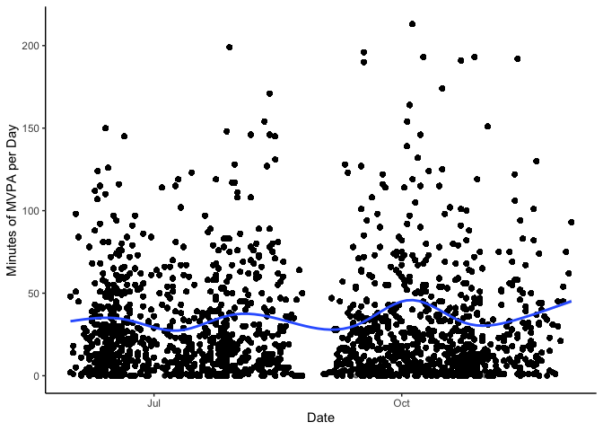

## Libraries


```r
library(lme4)
```

```
## Loading required package: Matrix
```

```r
library(tidyverse)
```

```
## ── Attaching packages ─────────────────────────────────────────────────────────────────────────────────────────────────────────────────────── tidyverse 1.3.0 ──
```

```
## ✓ ggplot2 3.3.2     ✓ purrr   0.3.4
## ✓ tibble  3.0.3     ✓ dplyr   1.0.2
## ✓ tidyr   1.1.2     ✓ stringr 1.4.0
## ✓ readr   1.3.1     ✓ forcats 0.5.0
```

```
## ── Conflicts ────────────────────────────────────────────────────────────────────────────────────────────────────────────────────────── tidyverse_conflicts() ──
## x tidyr::expand() masks Matrix::expand()
## x dplyr::filter() masks stats::filter()
## x dplyr::lag()    masks stats::lag()
## x tidyr::pack()   masks Matrix::pack()
## x tidyr::unpack() masks Matrix::unpack()
```

```r
library(gtools)
library(lubridate)
```

```
## 
## Attaching package: 'lubridate'
```

```
## The following objects are masked from 'package:base':
## 
##     date, intersect, setdiff, union
```

```r
library(DRDID)
library(did)
```

```
## Registered S3 methods overwritten by 'car':
##   method                          from
##   influence.merMod                lme4
##   cooks.distance.influence.merMod lme4
##   dfbeta.influence.merMod         lme4
##   dfbetas.influence.merMod        lme4
```

```r
library(modelsummary)
library(broom.mixed)
```

```
## Registered S3 method overwritten by 'broom.mixed':
##   method      from 
##   tidy.gamlss broom
```

```r
library(INLA)
```

```
## Warning: package 'INLA' was built under R version 4.0.4
```

```
## Loading required package: foreach
```

```
## 
## Attaching package: 'foreach'
```

```
## The following objects are masked from 'package:purrr':
## 
##     accumulate, when
```

```
## Loading required package: parallel
```

```
## Loading required package: sp
```

```
## This is INLA_21.02.23 built 2021-02-22 21:16:12 UTC.
##  - See www.r-inla.org/contact-us for how to get help.
##  - To enable PARDISO sparse library; see inla.pardiso()
##  - Save 350.5Mb of storage running 'inla.prune()'
```


## Analysis plan

1. Descriptive statistics outcome and exposure
2. Merge in demographic and weather variables 
3. Regression outcome and exposure (as per change discussions)
4. Sensitivity analysis (exposure changes)

### Read in data


```r
data <- read_csv("/Users/dfuller/Documents/INTERACT/data/sensors/sd_data_exposure.csv")
```

```
## Parsed with column specification:
## cols(
##   .default = col_double(),
##   utcdate = col_datetime(format = ""),
##   zone = col_character(),
##   activity_levels = col_character(),
##   gender = col_character(),
##   income = col_character(),
##   education = col_logical(),
##   city_id = col_character(),
##   date = col_date(format = "")
## )
```

```
## See spec(...) for full column specifications.
```

```
## Warning: 550640 parsing failures.
##    row       col           expected            actual                                                                  file
## 708730 education 1/0/T/F/TRUE/FALSE University degree '/Users/dfuller/Documents/INTERACT/data/sensors/sd_data_exposure.csv'
## 708731 education 1/0/T/F/TRUE/FALSE University degree '/Users/dfuller/Documents/INTERACT/data/sensors/sd_data_exposure.csv'
## 708732 education 1/0/T/F/TRUE/FALSE University degree '/Users/dfuller/Documents/INTERACT/data/sensors/sd_data_exposure.csv'
## 708733 education 1/0/T/F/TRUE/FALSE University degree '/Users/dfuller/Documents/INTERACT/data/sensors/sd_data_exposure.csv'
## 708734 education 1/0/T/F/TRUE/FALSE University degree '/Users/dfuller/Documents/INTERACT/data/sensors/sd_data_exposure.csv'
## ...... ......... .................. ................. .....................................................................
## See problems(...) for more details.
```

## Demographic data and weather

### Merging demographics


```r
health_data <- read_csv("/Users/dfuller/Documents/INTERACT/data/health_clean.csv")
```

```
## Parsed with column specification:
## cols(
##   .default = col_double(),
##   city_id = col_character(),
##   questionnaire_lang.x = col_character(),
##   date_of_survey = col_date(format = ""),
##   mode_used = col_character(),
##   mode_used_txt = col_character(),
##   cars_access_outside = col_character(),
##   cars_access_outside_txt = col_character(),
##   bike_access_options = col_character(),
##   bike_access_options_txt = col_character(),
##   tracking1_txt = col_character(),
##   house_tenure_txt = col_character(),
##   dwelling_type_txt = col_character(),
##   residence = col_date(format = ""),
##   gender_txt = col_character(),
##   sex_txt = col_logical(),
##   living_arrange = col_character(),
##   living_arrange_txt = col_character(),
##   group_id_mtl = col_character(),
##   group_id_mtl_txt = col_character(),
##   employment_txt = col_character()
##   # ... with 204 more columns
## )
```

```
## See spec(...) for full column specifications.
```

```
## Warning: 35032 parsing failures.
##  row            col           expected actual                                                      file
## 1156 sask_bus_pass  1/0/T/F/TRUE/FALSE     2  '/Users/dfuller/Documents/INTERACT/data/health_clean.csv'
## 1156 bus_safe       1/0/T/F/TRUE/FALSE     2  '/Users/dfuller/Documents/INTERACT/data/health_clean.csv'
## 1156 bus_reliable   1/0/T/F/TRUE/FALSE     2  '/Users/dfuller/Documents/INTERACT/data/health_clean.csv'
## 1156 bus_convenient 1/0/T/F/TRUE/FALSE     2  '/Users/dfuller/Documents/INTERACT/data/health_clean.csv'
## 1156 bus_freq_a     1/0/T/F/TRUE/FALSE     91 '/Users/dfuller/Documents/INTERACT/data/health_clean.csv'
## .... .............. .................. ...... .........................................................
## See problems(...) for more details.
```

```r
health_data <- health_data %>%
                  select(education_recode, gender_recode2, income_recode, age_recode, white, asian, indigenous, black, latin_american, 
                         middle_eastern, other_ethnicity, interact_id)

data <- left_join(data, health_data, by = c("interact_id"))
```

### Merging weather


```r
weather_data <- read_csv("/Users/dfuller/Documents/INTERACT/data/weather/2016_2020_weather_vic_van_sask_mtl.csv")
```

```
## Parsed with column specification:
## cols(
##   .default = col_character(),
##   lon = col_double(),
##   lat = col_double(),
##   climate_id = col_double(),
##   date_time = col_date(format = ""),
##   year = col_double(),
##   data_quality = col_logical(),
##   max_temp_c = col_double(),
##   min_temp_c = col_double(),
##   mean_temp_c = col_double(),
##   heat_days_c = col_double(),
##   cool_days_c = col_double(),
##   total_rain_mm = col_double(),
##   total_snow_mm = col_double(),
##   total_precip_mm = col_double(),
##   snow_ground_cm = col_double(),
##   snow_ground_flag = col_logical(),
##   dir_gust_10s_deg = col_double()
## )
```

```
## See spec(...) for full column specifications.
```

```
## Warning: 1835 parsing failures.
##  row              col           expected actual                                                                                    file
## 1135 snow_ground_flag 1/0/T/F/TRUE/FALSE      E '/Users/dfuller/Documents/INTERACT/data/weather/2016_2020_weather_vic_van_sask_mtl.csv'
## 1473 snow_ground_flag 1/0/T/F/TRUE/FALSE      E '/Users/dfuller/Documents/INTERACT/data/weather/2016_2020_weather_vic_van_sask_mtl.csv'
## 1817 snow_ground_flag 1/0/T/F/TRUE/FALSE      E '/Users/dfuller/Documents/INTERACT/data/weather/2016_2020_weather_vic_van_sask_mtl.csv'
## 2964 snow_ground_flag 1/0/T/F/TRUE/FALSE      E '/Users/dfuller/Documents/INTERACT/data/weather/2016_2020_weather_vic_van_sask_mtl.csv'
## 2968 snow_ground_flag 1/0/T/F/TRUE/FALSE      E '/Users/dfuller/Documents/INTERACT/data/weather/2016_2020_weather_vic_van_sask_mtl.csv'
## .... ................ .................. ...... .......................................................................................
## See problems(...) for more details.
```

```r
weather_data <- weather_data %>% dplyr::select(date_time, city_id, max_temp_c, min_temp_c, mean_temp_c, total_rain_mm, total_snow_mm, total_precip_mm, snow_ground_cm, speed_gust_km_h)

weather_data$date <- ymd(weather_data$date_time)

weather_data <- weather_data %>% filter(city_id == "Victoria")

weather_data <- arrange(weather_data, date)
data <- arrange(data, date)

data <- left_join(data, weather_data, by = c("date"))
```

### Exposure over time 


```r
## Overall 
table(data$wave_id, data$exposed_70)
```

```
##    
##          0      1
##   1 690274  18455
##   2 519463  35876
```

```r
## Individual level
data_exposure <- data %>%
                  group_by(interact_id, wave_id, date) %>%
                    summarise(
                      sum_exp_70 = sum(exposed_70), 
                      sum_exp_50 = sum(exposed_50), 
                      sum_exp_100 = sum(exposed_100), 
                      mvpa = first(total_mvpa_minutes),
                      sed = first(total_sed_minutes),
                      light = first(total_light_pa_minutes),
                      rel_exp_70 = sum(exposed_70)/n()*100,
                      rel_exp_50 = sum(exposed_50)/n()*100,
                      rel_exp_100 = sum(exposed_100)/n()*100,
                      minutes = first(minutes_id_date),
                      mean_temp_c = first(mean_temp_c),
                      total_precip_mm = first(total_precip_mm),
                      snow_ground_cm = first(snow_ground_cm),
                      speed_gust_km_h = first(speed_gust_km_h),
                      education_recode = first(education_recode),
                      gender_recode2 = first(gender_recode2),
                      income_recode = first(income_recode),
                      age_recode = first(age_recode),
                      white = first(white),
                      asian = first(asian),
                      indigenous = first(indigenous),
                      black = first(black),
                      latin_american = first(latin_american),
                      middle_eastern = first(middle_eastern),
                      other_ethnicity - first(other_ethnicity)
                    )
```

```
## `summarise()` regrouping output by 'interact_id', 'wave_id', 'date' (override with `.groups` argument)
```

```r
data_exposure$date_time <- as.factor(data_exposure$date)

data_exposure$speed_gust_km_h <- as.numeric(data_exposure$speed_gust_km_h)
```

```
## Warning: NAs introduced by coercion
```

### Histograms of absolute exposure (Total number of minutes)


```r
summary(data_exposure$sum_exp_70)
```

```
##    Min. 1st Qu.  Median    Mean 3rd Qu.    Max. 
##    0.00    0.00    2.00   24.37   13.00  652.00
```

```r
### Removing participants with more than 500 minutes of exposure
data_exposure$sum_exp_70 <- if_else(data_exposure$sum_exp_70 > 500, NA_real_, data_exposure$sum_exp_70)
data_exposure$sum_exp_50 <- if_else(data_exposure$sum_exp_50 > 500, NA_real_, data_exposure$sum_exp_50)
data_exposure$sum_exp_100 <- if_else(data_exposure$sum_exp_100 > 500, NA_real_, data_exposure$sum_exp_100)

data_exposure <- data_exposure %>% 
                    mutate(
                      sum_exp_70_quint = ntile(sum_exp_70, 5),
                      sum_exp_50_quint = ntile(sum_exp_50, 5),
                      sum_exp_100_quint = ntile(sum_exp_100, 5)
                      )

data_exposure$sum_exp_70_quint <- as.factor(data_exposure$sum_exp_70_quint)
data_exposure$sum_exp_50_quint <- as.factor(data_exposure$sum_exp_50_quint)
data_exposure$sum_exp_100_quint <- as.factor(data_exposure$sum_exp_100_quint)

table(data_exposure$sum_exp_70_quint)
```

```
## 
##      1      2      3      4      5 
## 252741 252150 251586 251090 250472
```

```r
table(data_exposure$sum_exp_100_quint)
```

```
## 
##      1      2      3      4      5 
## 252227 251638 251075 250579 249961
```


```r
abs_exposure_histo <- ggplot(data_exposure, aes(sum_exp_70)) + 
  geom_histogram() + 
  facet_wrap(~ wave_id) + 
  theme_classic()

plot(abs_exposure_histo)
```

```
## `stat_bin()` using `bins = 30`. Pick better value with `binwidth`.
```

```
## Warning: Removed 6029 rows containing non-finite values (stat_bin).
```

<!-- -->

### Histograms of relative exposure (% of total minutes exposed)


```r
summary(data_exposure$rel_exp_70)
```

```
##     Min.  1st Qu.   Median     Mean  3rd Qu.     Max. 
##   0.0000   0.0000   0.4057   4.2981   2.3684 100.0000
```

```r
### Removing participants with more than 40% exposure
data_exposure$rel_exp_70 <- if_else(data_exposure$rel_exp_70 > 40, NA_real_, data_exposure$rel_exp_70)
data_exposure$rel_exp_50 <- if_else(data_exposure$rel_exp_50 > 40, NA_real_, data_exposure$rel_exp_50)
data_exposure$rel_exp_100 <- if_else(data_exposure$rel_exp_100 > 40, NA_real_, data_exposure$rel_exp_100)

data_exposure <- data_exposure %>% 
                    mutate(
                      rel_exp_70_quint = ntile(rel_exp_70, 5),
                      rel_exp_50_quint = ntile(rel_exp_50, 5),
                      rel_exp_100_quint = ntile(rel_exp_100, 5)
                      )
data_exposure$rel_exp_70_quint <- as.factor(data_exposure$rel_exp_70_quint)
data_exposure$rel_exp_50_quint <- as.factor(data_exposure$rel_exp_50_quint)
data_exposure$rel_exp_100_quint <- as.factor(data_exposure$rel_exp_100_quint)

table(data_exposure$rel_exp_70_quint)
```

```
## 
##      1      2      3      4      5 
## 245996 245424 244873 244391 243790
```

```r
table(data_exposure$rel_exp_100_quint)
```

```
## 
##      1      2      3      4      5 
## 244839 244273 243726 243248 242649
```

### Creating a days variable 

```r
data_exposure <- data_exposure[order(data_exposure$date, data_exposure$interact_id), ]

data_exposure$time_seq <- as.numeric(data_exposure$date_time)
```


```r
rel_exposure_histo <- ggplot(data_exposure, aes(rel_exp_70)) + 
  geom_histogram() + 
  facet_wrap(~ wave_id) + 
  theme_classic()

plot(rel_exposure_histo)
```

```
## `stat_bin()` using `bins = 30`. Pick better value with `binwidth`.
```

```
## Warning: Removed 39594 rows containing non-finite values (stat_bin).
```

<!-- -->

### Histograms of Moderate to vigorous PA 


```r
pa_histo <- ggplot(data_exposure, aes(mvpa)) + 
  geom_histogram() + 
  facet_wrap(~ wave_id) + 
  theme_classic()

plot(pa_histo)
```

```
## `stat_bin()` using `bins = 30`. Pick better value with `binwidth`.
```

<!-- -->

### Scatterplot Absolute Exposure and Moderate to vigorous PA 


```r
abs_exp_pa_scatter <- ggplot(data_exposure, aes(x = sum_exp_70, y = mvpa)) + 
  geom_point(alpha = 0.2) +
  geom_smooth() +
  facet_wrap(~ wave_id) + 
  theme_classic()

plot(abs_exp_pa_scatter)
```

```
## `geom_smooth()` using method = 'gam' and formula 'y ~ s(x, bs = "cs")'
```

```
## Warning: Removed 6029 rows containing non-finite values (stat_smooth).
```

```
## Warning: Removed 6029 rows containing missing values (geom_point).
```

<!-- -->

### Scatterplot Relative Exposure and Moderate to vigorous PA 


```r
rel_exp_pa_scatter <- ggplot(data_exposure, aes(x = rel_exp_70, y = mvpa)) + 
  geom_point(alpha = 0.2) +
  geom_smooth() +
  facet_wrap(~ wave_id) + 
  theme_classic()

plot(rel_exp_pa_scatter)
```

```
## `geom_smooth()` using method = 'gam' and formula 'y ~ s(x, bs = "cs")'
```

```
## Warning: Removed 39594 rows containing non-finite values (stat_smooth).
```

```
## Warning: Removed 39594 rows containing missing values (geom_point).
```

<!-- -->

### Linear regression


```r
lm_models <- list(
  "Absolute Exposure" = lm(mvpa ~ sum_exp_70*factor(wave_id), data = data_exposure),
  "Relative Exposure" = lm(mvpa ~ rel_exp_70*factor(wave_id), data = data_exposure)
)

modelsummary(lm_models, fmt = "%.2f", statistic = 'conf.int')
```

<table class="table" style="width: auto !important; margin-left: auto; margin-right: auto;">
 <thead>
  <tr>
   <th style="text-align:left;">   </th>
   <th style="text-align:center;"> Absolute Exposure </th>
   <th style="text-align:center;"> Relative Exposure </th>
  </tr>
 </thead>
<tbody>
  <tr>
   <td style="text-align:left;"> (Intercept) </td>
   <td style="text-align:center;"> 33.28 </td>
   <td style="text-align:center;"> 33.57 </td>
  </tr>
  <tr>
   <td style="text-align:left;">  </td>
   <td style="text-align:center;"> [33.19, 33.36] </td>
   <td style="text-align:center;"> [33.49, 33.66] </td>
  </tr>
  <tr>
   <td style="text-align:left;"> sum_exp_70 </td>
   <td style="text-align:center;"> 0.13 </td>
   <td style="text-align:center;">  </td>
  </tr>
  <tr>
   <td style="text-align:left;">  </td>
   <td style="text-align:center;"> [0.13, 0.13] </td>
   <td style="text-align:center;">  </td>
  </tr>
  <tr>
   <td style="text-align:left;"> factor(wave_id)2 </td>
   <td style="text-align:center;"> 2.63 </td>
   <td style="text-align:center;"> 1.97 </td>
  </tr>
  <tr>
   <td style="text-align:left;">  </td>
   <td style="text-align:center;"> [2.50, 2.76] </td>
   <td style="text-align:center;"> [1.83, 2.10] </td>
  </tr>
  <tr>
   <td style="text-align:left;"> sum_exp_70 × factor(wave_id)2 </td>
   <td style="text-align:center;"> -0.09 </td>
   <td style="text-align:center;">  </td>
  </tr>
  <tr>
   <td style="text-align:left;">  </td>
   <td style="text-align:center;"> [-0.09, -0.09] </td>
   <td style="text-align:center;">  </td>
  </tr>
  <tr>
   <td style="text-align:left;"> rel_exp_70 </td>
   <td style="text-align:center;">  </td>
   <td style="text-align:center;"> 0.59 </td>
  </tr>
  <tr>
   <td style="text-align:left;">  </td>
   <td style="text-align:center;">  </td>
   <td style="text-align:center;"> [0.57, 0.60] </td>
  </tr>
  <tr>
   <td style="text-align:left;"> rel_exp_70 × factor(wave_id)2 </td>
   <td style="text-align:center;">  </td>
   <td style="text-align:center;"> -0.21 </td>
  </tr>
  <tr>
   <td style="text-align:left;box-shadow: 0px 1px">  </td>
   <td style="text-align:center;box-shadow: 0px 1px">  </td>
   <td style="text-align:center;box-shadow: 0px 1px"> [-0.23, -0.19] </td>
  </tr>
  <tr>
   <td style="text-align:left;"> Num.Obs. </td>
   <td style="text-align:center;"> 1258039 </td>
   <td style="text-align:center;"> 1224474 </td>
  </tr>
  <tr>
   <td style="text-align:left;"> R2 </td>
   <td style="text-align:center;"> 0.021 </td>
   <td style="text-align:center;"> 0.007 </td>
  </tr>
  <tr>
   <td style="text-align:left;"> R2 Adj. </td>
   <td style="text-align:center;"> 0.021 </td>
   <td style="text-align:center;"> 0.007 </td>
  </tr>
  <tr>
   <td style="text-align:left;"> AIC </td>
   <td style="text-align:center;"> 12474739.8 </td>
   <td style="text-align:center;"> 12132552.6 </td>
  </tr>
  <tr>
   <td style="text-align:left;"> BIC </td>
   <td style="text-align:center;"> 12474800.0 </td>
   <td style="text-align:center;"> 12132612.7 </td>
  </tr>
  <tr>
   <td style="text-align:left;"> Log.Lik. </td>
   <td style="text-align:center;"> -6237364.880 </td>
   <td style="text-align:center;"> -6066271.299 </td>
  </tr>
  <tr>
   <td style="text-align:left;"> F </td>
   <td style="text-align:center;"> 8964.212 </td>
   <td style="text-align:center;"> 2982.632 </td>
  </tr>
</tbody>
</table>

## Multilevel models 

MLM models with person level random intercepts using the lmer package

### Absolute exposure with a 70 meter buffer and no covariates


```r
### Null Model
lmer_null_exp70_ln <- lmer(mvpa ~ 1 + (1 | date_time) + (1 | interact_id), data = data_exposure)
summary(lmer_null_exp70_ln)
```

```
## Linear mixed model fit by REML ['lmerMod']
## Formula: mvpa ~ 1 + (1 | date_time) + (1 | interact_id)
##    Data: data_exposure
## 
## REML criterion at convergence: 11793864
## 
## Scaled residuals: 
##     Min      1Q  Median      3Q     Max 
## -5.5956 -0.6201 -0.0680  0.4895  5.3456 
## 
## Random effects:
##  Groups      Name        Variance Std.Dev.
##  date_time   (Intercept) 387.4    19.68   
##  interact_id (Intercept) 601.8    24.53   
##  Residual                657.8    25.65   
## Number of obs: 1264068, groups:  date_time, 345; interact_id, 210
## 
## Fixed effects:
##             Estimate Std. Error t value
## (Intercept)   31.268      1.998   15.65
```

```r
broom.mixed::glance(lmer_null_exp70_ln)
```

```
## # A tibble: 1 x 6
##   sigma    logLik       AIC       BIC  REMLcrit df.residual
##   <dbl>     <dbl>     <dbl>     <dbl>     <dbl>       <int>
## 1  25.6 -5896932. 11793872. 11793920. 11793864.     1264064
```

### Absolute exposure with a 70 meter buffer and covariates - Random intercepts

```r
### Absolute Model Continuous
lmer_abs_exp70_ln_cov <- lmer(mvpa ~ sum_exp_70*factor(wave_id) + mean_temp_c + total_precip_mm + speed_gust_km_h + gender_recode2 + income_recode + age_recode + (1 | date_time) + (1 | interact_id), data = data_exposure)
summary(lmer_abs_exp70_ln_cov)
```

```
## Linear mixed model fit by REML ['lmerMod']
## Formula: mvpa ~ sum_exp_70 * factor(wave_id) + mean_temp_c + total_precip_mm +  
##     speed_gust_km_h + gender_recode2 + income_recode + age_recode +  
##     (1 | date_time) + (1 | interact_id)
##    Data: data_exposure
## 
## REML criterion at convergence: 6453454
## 
## Scaled residuals: 
##     Min      1Q  Median      3Q     Max 
## -3.9465 -0.5699 -0.0554  0.5054  5.3845 
## 
## Random effects:
##  Groups      Name        Variance Std.Dev.
##  date_time   (Intercept) 326.9    18.08   
##  interact_id (Intercept) 494.3    22.23   
##  Residual                552.4    23.50   
## Number of obs: 704845, groups:  date_time, 225; interact_id, 134
## 
## Fixed effects:
##                                            Estimate Std. Error t value
## (Intercept)                               31.505701  12.321418   2.557
## sum_exp_70                                 0.115439   0.001296  89.041
## factor(wave_id)2                           0.932910   3.185072   0.293
## mean_temp_c                               -0.544184   0.301103  -1.807
## total_precip_mm                           -0.013153   0.255324  -0.052
## speed_gust_km_h                            0.070658   0.136200   0.519
## gender_recode2Transgender                -22.910528  16.214843  -1.413
## gender_recode2Woman                       -9.002616   4.034207  -2.232
## income_recode100_200                      -0.043974  11.056684  -0.004
## income_recode20_49 999                    12.140214  11.492284   1.056
## income_recode200+                         19.114407  24.883114   0.768
## income_recode50_99 999                    -0.448352  10.735386  -0.042
## income_recodeDon't know/prefer no answer   4.633076  12.895924   0.359
## age_recode30_39                            7.741094   6.329549   1.223
## age_recode40_49                            9.105662   6.714631   1.356
## age_recode50_64                            8.883314   7.574730   1.173
## age_recode65+                             -0.334705   7.983107  -0.042
## sum_exp_70:factor(wave_id)2               -0.157591   0.001728 -91.194
```

```
## 
## Correlation matrix not shown by default, as p = 18 > 12.
## Use print(x, correlation=TRUE)  or
##     vcov(x)        if you need it
```

```r
#confint.merMod(lmer_abs_exp70_ln_cov)
broom.mixed::glance(lmer_abs_exp70_ln_cov)
```

```
## # A tibble: 1 x 6
##   sigma    logLik      AIC      BIC REMLcrit df.residual
##   <dbl>     <dbl>    <dbl>    <dbl>    <dbl>       <int>
## 1  23.5 -3226727. 6453496. 6453736. 6453454.      704824
```

```r
### Absolute Model Continuous - with offset
lmer_abs_exp70_ln_cov_off <- lmer(mvpa ~ sum_exp_70*factor(wave_id) + mean_temp_c + total_precip_mm + speed_gust_km_h + gender_recode2 + income_recode + age_recode + (1 | date_time) + (1 | interact_id), data = data_exposure, offset = minutes)
summary(lmer_abs_exp70_ln_cov_off)
```

```
## Linear mixed model fit by REML ['lmerMod']
## Formula: mvpa ~ sum_exp_70 * factor(wave_id) + mean_temp_c + total_precip_mm +  
##     speed_gust_km_h + gender_recode2 + income_recode + age_recode +  
##     (1 | date_time) + (1 | interact_id)
##    Data: data_exposure
##  Offset: minutes
## 
## REML criterion at convergence: 8905394
## 
## Scaled residuals: 
##     Min      1Q  Median      3Q     Max 
## -3.5960 -0.6736 -0.1465  0.5165  5.5502 
## 
## Random effects:
##  Groups      Name        Variance Std.Dev.
##  date_time   (Intercept) 17904    133.8   
##  interact_id (Intercept) 25086    158.4   
##  Residual                17904    133.8   
## Number of obs: 704845, groups:  date_time, 225; interact_id, 134
## 
## Fixed effects:
##                                            Estimate Std. Error t value
## (Intercept)                              -3.060e+02  8.877e+01  -3.447
## sum_exp_70                               -3.466e-01  7.382e-03 -46.951
## factor(wave_id)2                          4.904e+01  2.355e+01   2.082
## mean_temp_c                              -6.203e+00  2.224e+00  -2.789
## total_precip_mm                           2.564e-01  1.889e+00   0.136
## speed_gust_km_h                           2.730e-01  1.008e+00   0.271
## gender_recode2Transgender                -1.235e+02  1.155e+02  -1.069
## gender_recode2Woman                       1.037e+01  2.874e+01   0.361
## income_recode100_200                     -3.708e+00  7.876e+01  -0.047
## income_recode20_49 999                   -4.539e+01  8.187e+01  -0.554
## income_recode200+                        -1.682e+02  1.773e+02  -0.949
## income_recode50_99 999                   -1.460e+00  7.647e+01  -0.019
## income_recodeDon't know/prefer no answer -1.709e+01  9.186e+01  -0.186
## age_recode30_39                          -6.430e+01  4.509e+01  -1.426
## age_recode40_49                          -9.346e+01  4.783e+01  -1.954
## age_recode50_64                          -1.550e+02  5.396e+01  -2.873
## age_recode65+                            -1.219e+02  5.687e+01  -2.144
## sum_exp_70:factor(wave_id)2               3.980e-01  9.840e-03  40.449
```

```
## 
## Correlation matrix not shown by default, as p = 18 > 12.
## Use print(x, correlation=TRUE)  or
##     vcov(x)        if you need it
```

```r
#confint.merMod(lmer_abs_exp70_ln_cov)
broom.mixed::glance(lmer_abs_exp70_ln_cov_off)
```

```
## # A tibble: 1 x 6
##   sigma    logLik      AIC      BIC REMLcrit df.residual
##   <dbl>     <dbl>    <dbl>    <dbl>    <dbl>       <int>
## 1  134. -4452697. 8905436. 8905677. 8905394.      704824
```

```r
### Absolute Model Quintiles
lmer_abs_exp70_q_cov <- lmer(mvpa ~ sum_exp_70_quint*factor(wave_id) + mean_temp_c + total_precip_mm + speed_gust_km_h + gender_recode2 + income_recode + age_recode + (1 | date_time) + (1 | interact_id), data = data_exposure)
summary(lmer_abs_exp70_q_cov)
```

```
## Linear mixed model fit by REML ['lmerMod']
## Formula: 
## mvpa ~ sum_exp_70_quint * factor(wave_id) + mean_temp_c + total_precip_mm +  
##     speed_gust_km_h + gender_recode2 + income_recode + age_recode +  
##     (1 | date_time) + (1 | interact_id)
##    Data: data_exposure
## 
## REML criterion at convergence: 6462817
## 
## Scaled residuals: 
##     Min      1Q  Median      3Q     Max 
## -3.9786 -0.5564 -0.0447  0.4969  5.3555 
## 
## Random effects:
##  Groups      Name        Variance Std.Dev.
##  date_time   (Intercept) 324.5    18.01   
##  interact_id (Intercept) 474.0    21.77   
##  Residual                559.8    23.66   
## Number of obs: 704845, groups:  date_time, 225; interact_id, 134
## 
## Fixed effects:
##                                            Estimate Std. Error t value
## (Intercept)                               32.230502  12.128291   2.657
## sum_exp_70_quint2                          0.010197   0.097314   0.105
## sum_exp_70_quint3                          0.018344   0.097369   0.188
## sum_exp_70_quint4                          0.029048   0.097419   0.298
## sum_exp_70_quint5                          0.036122   0.097481   0.371
## factor(wave_id)2                          -1.700241   3.176742  -0.535
## mean_temp_c                               -0.505224   0.300002  -1.684
## total_precip_mm                           -0.017584   0.254380  -0.069
## speed_gust_km_h                            0.047873   0.135696   0.353
## gender_recode2Transgender                -22.086227  15.878538  -1.391
## gender_recode2Woman                       -8.393268   3.950564  -2.125
## income_recode100_200                      -0.480690  10.827364  -0.044
## income_recode20_49 999                    12.874443  11.253915   1.144
## income_recode200+                         17.045033  24.367068   0.700
## income_recode50_99 999                     0.262062  10.512714   0.025
## income_recodeDon't know/prefer no answer   4.264155  12.628462   0.338
## age_recode30_39                            8.184408   6.198307   1.320
## age_recode40_49                            9.797109   6.575330   1.490
## age_recode50_64                            8.758135   7.417638   1.181
## age_recode65+                             -0.606259   7.817579  -0.078
## sum_exp_70_quint2:factor(wave_id)2         0.003353   0.240179   0.014
## sum_exp_70_quint3:factor(wave_id)2         0.007679   0.240338   0.032
## sum_exp_70_quint4:factor(wave_id)2        -0.003539   0.240456  -0.015
## sum_exp_70_quint5:factor(wave_id)2        -0.001609   0.240573  -0.007
```

```
## 
## Correlation matrix not shown by default, as p = 24 > 12.
## Use print(x, correlation=TRUE)  or
##     vcov(x)        if you need it
```

```r
#confint.merMod(lmer_abs_exp70_q_cov)
broom.mixed::glance(lmer_abs_exp70_q_cov)
```

```
## # A tibble: 1 x 6
##   sigma    logLik      AIC      BIC REMLcrit df.residual
##   <dbl>     <dbl>    <dbl>    <dbl>    <dbl>       <int>
## 1  23.7 -3231409. 6462871. 6463181. 6462817.      704818
```

```r
### Absolute Model Quintiles - with offset
lmer_abs_exp70_q_cov_off <- lmer(mvpa ~ sum_exp_70_quint*factor(wave_id) + mean_temp_c + total_precip_mm + speed_gust_km_h + gender_recode2 + income_recode + age_recode + (1 | date_time) + (1 | interact_id), data = data_exposure, offset = minutes)
summary(lmer_abs_exp70_q_cov_off)
```

```
## Linear mixed model fit by REML ['lmerMod']
## Formula: 
## mvpa ~ sum_exp_70_quint * factor(wave_id) + mean_temp_c + total_precip_mm +  
##     speed_gust_km_h + gender_recode2 + income_recode + age_recode +  
##     (1 | date_time) + (1 | interact_id)
##    Data: data_exposure
##  Offset: minutes
## 
## REML criterion at convergence: 8907655
## 
## Scaled residuals: 
##     Min      1Q  Median      3Q     Max 
## -3.5642 -0.6740 -0.1554  0.5125  5.5906 
## 
## Random effects:
##  Groups      Name        Variance Std.Dev.
##  date_time   (Intercept) 17864    133.7   
##  interact_id (Intercept) 25352    159.2   
##  Residual                17963    134.0   
## Number of obs: 704845, groups:  date_time, 225; interact_id, 134
## 
## Fixed effects:
##                                            Estimate Std. Error t value
## (Intercept)                              -304.80160   89.05878  -3.422
## sum_exp_70_quint2                          -0.18394    0.55125  -0.334
## sum_exp_70_quint3                          -0.32689    0.55156  -0.593
## sum_exp_70_quint4                          -0.46742    0.55184  -0.847
## sum_exp_70_quint5                          -0.65615    0.55219  -1.188
## factor(wave_id)2                           54.62152   23.54003   2.320
## mean_temp_c                                -6.47077    2.22105  -2.913
## total_precip_mm                             0.27176    1.88649   0.144
## speed_gust_km_h                             0.32390    1.00639   0.322
## gender_recode2Transgender                -124.97273  116.11770  -1.076
## gender_recode2Woman                         9.03522   28.88800   0.313
## income_recode100_200                       -2.87103   79.17915  -0.036
## income_recode20_49 999                    -47.42349   82.29926  -0.576
## income_recode200+                        -162.03697  178.19088  -0.909
## income_recode50_99 999                     -4.20599   76.87857  -0.055
## income_recodeDon't know/prefer no answer  -15.50156   92.35002  -0.168
## age_recode30_39                           -66.32408   45.32471  -1.463
## age_recode40_49                           -97.05744   48.08301  -2.019
## age_recode50_64                          -155.22142   54.24347  -2.862
## age_recode65+                            -121.23098   57.16656  -2.121
## sum_exp_70_quint2:factor(wave_id)2          0.03915    1.36052   0.029
## sum_exp_70_quint3:factor(wave_id)2          0.04233    1.36142   0.031
## sum_exp_70_quint4:factor(wave_id)2          0.12773    1.36209   0.094
## sum_exp_70_quint5:factor(wave_id)2          0.10699    1.36275   0.079
```

```
## 
## Correlation matrix not shown by default, as p = 24 > 12.
## Use print(x, correlation=TRUE)  or
##     vcov(x)        if you need it
```

```r
#confint.merMod(lmer_abs_exp70_q_cov)
broom.mixed::glance(lmer_abs_exp70_q_cov_off)
```

```
## # A tibble: 1 x 6
##   sigma    logLik      AIC      BIC REMLcrit df.residual
##   <dbl>     <dbl>    <dbl>    <dbl>    <dbl>       <int>
## 1  134. -4453827. 8907709. 8908019. 8907655.      704818
```

### Absolute exposure with a 70 meter buffer and covariates - Random slopes

```r
### Absolute Model Continuous
lmer_abs_exp70_ln_cov_rs <- lmer(mvpa ~ sum_exp_70*factor(wave_id) + mean_temp_c + total_precip_mm + speed_gust_km_h + gender_recode2 + income_recode + age_recode + (time_seq | interact_id) + (1 | interact_id), data = data_exposure, control = lmerControl(optimizer ="Nelder_Mead"))
```

```
## Warning in checkConv(attr(opt, "derivs"), opt$par, ctrl = control$checkConv, :
## unable to evaluate scaled gradient
```

```
## Warning in checkConv(attr(opt, "derivs"), opt$par, ctrl = control$checkConv, :
## Model failed to converge: degenerate Hessian with 1 negative eigenvalues
```

```r
summary(lmer_abs_exp70_ln_cov_rs)
```

```
## Linear mixed model fit by REML ['lmerMod']
## Formula: mvpa ~ sum_exp_70 * factor(wave_id) + mean_temp_c + total_precip_mm +  
##     speed_gust_km_h + gender_recode2 + income_recode + age_recode +  
##     (time_seq | interact_id) + (1 | interact_id)
##    Data: data_exposure
## Control: lmerControl(optimizer = "Nelder_Mead")
## 
## REML criterion at convergence: 6499533
## 
## Scaled residuals: 
##     Min      1Q  Median      3Q     Max 
## -5.4188 -0.5271 -0.0793  0.4206  5.7921 
## 
## Random effects:
##  Groups        Name        Variance  Std.Dev. Corr 
##  interact_id   (Intercept) 590445.20 768.40        
##                time_seq        22.75   4.77   -1.00
##  interact_id.1 (Intercept)  63229.69 251.46        
##  Residual                     589.41  24.28        
## Number of obs: 704845, groups:  interact_id, 134
## 
## Fixed effects:
##                                            Estimate Std. Error t value
## (Intercept)                              -95.934962 117.715810  -0.815
## sum_exp_70                                 0.070694   0.001426  49.580
## factor(wave_id)2                           4.419584   1.594614   2.772
## mean_temp_c                               -0.055381   0.019866  -2.788
## total_precip_mm                           -0.055008   0.006780  -8.113
## speed_gust_km_h                           -0.072574   0.003716 -19.532
## gender_recode2Transgender                -10.069480 184.354745  -0.055
## gender_recode2Woman                       -4.802933  45.936118  -0.105
## income_recode100_200                     140.514512 125.807134   1.117
## income_recode20_49 999                    46.109321 130.763091   0.353
## income_recode200+                        -90.465995 283.420286  -0.319
## income_recode50_99 999                   122.295295 122.136929   1.001
## income_recodeDon't know/prefer no answer 182.661117 146.727944   1.245
## age_recode30_39                            9.531184  72.090423   0.132
## age_recode40_49                           -8.690059  76.460024  -0.114
## age_recode50_64                           50.064009  86.230815   0.581
## age_recode65+                             77.216840  90.821204   0.850
## sum_exp_70:factor(wave_id)2               -0.126998   0.002411 -52.678
```

```
## 
## Correlation matrix not shown by default, as p = 18 > 12.
## Use print(x, correlation=TRUE)  or
##     vcov(x)        if you need it
```

```
## optimizer (Nelder_Mead) convergence code: 0 (OK)
## unable to evaluate scaled gradient
## Model failed to converge: degenerate  Hessian with 1 negative eigenvalues
```

```r
#confint.merMod(lmer_abs_exp70_ln_cov_rs)
broom.mixed::glance(lmer_abs_exp70_ln_cov_rs)
```

```
## # A tibble: 1 x 6
##   sigma    logLik      AIC      BIC REMLcrit df.residual
##   <dbl>     <dbl>    <dbl>    <dbl>    <dbl>       <int>
## 1  24.3 -3249767. 6499579. 6499843. 6499533.      704822
```

```r
lmer_abs_exp70_ln_cov <- lmer(mvpa ~ sum_exp_70*factor(wave_id) + mean_temp_c + total_precip_mm + speed_gust_km_h + gender_recode2 + income_recode + age_recode + (time_seq | interact_id) + (1 | interact_id), data = data_exposure, control = lmerControl(optimizer ="Nelder_Mead"))
```

```
## Warning in checkConv(attr(opt, "derivs"), opt$par, ctrl = control$checkConv, :
## unable to evaluate scaled gradient

## Warning in checkConv(attr(opt, "derivs"), opt$par, ctrl = control$checkConv, :
## Model failed to converge: degenerate Hessian with 1 negative eigenvalues
```

```r
summary(lmer_abs_exp70_ln_cov)
```

```
## Linear mixed model fit by REML ['lmerMod']
## Formula: mvpa ~ sum_exp_70 * factor(wave_id) + mean_temp_c + total_precip_mm +  
##     speed_gust_km_h + gender_recode2 + income_recode + age_recode +  
##     (time_seq | interact_id) + (1 | interact_id)
##    Data: data_exposure
## Control: lmerControl(optimizer = "Nelder_Mead")
## 
## REML criterion at convergence: 6499533
## 
## Scaled residuals: 
##     Min      1Q  Median      3Q     Max 
## -5.4188 -0.5271 -0.0793  0.4206  5.7921 
## 
## Random effects:
##  Groups        Name        Variance  Std.Dev. Corr 
##  interact_id   (Intercept) 590445.20 768.40        
##                time_seq        22.75   4.77   -1.00
##  interact_id.1 (Intercept)  63229.69 251.46        
##  Residual                     589.41  24.28        
## Number of obs: 704845, groups:  interact_id, 134
## 
## Fixed effects:
##                                            Estimate Std. Error t value
## (Intercept)                              -95.934962 117.715810  -0.815
## sum_exp_70                                 0.070694   0.001426  49.580
## factor(wave_id)2                           4.419584   1.594614   2.772
## mean_temp_c                               -0.055381   0.019866  -2.788
## total_precip_mm                           -0.055008   0.006780  -8.113
## speed_gust_km_h                           -0.072574   0.003716 -19.532
## gender_recode2Transgender                -10.069480 184.354745  -0.055
## gender_recode2Woman                       -4.802933  45.936118  -0.105
## income_recode100_200                     140.514512 125.807134   1.117
## income_recode20_49 999                    46.109321 130.763091   0.353
## income_recode200+                        -90.465995 283.420286  -0.319
## income_recode50_99 999                   122.295295 122.136929   1.001
## income_recodeDon't know/prefer no answer 182.661117 146.727944   1.245
## age_recode30_39                            9.531184  72.090423   0.132
## age_recode40_49                           -8.690059  76.460024  -0.114
## age_recode50_64                           50.064009  86.230815   0.581
## age_recode65+                             77.216840  90.821204   0.850
## sum_exp_70:factor(wave_id)2               -0.126998   0.002411 -52.678
```

```
## 
## Correlation matrix not shown by default, as p = 18 > 12.
## Use print(x, correlation=TRUE)  or
##     vcov(x)        if you need it
```

```
## optimizer (Nelder_Mead) convergence code: 0 (OK)
## unable to evaluate scaled gradient
## Model failed to converge: degenerate  Hessian with 1 negative eigenvalues
```

```r
### Absolute Model Continuous - with offset
lmer_abs_exp70_ln_cov_off_rs <- lmer(mvpa ~ sum_exp_70*factor(wave_id) + mean_temp_c + total_precip_mm + speed_gust_km_h + gender_recode2 + income_recode + age_recode + (time_seq | interact_id) + (1 | interact_id), data = data_exposure, offset = minutes, control = lmerControl(optimizer ="Nelder_Mead"))
```

```
## boundary (singular) fit: see ?isSingular
```

```r
summary(lmer_abs_exp70_ln_cov_off_rs)
```

```
## Linear mixed model fit by REML ['lmerMod']
## Formula: mvpa ~ sum_exp_70 * factor(wave_id) + mean_temp_c + total_precip_mm +  
##     speed_gust_km_h + gender_recode2 + income_recode + age_recode +  
##     (time_seq | interact_id) + (1 | interact_id)
##    Data: data_exposure
##  Offset: minutes
## Control: lmerControl(optimizer = "Nelder_Mead")
## 
## REML criterion at convergence: 8938657
## 
## Scaled residuals: 
##     Min      1Q  Median      3Q     Max 
## -2.7021 -0.6310 -0.1154  0.4901  7.4917 
## 
## Random effects:
##  Groups        Name        Variance  Std.Dev. Corr 
##  interact_id   (Intercept) 7625094.9 2761.36       
##                time_seq        719.1   26.82  -1.00
##  interact_id.1 (Intercept) 2729111.5 1652.00       
##  Residual                    18763.4  136.98       
## Number of obs: 704845, groups:  interact_id, 134
## 
## Fixed effects:
##                                            Estimate Std. Error t value
## (Intercept)                               1.595e+01  7.688e+02   0.021
## sum_exp_70                               -2.786e-01  8.046e-03 -34.623
## factor(wave_id)2                         -4.889e+02  8.998e+00 -54.333
## mean_temp_c                               2.711e+00  1.121e-01  24.189
## total_precip_mm                          -2.771e-01  3.825e-02  -7.243
## speed_gust_km_h                          -5.375e-01  2.096e-02 -25.637
## gender_recode2Transgender                -2.995e+02  1.205e+03  -0.249
## gender_recode2Woman                      -5.404e+01  3.007e+02  -0.180
## income_recode100_200                     -1.041e+02  8.219e+02  -0.127
## income_recode20_49 999                    2.199e+02  8.540e+02   0.258
## income_recode200+                        -9.905e+02  1.849e+03  -0.536
## income_recode50_99 999                   -2.999e+01  7.978e+02  -0.038
## income_recodeDon't know/prefer no answer  5.666e+02  9.582e+02   0.591
## age_recode30_39                          -3.195e+02  4.713e+02  -0.678
## age_recode40_49                          -4.403e+02  4.994e+02  -0.882
## age_recode50_64                          -5.158e+02  5.631e+02  -0.916
## age_recode65+                            -6.075e+02  5.933e+02  -1.024
## sum_exp_70:factor(wave_id)2              -1.645e-01  1.359e-02 -12.104
```

```
## 
## Correlation matrix not shown by default, as p = 18 > 12.
## Use print(x, correlation=TRUE)  or
##     vcov(x)        if you need it
```

```
## optimizer (Nelder_Mead) convergence code: 0 (OK)
## boundary (singular) fit: see ?isSingular
```

```r
#confint.merMod(lmer_abs_exp70_ln_cov_off_rs)
broom.mixed::glance(lmer_abs_exp70_ln_cov_off_rs)
```

```
## # A tibble: 1 x 6
##   sigma    logLik      AIC      BIC REMLcrit df.residual
##   <dbl>     <dbl>    <dbl>    <dbl>    <dbl>       <int>
## 1  137. -4469329. 8938703. 8938967. 8938657.      704822
```

```r
### Absolute Model Quintiles
lmer_abs_exp70_q_cov_rs <- lmer(mvpa ~ sum_exp_70_quint*factor(wave_id) + mean_temp_c + total_precip_mm + speed_gust_km_h + gender_recode2 + income_recode + age_recode + (time_seq | interact_id) + (1 | interact_id), data = data_exposure, control = lmerControl(optimizer ="Nelder_Mead"))
```

```
## boundary (singular) fit: see ?isSingular
```

```r
summary(lmer_abs_exp70_q_cov_rs)
```

```
## Linear mixed model fit by REML ['lmerMod']
## Formula: 
## mvpa ~ sum_exp_70_quint * factor(wave_id) + mean_temp_c + total_precip_mm +  
##     speed_gust_km_h + gender_recode2 + income_recode + age_recode +  
##     (time_seq | interact_id) + (1 | interact_id)
##    Data: data_exposure
## Control: lmerControl(optimizer = "Nelder_Mead")
## 
## REML criterion at convergence: 6502831
## 
## Scaled residuals: 
##     Min      1Q  Median      3Q     Max 
## -5.3793 -0.5068 -0.0794  0.4186  5.7742 
## 
## Random effects:
##  Groups        Name        Variance  Std.Dev. Corr 
##  interact_id   (Intercept) 775130.38 880.415       
##                time_seq        28.04   5.295  -1.00
##  interact_id.1 (Intercept)  65044.90 255.039       
##  Residual                     592.16  24.334       
## Number of obs: 704845, groups:  interact_id, 134
## 
## Fixed effects:
##                                            Estimate Std. Error t value
## (Intercept)                              -1.016e+02  1.188e+02  -0.855
## sum_exp_70_quint2                         1.264e-02  1.001e-01   0.126
## sum_exp_70_quint3                         1.988e-02  1.001e-01   0.199
## sum_exp_70_quint4                         3.202e-02  1.002e-01   0.320
## sum_exp_70_quint5                         3.962e-02  1.003e-01   0.395
## factor(wave_id)2                          1.312e+00  1.596e+00   0.822
## mean_temp_c                              -2.790e-02  1.990e-02  -1.402
## total_precip_mm                          -5.779e-02  6.795e-03  -8.505
## speed_gust_km_h                          -7.364e-02  3.724e-03 -19.774
## gender_recode2Transgender                -1.125e+01  1.860e+02  -0.060
## gender_recode2Woman                      -6.254e+00  4.634e+01  -0.135
## income_recode100_200                      1.429e+02  1.269e+02   1.126
## income_recode20_49 999                    4.162e+01  1.319e+02   0.315
## income_recode200+                        -8.774e+01  2.860e+02  -0.307
## income_recode50_99 999                    1.293e+02  1.232e+02   1.050
## income_recodeDon't know/prefer no answer  1.848e+02  1.480e+02   1.249
## age_recode30_39                           6.687e+00  7.273e+01   0.092
## age_recode40_49                          -2.884e+00  7.714e+01  -0.037
## age_recode50_64                           5.263e+01  8.700e+01   0.605
## age_recode65+                             8.882e+01  9.163e+01   0.969
## sum_exp_70_quint2:factor(wave_id)2        7.021e-03  2.470e-01   0.028
## sum_exp_70_quint3:factor(wave_id)2        9.165e-03  2.472e-01   0.037
## sum_exp_70_quint4:factor(wave_id)2       -2.001e-03  2.473e-01  -0.008
## sum_exp_70_quint5:factor(wave_id)2       -7.443e-03  2.474e-01  -0.030
```

```
## 
## Correlation matrix not shown by default, as p = 24 > 12.
## Use print(x, correlation=TRUE)  or
##     vcov(x)        if you need it
```

```
## optimizer (Nelder_Mead) convergence code: 0 (OK)
## boundary (singular) fit: see ?isSingular
```

```r
#confint.merMod(lmer_abs_exp70_q_cov_rs)
broom.mixed::glance(lmer_abs_exp70_q_cov_rs)
```

```
## # A tibble: 1 x 6
##   sigma    logLik      AIC      BIC REMLcrit df.residual
##   <dbl>     <dbl>    <dbl>    <dbl>    <dbl>       <int>
## 1  24.3 -3251416. 6502889. 6503222. 6502831.      704816
```

```r
### Absolute Model Quintiles - with offset
lmer_abs_exp70_q_cov_off_rs <- lmer(mvpa ~ sum_exp_70_quint*factor(wave_id) + mean_temp_c + total_precip_mm + speed_gust_km_h + gender_recode2 + income_recode + age_recode + (time_seq | interact_id) + (1 | interact_id), data = data_exposure, offset = minutes, control = lmerControl(optimizer ="Nelder_Mead"))
```

```
## boundary (singular) fit: see ?isSingular
```

```r
summary(lmer_abs_exp70_q_cov_off_rs)
```

```
## Linear mixed model fit by REML ['lmerMod']
## Formula: 
## mvpa ~ sum_exp_70_quint * factor(wave_id) + mean_temp_c + total_precip_mm +  
##     speed_gust_km_h + gender_recode2 + income_recode + age_recode +  
##     (time_seq | interact_id) + (1 | interact_id)
##    Data: data_exposure
##  Offset: minutes
## Control: lmerControl(optimizer = "Nelder_Mead")
## 
## REML criterion at convergence: 8941405
## 
## Scaled residuals: 
##     Min      1Q  Median      3Q     Max 
## -2.6871 -0.6262 -0.1250  0.4922  7.4865 
## 
## Random effects:
##  Groups        Name        Variance  Std.Dev. Corr 
##  interact_id   (Intercept) 9640364.8 3104.89       
##                time_seq        790.7   28.12  -1.00
##  interact_id.1 (Intercept) 3246004.8 1801.67       
##  Residual                    18836.7  137.25       
## Number of obs: 704845, groups:  interact_id, 134
## 
## Fixed effects:
##                                            Estimate Std. Error t value
## (Intercept)                               1.141e+02  8.385e+02   0.136
## sum_exp_70_quint2                        -2.085e-01  5.645e-01  -0.369
## sum_exp_70_quint3                        -3.446e-01  5.648e-01  -0.610
## sum_exp_70_quint4                        -4.890e-01  5.651e-01  -0.865
## sum_exp_70_quint5                        -6.720e-01  5.655e-01  -1.188
## factor(wave_id)2                         -5.358e+02  9.002e+00 -59.522
## mean_temp_c                               2.492e+00  1.122e-01  22.209
## total_precip_mm                          -2.410e-01  3.832e-02  -6.289
## speed_gust_km_h                          -5.185e-01  2.100e-02 -24.687
## gender_recode2Transgender                -3.613e+02  1.314e+03  -0.275
## gender_recode2Woman                      -1.275e+02  3.276e+02  -0.389
## income_recode100_200                     -8.943e+01  8.963e+02  -0.100
## income_recode20_49 999                    2.834e+02  9.313e+02   0.304
## income_recode200+                        -1.066e+03  2.017e+03  -0.529
## income_recode50_99 999                   -4.525e+01  8.701e+02  -0.052
## income_recodeDon't know/prefer no answer  6.129e+02  1.045e+03   0.586
## age_recode30_39                          -3.518e+02  5.137e+02  -0.685
## age_recode40_49                          -4.511e+02  5.445e+02  -0.828
## age_recode50_64                          -5.268e+02  6.140e+02  -0.858
## age_recode65+                            -6.572e+02  6.470e+02  -1.016
## sum_exp_70_quint2:factor(wave_id)2        1.979e-02  1.393e+00   0.014
## sum_exp_70_quint3:factor(wave_id)2        3.993e-02  1.394e+00   0.029
## sum_exp_70_quint4:factor(wave_id)2        1.132e-01  1.395e+00   0.081
## sum_exp_70_quint5:factor(wave_id)2        1.634e-01  1.396e+00   0.117
```

```
## 
## Correlation matrix not shown by default, as p = 24 > 12.
## Use print(x, correlation=TRUE)  or
##     vcov(x)        if you need it
```

```
## optimizer (Nelder_Mead) convergence code: 0 (OK)
## boundary (singular) fit: see ?isSingular
```

```r
#confint.merMod(lmer_abs_exp70_q_cov_off_rs)
broom.mixed::glance(lmer_abs_exp70_q_cov_off_rs)
```

```
## # A tibble: 1 x 6
##   sigma    logLik      AIC      BIC REMLcrit df.residual
##   <dbl>     <dbl>    <dbl>    <dbl>    <dbl>       <int>
## 1  137. -4470703. 8941463. 8941796. 8941405.      704816
```

## Relative Exposure

### Relative exposure with a 70 meter buffer and no covariates


```r
### Linear exposure
lmer_rel_exp_ln <- lmer(mvpa ~ rel_exp_70*factor(wave_id) + (1 | date_time) + (1 | interact_id), data = data_exposure)
summary(lmer_rel_exp_ln)
```

```
## Linear mixed model fit by REML ['lmerMod']
## Formula: mvpa ~ rel_exp_70 * factor(wave_id) + (1 | date_time) + (1 |  
##     interact_id)
##    Data: data_exposure
## 
## REML criterion at convergence: 11380651
## 
## Scaled residuals: 
##     Min      1Q  Median      3Q     Max 
## -5.5996 -0.6125 -0.0567  0.5016  5.3120 
## 
## Random effects:
##  Groups      Name        Variance Std.Dev.
##  date_time   (Intercept) 398.7    19.97   
##  interact_id (Intercept) 605.4    24.60   
##  Residual                634.6    25.19   
## Number of obs: 1224474, groups:  date_time, 345; interact_id, 210
## 
## Fixed effects:
##                               Estimate Std. Error t value
## (Intercept)                  34.469967   2.260092  15.252
## rel_exp_70                    0.401005   0.008087  49.585
## factor(wave_id)2            -11.629958   2.164780  -5.372
## rel_exp_70:factor(wave_id)2   0.289485   0.011075  26.137
## 
## Correlation of Fixed Effects:
##             (Intr) rl__70 fc(_)2
## rel_exp_70  -0.008              
## fctr(wv_d)2 -0.456  0.005       
## rl__70:(_)2  0.004 -0.710 -0.010
```

```r
### Quintiles of exposure
lmer_rel_exp_q <- lmer(mvpa ~ rel_exp_70_quint*factor(wave_id) + (1 | date_time) + (1 | interact_id), data = data_exposure)
summary(lmer_rel_exp_q)
```

```
## Linear mixed model fit by REML ['lmerMod']
## Formula: mvpa ~ rel_exp_70_quint * factor(wave_id) + (1 | date_time) +  
##     (1 | interact_id)
##    Data: data_exposure
## 
## REML criterion at convergence: 11390678
## 
## Scaled residuals: 
##     Min      1Q  Median      3Q     Max 
## -5.6732 -0.6171 -0.0682  0.4862  5.2779 
## 
## Random effects:
##  Groups      Name        Variance Std.Dev.
##  date_time   (Intercept) 395.6    19.89   
##  interact_id (Intercept) 614.7    24.79   
##  Residual                639.8    25.29   
## Number of obs: 1224474, groups:  date_time, 345; interact_id, 210
## 
## Fixed effects:
##                                      Estimate Std. Error t value
## (Intercept)                         3.570e+01  2.267e+00  15.749
## rel_exp_70_quint2                   1.118e-02  9.548e-02   0.117
## rel_exp_70_quint3                   1.911e-02  9.554e-02   0.200
## rel_exp_70_quint4                   2.926e-02  9.558e-02   0.306
## rel_exp_70_quint5                   3.882e-02  9.564e-02   0.406
## factor(wave_id)2                   -1.032e+01  2.158e+00  -4.781
## rel_exp_70_quint2:factor(wave_id)2  1.163e-03  1.458e-01   0.008
## rel_exp_70_quint3:factor(wave_id)2  6.265e-03  1.459e-01   0.043
## rel_exp_70_quint4:factor(wave_id)2  4.671e-03  1.460e-01   0.032
## rel_exp_70_quint5:factor(wave_id)2  9.524e-04  1.461e-01   0.007
## 
## Correlation of Fixed Effects:
##             (Intr) rl__70_2 rl__70_3 rl__70_4 rl__70_5 fc(_)2 r__70_2: r__70_3:
## rl_xp_70_q2 -0.021                                                             
## rl_xp_70_q3 -0.021  0.499                                                      
## rl_xp_70_q4 -0.021  0.499    0.499                                             
## rl_xp_70_q5 -0.021  0.499    0.498    0.498                                    
## fctr(wv_d)2 -0.454  0.022    0.022    0.022    0.022                           
## r__70_2:(_)  0.014 -0.655   -0.327   -0.327   -0.326   -0.034                  
## r__70_3:(_)  0.014 -0.327   -0.655   -0.326   -0.326   -0.034  0.499           
## r__70_4:(_)  0.014 -0.327   -0.326   -0.655   -0.326   -0.034  0.499    0.499  
## r__70_5:(_)  0.014 -0.326   -0.326   -0.326   -0.655   -0.034  0.499    0.498  
##             r__70_4:
## rl_xp_70_q2         
## rl_xp_70_q3         
## rl_xp_70_q4         
## rl_xp_70_q5         
## fctr(wv_d)2         
## r__70_2:(_)         
## r__70_3:(_)         
## r__70_4:(_)         
## r__70_5:(_)  0.498
```

### Relative exposure with a 70 meter buffer and covariates - Random intercepts


```r
### Linear exposure
lmer_rel_exp_ln_cov <- lmer(mvpa ~ rel_exp_70*factor(wave_id) + mean_temp_c + total_precip_mm + speed_gust_km_h + gender_recode2 + income_recode + age_recode + (1 | date_time) + (1 | interact_id), data = data_exposure)
summary(lmer_rel_exp_ln_cov)
```

```
## Linear mixed model fit by REML ['lmerMod']
## Formula: mvpa ~ rel_exp_70 * factor(wave_id) + mean_temp_c + total_precip_mm +  
##     speed_gust_km_h + gender_recode2 + income_recode + age_recode +  
##     (1 | date_time) + (1 | interact_id)
##    Data: data_exposure
## 
## REML criterion at convergence: 6332248
## 
## Scaled residuals: 
##     Min      1Q  Median      3Q     Max 
## -3.8824 -0.5607 -0.0441  0.5078  5.3225 
## 
## Random effects:
##  Groups      Name        Variance Std.Dev.
##  date_time   (Intercept) 332.3    18.23   
##  interact_id (Intercept) 517.7    22.75   
##  Residual                557.9    23.62   
## Number of obs: 690856, groups:  date_time, 222; interact_id, 134
## 
## Fixed effects:
##                                            Estimate Std. Error t value
## (Intercept)                               32.419049  12.564212   2.580
## rel_exp_70                                 0.460871   0.008572  53.766
## factor(wave_id)2                           1.064848   3.275743   0.325
## mean_temp_c                               -0.657558   0.304750  -2.158
## total_precip_mm                            0.024473   0.257881   0.095
## speed_gust_km_h                            0.097748   0.138122   0.708
## gender_recode2Transgender                -23.739208  16.594549  -1.431
## gender_recode2Woman                       -9.986631   4.128875  -2.419
## income_recode100_200                      -0.967093  11.315568  -0.085
## income_recode20_49 999                    12.759202  11.761301   1.085
## income_recode200+                         19.629923  25.465558   0.771
## income_recode50_99 999                    -0.277290  10.986738  -0.025
## income_recodeDon't know/prefer no answer   4.214822  13.197798   0.319
## age_recode30_39                            8.070241   6.477769   1.246
## age_recode40_49                           11.102231   6.872459   1.615
## age_recode50_64                            9.756712   7.752126   1.259
## age_recode65+                             -0.550469   8.170017  -0.067
## rel_exp_70:factor(wave_id)2               -0.352994   0.016688 -21.152
```

```
## 
## Correlation matrix not shown by default, as p = 18 > 12.
## Use print(x, correlation=TRUE)  or
##     vcov(x)        if you need it
```

```r
#confint.merMod(lmer_rel_exp_ln_cov)

### Linear exposure - with offset
lmer_rel_exp_ln_cov_off <- lmer(mvpa ~ rel_exp_70*factor(wave_id) + mean_temp_c + total_precip_mm + speed_gust_km_h + gender_recode2 + income_recode + age_recode + (1 | date_time) + (1 | interact_id), data = data_exposure, offset = minutes)
summary(lmer_rel_exp_ln_cov_off)
```

```
## Linear mixed model fit by REML ['lmerMod']
## Formula: mvpa ~ rel_exp_70 * factor(wave_id) + mean_temp_c + total_precip_mm +  
##     speed_gust_km_h + gender_recode2 + income_recode + age_recode +  
##     (1 | date_time) + (1 | interact_id)
##    Data: data_exposure
##  Offset: minutes
## 
## REML criterion at convergence: 8726810
## 
## Scaled residuals: 
##     Min      1Q  Median      3Q     Max 
## -3.7082 -0.6605 -0.1588  0.5108  5.6359 
## 
## Random effects:
##  Groups      Name        Variance Std.Dev.
##  date_time   (Intercept) 17585    132.6   
##  interact_id (Intercept) 25952    161.1   
##  Residual                17856    133.6   
## Number of obs: 690856, groups:  date_time, 222; interact_id, 134
## 
## Fixed effects:
##                                            Estimate Std. Error t value
## (Intercept)                              -299.24503   89.64184  -3.338
## rel_exp_70                                  1.83087    0.04850  37.749
## factor(wave_id)2                           51.75747   23.81152   2.174
## mean_temp_c                                -7.21377    2.21232  -3.261
## total_precip_mm                             0.48507    1.87519   0.259
## speed_gust_km_h                             0.45357    1.00441   0.452
## gender_recode2Transgender                -125.86233  117.48242  -1.071
## gender_recode2Woman                        -2.19498   29.22848  -0.075
## income_recode100_200                      -14.51122   80.10958  -0.181
## income_recode20_49 999                    -49.21078   83.26604  -0.591
## income_recode200+                        -153.09299  180.28403  -0.849
## income_recode50_99 999                     -6.29076   77.78196  -0.081
## income_recodeDon't know/prefer no answer  -15.42059   93.43489  -0.165
## age_recode30_39                           -60.17935   45.85750  -1.312
## age_recode40_49                           -77.29208   48.65113  -1.589
## age_recode50_64                          -142.01229   54.88108  -2.588
## age_recode65+                            -116.59198   57.83830  -2.016
## rel_exp_70:factor(wave_id)2                 3.49363    0.09443  36.996
```

```
## 
## Correlation matrix not shown by default, as p = 18 > 12.
## Use print(x, correlation=TRUE)  or
##     vcov(x)        if you need it
```

```r
#confint.merMod(lmer_rel_exp_ln_cov_off)

### Quintiles of exposure
lmer_rel_exp_q_cov <- lmer(mvpa ~ rel_exp_70_quint*factor(wave_id) + mean_temp_c + total_precip_mm + speed_gust_km_h + gender_recode2 + income_recode + age_recode + (1 | date_time) + (1 | interact_id), data = data_exposure)
summary(lmer_rel_exp_q_cov)
```

```
## Linear mixed model fit by REML ['lmerMod']
## Formula: 
## mvpa ~ rel_exp_70_quint * factor(wave_id) + mean_temp_c + total_precip_mm +  
##     speed_gust_km_h + gender_recode2 + income_recode + age_recode +  
##     (1 | date_time) + (1 | interact_id)
##    Data: data_exposure
## 
## REML criterion at convergence: 6335156
## 
## Scaled residuals: 
##     Min      1Q  Median      3Q     Max 
## -3.9704 -0.5600 -0.0423  0.4976  5.3464 
## 
## Random effects:
##  Groups      Name        Variance Std.Dev.
##  date_time   (Intercept) 324.1    18.00   
##  interact_id (Intercept) 519.5    22.79   
##  Residual                560.3    23.67   
## Number of obs: 690856, groups:  date_time, 222; interact_id, 134
## 
## Fixed effects:
##                                            Estimate Std. Error t value
## (Intercept)                               32.053454  12.535163   2.557
## rel_exp_70_quint2                          0.010354   0.097921   0.106
## rel_exp_70_quint3                          0.017947   0.097976   0.183
## rel_exp_70_quint4                          0.028390   0.098026   0.290
## rel_exp_70_quint5                          0.035381   0.098088   0.361
## factor(wave_id)2                           0.263504   3.238448   0.081
## mean_temp_c                               -0.579268   0.300994  -1.925
## total_precip_mm                            0.004761   0.254677   0.019
## speed_gust_km_h                            0.092489   0.136405   0.678
## gender_recode2Transgender                -23.363715  16.623619  -1.405
## gender_recode2Woman                       -9.238491   4.136081  -2.234
## income_recode100_200                      -0.526550  11.335417  -0.046
## income_recode20_49 999                    12.895443  11.781936   1.095
## income_recode200+                         17.638534  25.510209   0.691
## income_recode50_99 999                     0.138276  11.006010   0.013
## income_recodeDon't know/prefer no answer   3.898057  13.220949   0.295
## age_recode30_39                            8.113319   6.489124   1.250
## age_recode40_49                           10.703042   6.884514   1.555
## age_recode50_64                            8.939917   7.765709   1.151
## age_recode65+                             -0.939608   8.184318  -0.115
## rel_exp_70_quint2:factor(wave_id)2         0.004989   0.247074   0.020
## rel_exp_70_quint3:factor(wave_id)2         0.012424   0.247235   0.050
## rel_exp_70_quint4:factor(wave_id)2         0.001892   0.247359   0.008
## rel_exp_70_quint5:factor(wave_id)2         0.005227   0.247480   0.021
```

```
## 
## Correlation matrix not shown by default, as p = 24 > 12.
## Use print(x, correlation=TRUE)  or
##     vcov(x)        if you need it
```

```r
#confint.merMod(lmer_rel_exp_q_cov)

### Quintiles of exposure - with offset
lmer_rel_exp_q_cov_off <- lmer(mvpa ~ rel_exp_70_quint*factor(wave_id) + mean_temp_c + total_precip_mm + speed_gust_km_h + gender_recode2 + income_recode + age_recode + (1 | date_time) + (1 | interact_id), data = data_exposure, offset = minutes)
summary(lmer_rel_exp_q_cov_off)
```

```
## Linear mixed model fit by REML ['lmerMod']
## Formula: 
## mvpa ~ rel_exp_70_quint * factor(wave_id) + mean_temp_c + total_precip_mm +  
##     speed_gust_km_h + gender_recode2 + income_recode + age_recode +  
##     (1 | date_time) + (1 | interact_id)
##    Data: data_exposure
##  Offset: minutes
## 
## REML criterion at convergence: 8732013
## 
## Scaled residuals: 
##     Min      1Q  Median      3Q     Max 
## -3.5322 -0.6674 -0.1572  0.5068  5.6280 
## 
## Random effects:
##  Groups      Name        Variance Std.Dev.
##  date_time   (Intercept) 18500    136.0   
##  interact_id (Intercept) 26706    163.4   
##  Residual                17992    134.1   
## Number of obs: 690856, groups:  date_time, 222; interact_id, 134
## 
## Fixed effects:
##                                            Estimate Std. Error t value
## (Intercept)                              -290.50767   91.23853  -3.184
## rel_exp_70_quint2                          -0.18360    0.55490  -0.331
## rel_exp_70_quint3                          -0.32308    0.55521  -0.582
## rel_exp_70_quint4                          -0.46034    0.55550  -0.829
## rel_exp_70_quint5                          -0.65123    0.55585  -1.172
## factor(wave_id)2                           65.08698   24.43618   2.664
## mean_temp_c                                -7.32679    2.26882  -3.229
## total_precip_mm                             0.41259    1.92331   0.215
## speed_gust_km_h                             0.48532    1.03019   0.471
## gender_recode2Transgender                -137.00331  119.17686  -1.150
## gender_recode2Woman                        -2.58305   29.64983  -0.087
## income_recode100_200                      -10.79640   81.26512  -0.133
## income_recode20_49 999                    -47.03479   84.46716  -0.557
## income_recode200+                        -157.41210  182.88438  -0.861
## income_recode50_99 999                     -2.08202   78.90393  -0.026
## income_recodeDon't know/prefer no answer  -20.08025   94.78264  -0.212
## age_recode30_39                           -63.95213   46.51884  -1.375
## age_recode40_49                           -80.09470   49.35277  -1.623
## age_recode50_64                          -148.25622   55.67261  -2.663
## age_recode65+                            -125.84064   58.67237  -2.145
## rel_exp_70_quint2:factor(wave_id)2          0.02795    1.40013   0.020
## rel_exp_70_quint3:factor(wave_id)2          0.02526    1.40104   0.018
## rel_exp_70_quint4:factor(wave_id)2          0.10805    1.40174   0.077
## rel_exp_70_quint5:factor(wave_id)2          0.07655    1.40243   0.055
```

```
## 
## Correlation matrix not shown by default, as p = 24 > 12.
## Use print(x, correlation=TRUE)  or
##     vcov(x)        if you need it
```

```r
#confint.merMod(lmer_rel_exp_q_cov_off)
```

### Relative exposure with a 70 meter buffer and covariates - Random Slopes


```r
### Linear exposure
lmer_rel_exp_ln_cov_rs <- lmer(mvpa ~ rel_exp_70*factor(wave_id) + mean_temp_c + total_precip_mm + speed_gust_km_h + gender_recode2 + income_recode + age_recode + (time_seq | interact_id) + (1 | interact_id), data = data_exposure, control = lmerControl(optimizer ="Nelder_Mead"))
```

```
## Warning in checkConv(attr(opt, "derivs"), opt$par, ctrl = control$checkConv, :
## unable to evaluate scaled gradient
```

```
## Warning in checkConv(attr(opt, "derivs"), opt$par, ctrl = control$checkConv, :
## Model failed to converge: degenerate Hessian with 1 negative eigenvalues
```

```r
summary(lmer_rel_exp_ln_cov_rs)
```

```
## Linear mixed model fit by REML ['lmerMod']
## Formula: mvpa ~ rel_exp_70 * factor(wave_id) + mean_temp_c + total_precip_mm +  
##     speed_gust_km_h + gender_recode2 + income_recode + age_recode +  
##     (time_seq | interact_id) + (1 | interact_id)
##    Data: data_exposure
## Control: lmerControl(optimizer = "Nelder_Mead")
## 
## REML criterion at convergence: 6374885
## 
## Scaled residuals: 
##     Min      1Q  Median      3Q     Max 
## -5.4121 -0.5251 -0.0818  0.4427  5.7715 
## 
## Random effects:
##  Groups        Name        Variance  Std.Dev. Corr 
##  interact_id   (Intercept) 46806.796 216.349       
##                time_seq        6.007   2.451  -1.00
##  interact_id.1 (Intercept) 36242.048 190.373       
##  Residual                    593.317  24.358       
## Number of obs: 690856, groups:  interact_id, 134
## 
## Fixed effects:
##                                            Estimate Std. Error t value
## (Intercept)                               -8.263615  88.960638  -0.093
## rel_exp_70                                 0.137382   0.008920  15.401
## factor(wave_id)2                           7.545492   1.612772   4.679
## mean_temp_c                               -0.013147   0.020110  -0.654
## total_precip_mm                           -0.070270   0.006868 -10.232
## speed_gust_km_h                           -0.066907   0.003775 -17.726
## gender_recode2Transgender                -13.528012 139.479087  -0.097
## gender_recode2Woman                       -7.515934  35.055222  -0.214
## income_recode100_200                       8.067841  95.174827   0.085
## income_recode20_49 999                    31.555161  98.803499   0.319
## income_recode200+                        -96.707208 214.019075  -0.452
## income_recode50_99 999                    70.118152  92.349345   0.759
## income_recodeDon't know/prefer no answer 162.767071 110.882352   1.468
## age_recode30_39                           56.462283  54.664595   1.033
## age_recode40_49                           17.256582  58.196734   0.297
## age_recode50_64                          -30.130545  65.216802  -0.462
## age_recode65+                            -66.206914  68.683316  -0.964
## rel_exp_70:factor(wave_id)2               -1.021549   0.018586 -54.962
```

```
## 
## Correlation matrix not shown by default, as p = 18 > 12.
## Use print(x, correlation=TRUE)  or
##     vcov(x)        if you need it
```

```
## optimizer (Nelder_Mead) convergence code: 0 (OK)
## unable to evaluate scaled gradient
## Model failed to converge: degenerate  Hessian with 1 negative eigenvalues
```

```r
#confint.merMod(lmer_rel_exp_ln_cov_rs)

### Linear exposure - with offset
lmer_rel_exp_ln_cov_off_rs <- lmer(mvpa ~ rel_exp_70*factor(wave_id) + mean_temp_c + total_precip_mm + speed_gust_km_h + gender_recode2 + income_recode + age_recode + (time_seq | interact_id) + (1 | interact_id), data = data_exposure, control = lmerControl(optimizer ="Nelder_Mead"))
```

```
## Warning in checkConv(attr(opt, "derivs"), opt$par, ctrl = control$checkConv, :
## unable to evaluate scaled gradient

## Warning in checkConv(attr(opt, "derivs"), opt$par, ctrl = control$checkConv, :
## Model failed to converge: degenerate Hessian with 1 negative eigenvalues
```

```r
summary(lmer_rel_exp_ln_cov_off_rs)
```

```
## Linear mixed model fit by REML ['lmerMod']
## Formula: mvpa ~ rel_exp_70 * factor(wave_id) + mean_temp_c + total_precip_mm +  
##     speed_gust_km_h + gender_recode2 + income_recode + age_recode +  
##     (time_seq | interact_id) + (1 | interact_id)
##    Data: data_exposure
## Control: lmerControl(optimizer = "Nelder_Mead")
## 
## REML criterion at convergence: 6374885
## 
## Scaled residuals: 
##     Min      1Q  Median      3Q     Max 
## -5.4121 -0.5251 -0.0818  0.4427  5.7715 
## 
## Random effects:
##  Groups        Name        Variance  Std.Dev. Corr 
##  interact_id   (Intercept) 46806.796 216.349       
##                time_seq        6.007   2.451  -1.00
##  interact_id.1 (Intercept) 36242.048 190.373       
##  Residual                    593.317  24.358       
## Number of obs: 690856, groups:  interact_id, 134
## 
## Fixed effects:
##                                            Estimate Std. Error t value
## (Intercept)                               -8.263615  88.960638  -0.093
## rel_exp_70                                 0.137382   0.008920  15.401
## factor(wave_id)2                           7.545492   1.612772   4.679
## mean_temp_c                               -0.013147   0.020110  -0.654
## total_precip_mm                           -0.070270   0.006868 -10.232
## speed_gust_km_h                           -0.066907   0.003775 -17.726
## gender_recode2Transgender                -13.528012 139.479087  -0.097
## gender_recode2Woman                       -7.515934  35.055222  -0.214
## income_recode100_200                       8.067841  95.174827   0.085
## income_recode20_49 999                    31.555161  98.803499   0.319
## income_recode200+                        -96.707208 214.019075  -0.452
## income_recode50_99 999                    70.118152  92.349345   0.759
## income_recodeDon't know/prefer no answer 162.767071 110.882352   1.468
## age_recode30_39                           56.462283  54.664595   1.033
## age_recode40_49                           17.256582  58.196734   0.297
## age_recode50_64                          -30.130545  65.216802  -0.462
## age_recode65+                            -66.206914  68.683316  -0.964
## rel_exp_70:factor(wave_id)2               -1.021549   0.018586 -54.962
```

```
## 
## Correlation matrix not shown by default, as p = 18 > 12.
## Use print(x, correlation=TRUE)  or
##     vcov(x)        if you need it
```

```
## optimizer (Nelder_Mead) convergence code: 0 (OK)
## unable to evaluate scaled gradient
## Model failed to converge: degenerate  Hessian with 1 negative eigenvalues
```

```r
#confint.merMod(lmer_rel_exp_ln_cov_off_rs)

### Quintiles of exposure
lmer_rel_exp_q_cov_rs <- lmer(mvpa ~ rel_exp_70_quint*factor(wave_id) + mean_temp_c + total_precip_mm + speed_gust_km_h + gender_recode2 + income_recode + age_recode + (time_seq | interact_id) + (1 | interact_id), data = data_exposure, control = lmerControl(optimizer ="Nelder_Mead"))
summary(lmer_rel_exp_q_cov_rs)
```

```
## Linear mixed model fit by REML ['lmerMod']
## Formula: 
## mvpa ~ rel_exp_70_quint * factor(wave_id) + mean_temp_c + total_precip_mm +  
##     speed_gust_km_h + gender_recode2 + income_recode + age_recode +  
##     (time_seq | interact_id) + (1 | interact_id)
##    Data: data_exposure
## Control: lmerControl(optimizer = "Nelder_Mead")
## 
## REML criterion at convergence: 6378026
## 
## Scaled residuals: 
##     Min      1Q  Median      3Q     Max 
## -5.3575 -0.5130 -0.0782  0.4358  5.7623 
## 
## Random effects:
##  Groups        Name        Variance  Std.Dev.  Corr 
##  interact_id   (Intercept) 1.220e+05 3.493e+02      
##                time_seq    8.267e+00 2.875e+00 -0.90
##  interact_id.1 (Intercept) 5.462e-05 7.391e-03      
##  Residual                  5.960e+02 2.441e+01      
## Number of obs: 690856, groups:  interact_id, 134
## 
## Fixed effects:
##                                            Estimate Std. Error t value
## (Intercept)                              -36.779461  70.842566  -0.519
## rel_exp_70_quint2                          0.012228   0.100998   0.121
## rel_exp_70_quint3                          0.019614   0.101056   0.194
## rel_exp_70_quint4                          0.031664   0.101107   0.313
## rel_exp_70_quint5                          0.039723   0.101170   0.393
## factor(wave_id)2                          -0.841264   1.616014  -0.521
## mean_temp_c                               -0.015392   0.020156  -0.764
## total_precip_mm                           -0.055756   0.006875  -8.110
## speed_gust_km_h                           -0.064417   0.003782 -17.033
## gender_recode2Transgender                -10.307419 111.052121  -0.093
## gender_recode2Woman                       -5.500355  27.975043  -0.197
## income_recode100_200                      33.091535  75.809437   0.437
## income_recode20_49 999                    33.079978  78.687018   0.420
## income_recode200+                        -99.485112 170.583887  -0.583
## income_recode50_99 999                    85.960268  73.551645   1.169
## income_recodeDon't know/prefer no answer 164.004134  88.308269   1.857
## age_recode30_39                           49.430600  43.576152   1.134
## age_recode40_49                           21.382091  46.500043   0.460
## age_recode50_64                            1.983408  51.972774   0.038
## age_recode65+                            -20.485634  54.701128  -0.375
## rel_exp_70_quint2:factor(wave_id)2         0.008505   0.254839   0.033
## rel_exp_70_quint3:factor(wave_id)2         0.012388   0.255006   0.049
## rel_exp_70_quint4:factor(wave_id)2         0.001284   0.255133   0.005
## rel_exp_70_quint5:factor(wave_id)2        -0.004860   0.255258  -0.019
```

```
## 
## Correlation matrix not shown by default, as p = 24 > 12.
## Use print(x, correlation=TRUE)  or
##     vcov(x)        if you need it
```

```r
#confint.merMod(lmer_rel_exp_q_cov_rs)

### Quintiles of exposure - with offset
lmer_rel_exp_q_cov_off_rs <- lmer(mvpa ~ rel_exp_70_quint*factor(wave_id) + mean_temp_c + total_precip_mm + speed_gust_km_h + gender_recode2 + income_recode + age_recode + (time_seq | interact_id) + (1 | interact_id), data = data_exposure, control = lmerControl(optimizer ="Nelder_Mead"))
summary(lmer_rel_exp_q_cov_off_rs)
```

```
## Linear mixed model fit by REML ['lmerMod']
## Formula: 
## mvpa ~ rel_exp_70_quint * factor(wave_id) + mean_temp_c + total_precip_mm +  
##     speed_gust_km_h + gender_recode2 + income_recode + age_recode +  
##     (time_seq | interact_id) + (1 | interact_id)
##    Data: data_exposure
## Control: lmerControl(optimizer = "Nelder_Mead")
## 
## REML criterion at convergence: 6378026
## 
## Scaled residuals: 
##     Min      1Q  Median      3Q     Max 
## -5.3575 -0.5130 -0.0782  0.4358  5.7623 
## 
## Random effects:
##  Groups        Name        Variance  Std.Dev.  Corr 
##  interact_id   (Intercept) 1.220e+05 3.493e+02      
##                time_seq    8.267e+00 2.875e+00 -0.90
##  interact_id.1 (Intercept) 5.462e-05 7.391e-03      
##  Residual                  5.960e+02 2.441e+01      
## Number of obs: 690856, groups:  interact_id, 134
## 
## Fixed effects:
##                                            Estimate Std. Error t value
## (Intercept)                              -36.779461  70.842566  -0.519
## rel_exp_70_quint2                          0.012228   0.100998   0.121
## rel_exp_70_quint3                          0.019614   0.101056   0.194
## rel_exp_70_quint4                          0.031664   0.101107   0.313
## rel_exp_70_quint5                          0.039723   0.101170   0.393
## factor(wave_id)2                          -0.841264   1.616014  -0.521
## mean_temp_c                               -0.015392   0.020156  -0.764
## total_precip_mm                           -0.055756   0.006875  -8.110
## speed_gust_km_h                           -0.064417   0.003782 -17.033
## gender_recode2Transgender                -10.307419 111.052121  -0.093
## gender_recode2Woman                       -5.500355  27.975043  -0.197
## income_recode100_200                      33.091535  75.809437   0.437
## income_recode20_49 999                    33.079978  78.687018   0.420
## income_recode200+                        -99.485112 170.583887  -0.583
## income_recode50_99 999                    85.960268  73.551645   1.169
## income_recodeDon't know/prefer no answer 164.004134  88.308269   1.857
## age_recode30_39                           49.430600  43.576152   1.134
## age_recode40_49                           21.382091  46.500043   0.460
## age_recode50_64                            1.983408  51.972774   0.038
## age_recode65+                            -20.485634  54.701128  -0.375
## rel_exp_70_quint2:factor(wave_id)2         0.008505   0.254839   0.033
## rel_exp_70_quint3:factor(wave_id)2         0.012388   0.255006   0.049
## rel_exp_70_quint4:factor(wave_id)2         0.001284   0.255133   0.005
## rel_exp_70_quint5:factor(wave_id)2        -0.004860   0.255258  -0.019
```

```
## 
## Correlation matrix not shown by default, as p = 24 > 12.
## Use print(x, correlation=TRUE)  or
##     vcov(x)        if you need it
```

```r
#confint.merMod(lmer_rel_exp_q_cov_off_rs)
```

# Sensitivity Analysis for different buffers

## 50 Meter Buffer

Absolute Exposure 


```r
### Absolute Model Continuous
lmer_abs_exp50_ln <- lmer(mvpa ~ sum_exp_50*factor(wave_id) + (1 | date_time) + (1 | interact_id), data = data_exposure)
summary(lmer_abs_exp50_ln)
```

```
## Linear mixed model fit by REML ['lmerMod']
## Formula: mvpa ~ sum_exp_50 * factor(wave_id) + (1 | date_time) + (1 |  
##     interact_id)
##    Data: data_exposure
## 
## REML criterion at convergence: 11777746
## 
## Scaled residuals: 
##     Min      1Q  Median      3Q     Max 
## -5.5882 -0.6102 -0.0693  0.4968  5.1566 
## 
## Random effects:
##  Groups      Name        Variance Std.Dev.
##  date_time   (Intercept) 368.5    19.20   
##  interact_id (Intercept) 587.1    24.23   
##  Residual                652.6    25.55   
## Number of obs: 1263404, groups:  date_time, 345; interact_id, 210
## 
## Fixed effects:
##                              Estimate Std. Error t value
## (Intercept)                 34.308043   2.202988  15.573
## sum_exp_50                   0.117191   0.001324  88.519
## factor(wave_id)2            -9.219587   2.080768  -4.431
## sum_exp_50:factor(wave_id)2 -0.079950   0.001494 -53.529
## 
## Correlation of Fixed Effects:
##             (Intr) sm__50 fc(_)2
## sum_exp_50  -0.007              
## fctr(wv_d)2 -0.450  0.005       
## sm__50:(_)2  0.005 -0.882 -0.007
```

```r
### Absolute Model Quintiles
lmer_abs_exp50_q <- lmer(mvpa ~ sum_exp_50_quint*factor(wave_id) + (1 | date_time) + (1 | interact_id), data = data_exposure)
summary(lmer_abs_exp50_q)
```

```
## Linear mixed model fit by REML ['lmerMod']
## Formula: mvpa ~ sum_exp_50_quint * factor(wave_id) + (1 | date_time) +  
##     (1 | interact_id)
##    Data: data_exposure
## 
## REML criterion at convergence: 11788239
## 
## Scaled residuals: 
##     Min      1Q  Median      3Q     Max 
## -5.5950 -0.6201 -0.0680  0.4896  5.3444 
## 
## Random effects:
##  Groups      Name        Variance Std.Dev.
##  date_time   (Intercept) 368.3    19.19   
##  interact_id (Intercept) 602.9    24.55   
##  Residual                658.1    25.65   
## Number of obs: 1263404, groups:  date_time, 345; interact_id, 210
## 
## Fixed effects:
##                                      Estimate Std. Error t value
## (Intercept)                         3.576e+01  2.221e+00  16.105
## sum_exp_50_quint2                   1.158e-02  9.620e-02   0.120
## sum_exp_50_quint3                   1.962e-02  9.625e-02   0.204
## sum_exp_50_quint4                   3.010e-02  9.630e-02   0.313
## sum_exp_50_quint5                   3.953e-02  9.636e-02   0.410
## factor(wave_id)2                   -9.442e+00  2.082e+00  -4.535
## sum_exp_50_quint2:factor(wave_id)2  6.095e-04  1.452e-01   0.004
## sum_exp_50_quint3:factor(wave_id)2  3.586e-03  1.453e-01   0.025
## sum_exp_50_quint4:factor(wave_id)2  3.099e-03  1.453e-01   0.021
## sum_exp_50_quint5:factor(wave_id)2  5.792e-05  1.454e-01   0.000
## 
## Correlation of Fixed Effects:
##             (Intr) sm__50_2 sm__50_3 sm__50_4 sm__50_5 fc(_)2 s__50_2: s__50_3:
## sm_xp_50_q2 -0.022                                                             
## sm_xp_50_q3 -0.022  0.499                                                      
## sm_xp_50_q4 -0.022  0.499    0.499                                             
## sm_xp_50_q5 -0.022  0.499    0.498    0.498                                    
## fctr(wv_d)2 -0.447  0.023    0.023    0.023    0.023                           
## s__50_2:(_)  0.014 -0.663   -0.331   -0.331   -0.330   -0.035                  
## s__50_3:(_)  0.014 -0.331   -0.663   -0.330   -0.330   -0.035  0.499           
## s__50_4:(_)  0.014 -0.331   -0.330   -0.663   -0.330   -0.035  0.499    0.499  
## s__50_5:(_)  0.014 -0.330   -0.330   -0.330   -0.663   -0.035  0.499    0.498  
##             s__50_4:
## sm_xp_50_q2         
## sm_xp_50_q3         
## sm_xp_50_q4         
## sm_xp_50_q5         
## fctr(wv_d)2         
## s__50_2:(_)         
## s__50_3:(_)         
## s__50_4:(_)         
## s__50_5:(_)  0.498
```

### Relative Exposure


```r
### Linear exposure
lmer_rel_exp50_ln <- lmer(mvpa ~ rel_exp_50*factor(wave_id) + (1 | date_time) + (1 | interact_id), data = data_exposure)
summary(lmer_rel_exp50_ln)
```

```
## Linear mixed model fit by REML ['lmerMod']
## Formula: mvpa ~ rel_exp_50 * factor(wave_id) + (1 | date_time) + (1 |  
##     interact_id)
##    Data: data_exposure
## 
## REML criterion at convergence: 11498309
## 
## Scaled residuals: 
##     Min      1Q  Median      3Q     Max 
## -5.5642 -0.6128 -0.0560  0.4886  5.2598 
## 
## Random effects:
##  Groups      Name        Variance Std.Dev.
##  date_time   (Intercept) 391.6    19.79   
##  interact_id (Intercept) 605.3    24.60   
##  Residual                647.5    25.45   
## Number of obs: 1234470, groups:  date_time, 345; interact_id, 210
## 
## Fixed effects:
##                               Estimate Std. Error t value
## (Intercept)                  34.438752   2.251422  15.296
## rel_exp_50                    0.482402   0.009188  52.501
## factor(wave_id)2            -11.239668   2.144739  -5.241
## rel_exp_50:factor(wave_id)2   0.272436   0.011994  22.714
## 
## Correlation of Fixed Effects:
##             (Intr) rl__50 fc(_)2
## rel_exp_50  -0.008              
## fctr(wv_d)2 -0.454  0.005       
## rl__50:(_)2  0.004 -0.751 -0.009
```

```r
### Quintiles of exposure
lmer_rel_exp50_q <- lmer(mvpa ~ rel_exp_50_quint*factor(wave_id) + (1 | date_time) + (1 | interact_id), data = data_exposure)
summary(lmer_rel_exp50_q)
```

```
## Linear mixed model fit by REML ['lmerMod']
## Formula: mvpa ~ rel_exp_50_quint * factor(wave_id) + (1 | date_time) +  
##     (1 | interact_id)
##    Data: data_exposure
## 
## REML criterion at convergence: 11509895
## 
## Scaled residuals: 
##     Min      1Q  Median      3Q     Max 
## -5.6122 -0.6108 -0.0689  0.4826  5.2192 
## 
## Random effects:
##  Groups      Name        Variance Std.Dev.
##  date_time   (Intercept) 391.3    19.78   
##  interact_id (Intercept) 623.5    24.97   
##  Residual                653.6    25.56   
## Number of obs: 1234470, groups:  date_time, 345; interact_id, 210
## 
## Fixed effects:
##                                      Estimate Std. Error t value
## (Intercept)                         3.577e+01  2.271e+00  15.749
## rel_exp_50_quint2                   1.095e-02  9.632e-02   0.114
## rel_exp_50_quint3                   1.881e-02  9.638e-02   0.195
## rel_exp_50_quint4                   2.904e-02  9.642e-02   0.301
## rel_exp_50_quint5                   3.870e-02  9.648e-02   0.401
## factor(wave_id)2                   -1.007e+01  2.146e+00  -4.691
## rel_exp_50_quint2:factor(wave_id)2  1.205e-03  1.467e-01   0.008
## rel_exp_50_quint3:factor(wave_id)2  4.705e-03  1.468e-01   0.032
## rel_exp_50_quint4:factor(wave_id)2  3.969e-03  1.468e-01   0.027
## rel_exp_50_quint5:factor(wave_id)2  7.285e-04  1.469e-01   0.005
## 
## Correlation of Fixed Effects:
##             (Intr) rl__50_2 rl__50_3 rl__50_4 rl__50_5 fc(_)2 r__50_2: r__50_3:
## rl_xp_50_q2 -0.021                                                             
## rl_xp_50_q3 -0.021  0.499                                                      
## rl_xp_50_q4 -0.021  0.499    0.499                                             
## rl_xp_50_q5 -0.021  0.499    0.498    0.498                                    
## fctr(wv_d)2 -0.451  0.022    0.022    0.022    0.022                           
## r__50_2:(_)  0.014 -0.657   -0.328   -0.328   -0.327   -0.034                  
## r__50_3:(_)  0.014 -0.328   -0.657   -0.327   -0.327   -0.034  0.499           
## r__50_4:(_)  0.014 -0.328   -0.327   -0.657   -0.327   -0.034  0.499    0.499  
## r__50_5:(_)  0.014 -0.327   -0.327   -0.327   -0.657   -0.034  0.499    0.498  
##             r__50_4:
## rl_xp_50_q2         
## rl_xp_50_q3         
## rl_xp_50_q4         
## rl_xp_50_q5         
## fctr(wv_d)2         
## r__50_2:(_)         
## r__50_3:(_)         
## r__50_4:(_)         
## r__50_5:(_)  0.498
```

## 100 Meter Buffer

Absolute Exposure 


```r
### Absolute Model Continuous
lmer_abs_exp100_ln <- lmer(mvpa ~ sum_exp_100*factor(wave_id) + (1 | date_time) + (1 | interact_id), data = data_exposure)
summary(lmer_abs_exp100_ln)
```

```
## Linear mixed model fit by REML ['lmerMod']
## Formula: mvpa ~ sum_exp_100 * factor(wave_id) + (1 | date_time) + (1 |  
##     interact_id)
##    Data: data_exposure
## 
## REML criterion at convergence: 11671942
## 
## Scaled residuals: 
##     Min      1Q  Median      3Q     Max 
## -5.5955 -0.6236 -0.0703  0.4939  5.3068 
## 
## Random effects:
##  Groups      Name        Variance Std.Dev.
##  date_time   (Intercept) 368.4    19.19   
##  interact_id (Intercept) 585.6    24.20   
##  Residual                636.2    25.22   
## Number of obs: 1255480, groups:  date_time, 345; interact_id, 210
## 
## Fixed effects:
##                               Estimate Std. Error t value
## (Intercept)                  34.110667   2.201275  15.496
## sum_exp_100                   0.083612   0.000911  91.778
## factor(wave_id)2             -9.491367   2.080369  -4.562
## sum_exp_100:factor(wave_id)2 -0.044812   0.001111 -40.341
## 
## Correlation of Fixed Effects:
##             (Intr) sm__100 fc(_)2
## sum_exp_100 -0.007               
## fctr(wv_d)2 -0.451  0.004        
## s__100:(_)2  0.004 -0.798  -0.008
```

```r
### Absolute Model Quintiles
lmer_abs_exp100_q <- lmer(mvpa ~ sum_exp_100_quint*factor(wave_id) + (1 | date_time) + (1 | interact_id), data = data_exposure)
summary(lmer_abs_exp100_q)
```

```
## Linear mixed model fit by REML ['lmerMod']
## Formula: mvpa ~ sum_exp_100_quint * factor(wave_id) + (1 | date_time) +  
##     (1 | interact_id)
##    Data: data_exposure
## 
## REML criterion at convergence: 11683306
## 
## Scaled residuals: 
##     Min      1Q  Median      3Q     Max 
## -5.6657 -0.6245 -0.0720  0.4870  5.2761 
## 
## Random effects:
##  Groups      Name        Variance Std.Dev.
##  date_time   (Intercept) 364.5    19.09   
##  interact_id (Intercept) 599.9    24.49   
##  Residual                642.0    25.34   
## Number of obs: 1255480, groups:  date_time, 345; interact_id, 210
## 
## Fixed effects:
##                                       Estimate Std. Error t value
## (Intercept)                         35.6183407  2.2124992  16.099
## sum_exp_100_quint2                   0.0115503  0.0950738   0.121
## sum_exp_100_quint3                   0.0196742  0.0951278   0.207
## sum_exp_100_quint4                   0.0302001  0.0951745   0.317
## sum_exp_100_quint5                   0.0395910  0.0952348   0.416
## factor(wave_id)2                    -9.2606343  2.0712199  -4.471
## sum_exp_100_quint2:factor(wave_id)2  0.0004275  0.1439598   0.003
## sum_exp_100_quint3:factor(wave_id)2  0.0042101  0.1440404   0.029
## sum_exp_100_quint4:factor(wave_id)2  0.0041840  0.1441121   0.029
## sum_exp_100_quint5:factor(wave_id)2  0.0010346  0.1442009   0.007
## 
## Correlation of Fixed Effects:
##             (Intr) sm__100_2 sm__100_3 sm__100_4 sm__100_5 fc(_)2 s__100_2:
## sm_xp_100_2 -0.021                                                         
## sm_xp_100_3 -0.021  0.499                                                  
## sm_xp_100_4 -0.021  0.499     0.499                                        
## sm_xp_100_5 -0.021  0.499     0.498     0.498                              
## fctr(wv_d)2 -0.446  0.023     0.023     0.023     0.023                    
## s__100_2:(_  0.014 -0.660    -0.330    -0.329    -0.329    -0.035          
## s__100_3:(_  0.014 -0.330    -0.660    -0.329    -0.329    -0.035  0.499   
## s__100_4:(_  0.014 -0.329    -0.329    -0.660    -0.329    -0.035  0.499   
## s__100_5:(_  0.014 -0.329    -0.329    -0.329    -0.660    -0.035  0.499   
##             s__100_3: s__100_4:
## sm_xp_100_2                    
## sm_xp_100_3                    
## sm_xp_100_4                    
## sm_xp_100_5                    
## fctr(wv_d)2                    
## s__100_2:(_                    
## s__100_3:(_                    
## s__100_4:(_  0.499             
## s__100_5:(_  0.498     0.498
```

### Relative Exposure


```r
### Linear exposure
lmer_rel_exp100_ln <- lmer(mvpa ~ rel_exp_100*factor(wave_id) + (1 | date_time) + (1 | interact_id), data = data_exposure)
summary(lmer_rel_exp100_ln)
```

```
## Linear mixed model fit by REML ['lmerMod']
## Formula: mvpa ~ rel_exp_100 * factor(wave_id) + (1 | date_time) + (1 |  
##     interact_id)
##    Data: data_exposure
## 
## REML criterion at convergence: 11329533
## 
## Scaled residuals: 
##     Min      1Q  Median      3Q     Max 
## -5.5545 -0.6055 -0.0512  0.4948  5.3136 
## 
## Random effects:
##  Groups      Name        Variance Std.Dev.
##  date_time   (Intercept) 403.4    20.09   
##  interact_id (Intercept) 613.0    24.76   
##  Residual                635.7    25.21   
## Number of obs: 1218735, groups:  date_time, 345; interact_id, 210
## 
## Fixed effects:
##                                Estimate Std. Error t value
## (Intercept)                   34.456317   2.273935   15.15
## rel_exp_100                    0.331501   0.006910   47.98
## factor(wave_id)2             -11.845569   2.177568   -5.44
## rel_exp_100:factor(wave_id)2   0.266547   0.009585   27.81
## 
## Correlation of Fixed Effects:
##             (Intr) rl__100 fc(_)2
## rel_exp_100 -0.008               
## fctr(wv_d)2 -0.456  0.006        
## r__100:(_)2  0.005 -0.699  -0.013
```

```r
### Quintiles of exposure
lmer_rel_exp100_q <- lmer(mvpa ~ rel_exp_100_quint*factor(wave_id) + (1 | date_time) + (1 | interact_id), data = data_exposure)
summary(lmer_rel_exp100_q)
```

```
## Linear mixed model fit by REML ['lmerMod']
## Formula: mvpa ~ rel_exp_100_quint * factor(wave_id) + (1 | date_time) +  
##     (1 | interact_id)
##    Data: data_exposure
## 
## REML criterion at convergence: 11339177
## 
## Scaled residuals: 
##     Min      1Q  Median      3Q     Max 
## -5.6691 -0.6157 -0.0702  0.4864  5.2749 
## 
## Random effects:
##  Groups      Name        Variance Std.Dev.
##  date_time   (Intercept) 396.7    19.92   
##  interact_id (Intercept) 616.7    24.83   
##  Residual                640.8    25.31   
## Number of obs: 1218735, groups:  date_time, 345; interact_id, 210
## 
## Fixed effects:
##                                       Estimate Std. Error t value
## (Intercept)                          3.560e+01  2.270e+00  15.683
## rel_exp_100_quint2                   1.124e-02  9.576e-02   0.117
## rel_exp_100_quint3                   1.929e-02  9.581e-02   0.201
## rel_exp_100_quint4                   2.920e-02  9.586e-02   0.305
## rel_exp_100_quint5                   3.902e-02  9.592e-02   0.407
## factor(wave_id)2                    -1.018e+01  2.161e+00  -4.711
## rel_exp_100_quint2:factor(wave_id)2  7.928e-04  1.463e-01   0.005
## rel_exp_100_quint3:factor(wave_id)2  5.925e-03  1.464e-01   0.040
## rel_exp_100_quint4:factor(wave_id)2  4.373e-03  1.464e-01   0.030
## rel_exp_100_quint5:factor(wave_id)2  6.587e-04  1.465e-01   0.004
## 
## Correlation of Fixed Effects:
##             (Intr) rl__100_2 rl__100_3 rl__100_4 rl__100_5 fc(_)2 r__100_2:
## rl_xp_100_2 -0.021                                                         
## rl_xp_100_3 -0.021  0.499                                                  
## rl_xp_100_4 -0.021  0.499     0.499                                        
## rl_xp_100_5 -0.021  0.499     0.498     0.498                              
## fctr(wv_d)2 -0.453  0.022     0.022     0.022     0.022                    
## r__100_2:(_  0.014 -0.655    -0.327    -0.327    -0.326    -0.034          
## r__100_3:(_  0.014 -0.327    -0.655    -0.326    -0.326    -0.034  0.499   
## r__100_4:(_  0.014 -0.327    -0.326    -0.655    -0.326    -0.034  0.499   
## r__100_5:(_  0.014 -0.326    -0.326    -0.326    -0.655    -0.034  0.499   
##             r__100_3: r__100_4:
## rl_xp_100_2                    
## rl_xp_100_3                    
## rl_xp_100_4                    
## rl_xp_100_5                    
## fctr(wv_d)2                    
## r__100_2:(_                    
## r__100_3:(_                    
## r__100_4:(_  0.499             
## r__100_5:(_  0.498     0.498
```
