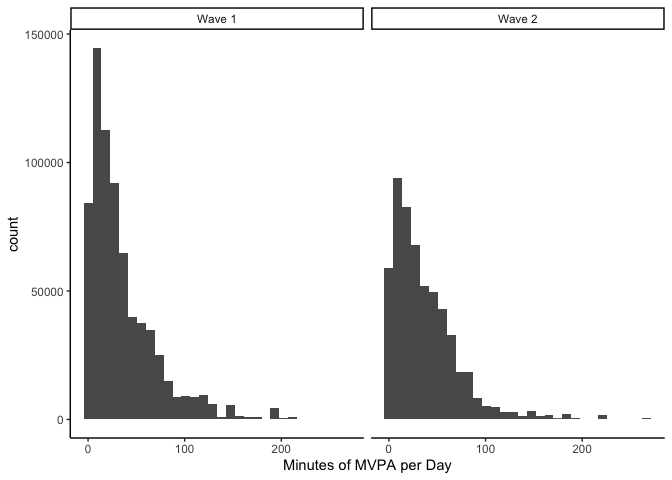

## Libraries


```r
library(lme4)
```

```
## Loading required package: Matrix
```

```r
library(tidyverse)
```

```
## ── Attaching packages ───────────────────────────────────────────────────────────────── tidyverse 1.3.0 ──
```

```
## ✓ ggplot2 3.3.2     ✓ purrr   0.3.4
## ✓ tibble  3.0.3     ✓ dplyr   1.0.2
## ✓ tidyr   1.1.2     ✓ stringr 1.4.0
## ✓ readr   1.3.1     ✓ forcats 0.5.0
```

```
## ── Conflicts ──────────────────────────────────────────────────────────────────── tidyverse_conflicts() ──
## x tidyr::expand() masks Matrix::expand()
## x dplyr::filter() masks stats::filter()
## x dplyr::lag()    masks stats::lag()
## x tidyr::pack()   masks Matrix::pack()
## x tidyr::unpack() masks Matrix::unpack()
```

```r
library(gtools)
library(lubridate)
```

```
## 
## Attaching package: 'lubridate'
```

```
## The following objects are masked from 'package:base':
## 
##     date, intersect, setdiff, union
```

```r
library(DRDID)
library(did)
```

```
## Registered S3 methods overwritten by 'car':
##   method                          from
##   influence.merMod                lme4
##   cooks.distance.influence.merMod lme4
##   dfbeta.influence.merMod         lme4
##   dfbetas.influence.merMod        lme4
```

```r
library(modelsummary)
library(broom.mixed)
```

```
## Registered S3 method overwritten by 'broom.mixed':
##   method      from 
##   tidy.gamlss broom
```


## Analysis plan

1. Descriptive statistics outcome and exposure
2. Merge in demographic and weather variables 
3. Regression outcome and exposure (as per change discussions)
4. Sensitivity analysis (exposure changes)

### Read in data


```r
data <- read_csv("/Users/dfuller/Documents/INTERACT/data/sensors/sd_data_exposure.csv")
```

```
## Parsed with column specification:
## cols(
##   .default = col_double(),
##   utcdate = col_datetime(format = ""),
##   zone = col_character(),
##   activity_levels = col_character(),
##   gender = col_character(),
##   income = col_character(),
##   education = col_logical(),
##   city_id = col_character(),
##   date = col_date(format = "")
## )
```

```
## See spec(...) for full column specifications.
```

```
## Warning: 550640 parsing failures.
##    row       col           expected            actual                                                                  file
## 708730 education 1/0/T/F/TRUE/FALSE University degree '/Users/dfuller/Documents/INTERACT/data/sensors/sd_data_exposure.csv'
## 708731 education 1/0/T/F/TRUE/FALSE University degree '/Users/dfuller/Documents/INTERACT/data/sensors/sd_data_exposure.csv'
## 708732 education 1/0/T/F/TRUE/FALSE University degree '/Users/dfuller/Documents/INTERACT/data/sensors/sd_data_exposure.csv'
## 708733 education 1/0/T/F/TRUE/FALSE University degree '/Users/dfuller/Documents/INTERACT/data/sensors/sd_data_exposure.csv'
## 708734 education 1/0/T/F/TRUE/FALSE University degree '/Users/dfuller/Documents/INTERACT/data/sensors/sd_data_exposure.csv'
## ...... ......... .................. ................. .....................................................................
## See problems(...) for more details.
```

## Demographic data and weather

### Merging demographics


```r
health_data <- read_csv("/Users/dfuller/Documents/INTERACT/data/health_clean.csv")
```

```
## Parsed with column specification:
## cols(
##   .default = col_double(),
##   city_id = col_character(),
##   questionnaire_lang.x = col_character(),
##   date_of_survey = col_date(format = ""),
##   mode_used = col_character(),
##   mode_used_txt = col_character(),
##   cars_access_outside = col_character(),
##   cars_access_outside_txt = col_character(),
##   bike_access_options = col_character(),
##   bike_access_options_txt = col_character(),
##   tracking1_txt = col_character(),
##   house_tenure_txt = col_character(),
##   dwelling_type_txt = col_character(),
##   residence = col_date(format = ""),
##   gender_txt = col_character(),
##   sex_txt = col_logical(),
##   living_arrange = col_character(),
##   living_arrange_txt = col_character(),
##   group_id_mtl = col_character(),
##   group_id_mtl_txt = col_character(),
##   employment_txt = col_character()
##   # ... with 204 more columns
## )
```

```
## See spec(...) for full column specifications.
```

```
## Warning: 35032 parsing failures.
##  row            col           expected actual                                                      file
## 1156 sask_bus_pass  1/0/T/F/TRUE/FALSE     2  '/Users/dfuller/Documents/INTERACT/data/health_clean.csv'
## 1156 bus_safe       1/0/T/F/TRUE/FALSE     2  '/Users/dfuller/Documents/INTERACT/data/health_clean.csv'
## 1156 bus_reliable   1/0/T/F/TRUE/FALSE     2  '/Users/dfuller/Documents/INTERACT/data/health_clean.csv'
## 1156 bus_convenient 1/0/T/F/TRUE/FALSE     2  '/Users/dfuller/Documents/INTERACT/data/health_clean.csv'
## 1156 bus_freq_a     1/0/T/F/TRUE/FALSE     91 '/Users/dfuller/Documents/INTERACT/data/health_clean.csv'
## .... .............. .................. ...... .........................................................
## See problems(...) for more details.
```

```r
health_data <- health_data %>%
                  select(education_recode, gender_recode2, income_recode, age_recode, white, asian, indigenous, black, latin_american, 
                         middle_eastern, other_ethnicity, interact_id)

data <- left_join(data, health_data, by = c("interact_id"))
```

### Merging weather


```r
weather_data <- read_csv("/Users/dfuller/Documents/INTERACT/data/weather/2016_2020_weather_vic_van_sask_mtl.csv")
```

```
## Parsed with column specification:
## cols(
##   .default = col_character(),
##   lon = col_double(),
##   lat = col_double(),
##   climate_id = col_double(),
##   date_time = col_date(format = ""),
##   year = col_double(),
##   data_quality = col_logical(),
##   max_temp_c = col_double(),
##   min_temp_c = col_double(),
##   mean_temp_c = col_double(),
##   heat_days_c = col_double(),
##   cool_days_c = col_double(),
##   total_rain_mm = col_double(),
##   total_snow_mm = col_double(),
##   total_precip_mm = col_double(),
##   snow_ground_cm = col_double(),
##   snow_ground_flag = col_logical(),
##   dir_gust_10s_deg = col_double()
## )
```

```
## See spec(...) for full column specifications.
```

```
## Warning: 1835 parsing failures.
##  row              col           expected actual                                                                                    file
## 1135 snow_ground_flag 1/0/T/F/TRUE/FALSE      E '/Users/dfuller/Documents/INTERACT/data/weather/2016_2020_weather_vic_van_sask_mtl.csv'
## 1473 snow_ground_flag 1/0/T/F/TRUE/FALSE      E '/Users/dfuller/Documents/INTERACT/data/weather/2016_2020_weather_vic_van_sask_mtl.csv'
## 1817 snow_ground_flag 1/0/T/F/TRUE/FALSE      E '/Users/dfuller/Documents/INTERACT/data/weather/2016_2020_weather_vic_van_sask_mtl.csv'
## 2964 snow_ground_flag 1/0/T/F/TRUE/FALSE      E '/Users/dfuller/Documents/INTERACT/data/weather/2016_2020_weather_vic_van_sask_mtl.csv'
## 2968 snow_ground_flag 1/0/T/F/TRUE/FALSE      E '/Users/dfuller/Documents/INTERACT/data/weather/2016_2020_weather_vic_van_sask_mtl.csv'
## .... ................ .................. ...... .......................................................................................
## See problems(...) for more details.
```

```r
weather_data <- weather_data %>% dplyr::select(date_time, city_id, max_temp_c, min_temp_c, mean_temp_c, total_rain_mm, total_snow_mm, total_precip_mm, snow_ground_cm, speed_gust_km_h)

weather_data$date <- ymd(weather_data$date_time)

weather_data <- weather_data %>% filter(city_id == "Victoria")

weather_data <- arrange(weather_data, date)
data <- arrange(data, date)

data <- left_join(data, weather_data, by = c("date"))
```

### Exposure over time 


```r
## Overall 
table(data$wave_id, data$exposed_70)
```

```
##    
##          0      1
##   1 690274  18455
##   2 519463  35876
```

```r
## Individual level
data_exposure <- data %>%
                  group_by(interact_id, wave_id, date) %>%
                    summarise(
                      sum_exp_70 = sum(exposed_70), 
                      sum_exp_50 = sum(exposed_50), 
                      sum_exp_100 = sum(exposed_100), 
                      mvpa = first(total_mvpa_minutes),
                      sed = first(total_sed_minutes),
                      light = first(total_light_pa_minutes),
                      rel_exp_70 = sum(exposed_70)/n()*100,
                      rel_exp_50 = sum(exposed_50)/n()*100,
                      rel_exp_100 = sum(exposed_100)/n()*100,
                      minutes = first(minutes_id_date),
                      mean_temp_c = first(mean_temp_c),
                      total_precip_mm = first(total_precip_mm),
                      snow_ground_cm = first(snow_ground_cm),
                      speed_gust_km_h = first(speed_gust_km_h),
                      education_recode = first(education_recode),
                      gender_recode2 = first(gender_recode2),
                      income_recode = first(income_recode),
                      age_recode = first(age_recode),
                      white = first(white),
                      asian = first(asian),
                      indigenous = first(indigenous),
                      black = first(black),
                      latin_american = first(latin_american),
                      middle_eastern = first(middle_eastern),
                      other_ethnicity - first(other_ethnicity)
                    )
```

```
## `summarise()` regrouping output by 'interact_id', 'wave_id', 'date' (override with `.groups` argument)
```

```r
data_exposure$date_time <- as.factor(data_exposure$date)

data_exposure$speed_gust_km_h <- as.numeric(data_exposure$speed_gust_km_h)
```

```
## Warning: NAs introduced by coercion
```

### Histograms of absolute exposure (Total number of minutes)


```r
summary(data_exposure$sum_exp_70)
```

```
##    Min. 1st Qu.  Median    Mean 3rd Qu.    Max. 
##    0.00    0.00    2.00   24.37   13.00  652.00
```

```r
### Removing participants with more than 500 minutes of exposure
data_exposure$sum_exp_70 <- if_else(data_exposure$sum_exp_70 > 500, NA_real_, data_exposure$sum_exp_70)
data_exposure$sum_exp_50 <- if_else(data_exposure$sum_exp_50 > 500, NA_real_, data_exposure$sum_exp_50)
data_exposure$sum_exp_100 <- if_else(data_exposure$sum_exp_100 > 500, NA_real_, data_exposure$sum_exp_100)

data_exposure <- data_exposure %>% 
                    mutate(
                      sum_exp_70_quint = ntile(sum_exp_70, 5),
                      sum_exp_50_quint = ntile(sum_exp_50, 5),
                      sum_exp_100_quint = ntile(sum_exp_100, 5)
                      )

data_exposure$sum_exp_70_quint <- as.factor(data_exposure$sum_exp_70_quint)
data_exposure$sum_exp_50_quint <- as.factor(data_exposure$sum_exp_50_quint)
data_exposure$sum_exp_100_quint <- as.factor(data_exposure$sum_exp_100_quint)

table(data_exposure$sum_exp_70_quint)
```

```
## 
##      1      2      3      4      5 
## 252741 252150 251586 251090 250472
```

```r
table(data_exposure$sum_exp_100_quint)
```

```
## 
##      1      2      3      4      5 
## 252227 251638 251075 250579 249961
```


```r
abs_exposure_histo <- ggplot(data_exposure, aes(sum_exp_70)) + 
  geom_histogram() + 
  facet_wrap(~ wave_id) + 
  theme_classic()

plot(abs_exposure_histo)
```

```
## `stat_bin()` using `bins = 30`. Pick better value with `binwidth`.
```

```
## Warning: Removed 6029 rows containing non-finite values (stat_bin).
```

<!-- -->

### Histograms of relative exposure (% of total minutes exposed)


```r
summary(data_exposure$rel_exp_70)
```

```
##     Min.  1st Qu.   Median     Mean  3rd Qu.     Max. 
##   0.0000   0.0000   0.4057   4.2981   2.3684 100.0000
```

```r
### Removing participants with more than 40% exposure
data_exposure$rel_exp_70 <- if_else(data_exposure$rel_exp_70 > 0.40, NA_real_, data_exposure$rel_exp_70)
data_exposure$rel_exp_50 <- if_else(data_exposure$rel_exp_50 > 0.40, NA_real_, data_exposure$rel_exp_50)
data_exposure$rel_exp_100 <- if_else(data_exposure$rel_exp_100 > 0.40, NA_real_, data_exposure$rel_exp_100)

data_exposure <- data_exposure %>% 
                    mutate(
                      rel_exp_70_quint = ntile(rel_exp_70, 5),
                      rel_exp_50_quint = ntile(rel_exp_50, 5),
                      rel_exp_100_quint = ntile(rel_exp_100, 5)
                      )
data_exposure$rel_exp_70_quint <- as.factor(data_exposure$rel_exp_70_quint)
data_exposure$rel_exp_50_quint <- as.factor(data_exposure$rel_exp_50_quint)
data_exposure$rel_exp_100_quint <- as.factor(data_exposure$rel_exp_100_quint)

table(data_exposure$rel_exp_70_quint)
```

```
## 
##      1      2      3      4      5 
## 126591 126295 126030 125776 125463
```

```r
table(data_exposure$rel_exp_100_quint)
```

```
## 
##      1      2      3      4      5 
## 113449 113181 112944 112708 112425
```


```r
rel_exposure_histo <- ggplot(data_exposure, aes(rel_exp_70)) + 
  geom_histogram() + 
  facet_wrap(~ wave_id) + 
  theme_classic()

plot(rel_exposure_histo)
```

```
## `stat_bin()` using `bins = 30`. Pick better value with `binwidth`.
```

```
## Warning: Removed 633913 rows containing non-finite values (stat_bin).
```

<!-- -->

### Histograms of Moderate to vigorous PA 


```r
pa_histo <- ggplot(data_exposure, aes(mvpa)) + 
  geom_histogram() + 
  facet_wrap(~ wave_id) + 
  theme_classic()

plot(pa_histo)
```

```
## `stat_bin()` using `bins = 30`. Pick better value with `binwidth`.
```

<!-- -->

### Scatterplot Absolute Exposure and Moderate to vigorous PA 


```r
abs_exp_pa_scatter <- ggplot(data_exposure, aes(x = sum_exp_70, y = mvpa)) + 
  geom_point(alpha = 0.2) +
  geom_smooth() +
  facet_wrap(~ wave_id) + 
  theme_classic()

plot(abs_exp_pa_scatter)
```

```
## `geom_smooth()` using method = 'gam' and formula 'y ~ s(x, bs = "cs")'
```

```
## Warning: Removed 6029 rows containing non-finite values (stat_smooth).
```

```
## Warning: Removed 6029 rows containing missing values (geom_point).
```

<!-- -->

### Scatterplot Relative Exposure and Moderate to vigorous PA 


```r
rel_exp_pa_scatter <- ggplot(data_exposure, aes(x = rel_exp_70, y = mvpa)) + 
  geom_point(alpha = 0.2) +
  geom_smooth() +
  facet_wrap(~ wave_id) + 
  theme_classic()

plot(rel_exp_pa_scatter)
```

```
## `geom_smooth()` using method = 'gam' and formula 'y ~ s(x, bs = "cs")'
```

```
## Warning: Removed 633913 rows containing non-finite values (stat_smooth).
```

```
## Warning: Removed 633913 rows containing missing values (geom_point).
```

<!-- -->

### Linear regression


```r
lm_models <- list(
  "Absolute Exposure" = lm(mvpa ~ sum_exp_70*factor(wave_id), data = data_exposure),
  "Relative Exposure" = lm(mvpa ~ rel_exp_70*factor(wave_id), data = data_exposure)
)

modelsummary(lm_models, fmt = "%.2f", statistic = 'conf.int')
```

<table class="table" style="width: auto !important; margin-left: auto; margin-right: auto;">
 <thead>
  <tr>
   <th style="text-align:left;">   </th>
   <th style="text-align:center;"> Absolute Exposure </th>
   <th style="text-align:center;"> Relative Exposure </th>
  </tr>
 </thead>
<tbody>
  <tr>
   <td style="text-align:left;"> (Intercept) </td>
   <td style="text-align:center;"> 33.28 </td>
   <td style="text-align:center;"> 34.90 </td>
  </tr>
  <tr>
   <td style="text-align:left;">  </td>
   <td style="text-align:center;"> [33.19, 33.36] </td>
   <td style="text-align:center;"> [34.79, 35.01] </td>
  </tr>
  <tr>
   <td style="text-align:left;"> sum_exp_70 </td>
   <td style="text-align:center;"> 0.13 </td>
   <td style="text-align:center;">  </td>
  </tr>
  <tr>
   <td style="text-align:left;">  </td>
   <td style="text-align:center;"> [0.13, 0.13] </td>
   <td style="text-align:center;">  </td>
  </tr>
  <tr>
   <td style="text-align:left;"> factor(wave_id)2 </td>
   <td style="text-align:center;"> 2.63 </td>
   <td style="text-align:center;"> 4.53 </td>
  </tr>
  <tr>
   <td style="text-align:left;">  </td>
   <td style="text-align:center;"> [2.50, 2.76] </td>
   <td style="text-align:center;"> [4.29, 4.78] </td>
  </tr>
  <tr>
   <td style="text-align:left;"> sum_exp_70 × factor(wave_id)2 </td>
   <td style="text-align:center;"> -0.09 </td>
   <td style="text-align:center;">  </td>
  </tr>
  <tr>
   <td style="text-align:left;">  </td>
   <td style="text-align:center;"> [-0.09, -0.09] </td>
   <td style="text-align:center;">  </td>
  </tr>
  <tr>
   <td style="text-align:left;"> rel_exp_70 </td>
   <td style="text-align:center;">  </td>
   <td style="text-align:center;"> -6.38 </td>
  </tr>
  <tr>
   <td style="text-align:left;">  </td>
   <td style="text-align:center;">  </td>
   <td style="text-align:center;"> [-7.49, -5.28] </td>
  </tr>
  <tr>
   <td style="text-align:left;"> rel_exp_70 × factor(wave_id)2 </td>
   <td style="text-align:center;">  </td>
   <td style="text-align:center;"> -29.24 </td>
  </tr>
  <tr>
   <td style="text-align:left;box-shadow: 0px 1px">  </td>
   <td style="text-align:center;box-shadow: 0px 1px">  </td>
   <td style="text-align:center;box-shadow: 0px 1px"> [-31.01, -27.47] </td>
  </tr>
  <tr>
   <td style="text-align:left;"> Num.Obs. </td>
   <td style="text-align:center;"> 1258039 </td>
   <td style="text-align:center;"> 630155 </td>
  </tr>
  <tr>
   <td style="text-align:left;"> R2 </td>
   <td style="text-align:center;"> 0.021 </td>
   <td style="text-align:center;"> 0.005 </td>
  </tr>
  <tr>
   <td style="text-align:left;"> R2 Adj. </td>
   <td style="text-align:center;"> 0.021 </td>
   <td style="text-align:center;"> 0.005 </td>
  </tr>
  <tr>
   <td style="text-align:left;"> AIC </td>
   <td style="text-align:center;"> 12474739.8 </td>
   <td style="text-align:center;"> 6320408.5 </td>
  </tr>
  <tr>
   <td style="text-align:left;"> BIC </td>
   <td style="text-align:center;"> 12474800.0 </td>
   <td style="text-align:center;"> 6320465.3 </td>
  </tr>
  <tr>
   <td style="text-align:left;"> Log.Lik. </td>
   <td style="text-align:center;"> -6237364.880 </td>
   <td style="text-align:center;"> -3160199.251 </td>
  </tr>
  <tr>
   <td style="text-align:left;"> F </td>
   <td style="text-align:center;"> 8964.212 </td>
   <td style="text-align:center;"> 986.314 </td>
  </tr>
</tbody>
</table>

## Multilevel models 

MLM models with person level random intercepts using the lmer package

### Absolute exposure with a 70 meter buffer and no covariates


```r
### Null Model
lmer_null_exp70_ln <- lmer(mvpa ~ 1 + (1 | date_time) + (1 | interact_id), data = data_exposure)
summary(lmer_null_exp70_ln)
```

```
## Linear mixed model fit by REML ['lmerMod']
## Formula: mvpa ~ 1 + (1 | date_time) + (1 | interact_id)
##    Data: data_exposure
## 
## REML criterion at convergence: 11793864
## 
## Scaled residuals: 
##     Min      1Q  Median      3Q     Max 
## -5.5956 -0.6201 -0.0680  0.4895  5.3456 
## 
## Random effects:
##  Groups      Name        Variance Std.Dev.
##  date_time   (Intercept) 387.4    19.68   
##  interact_id (Intercept) 601.8    24.53   
##  Residual                657.8    25.65   
## Number of obs: 1264068, groups:  date_time, 345; interact_id, 210
## 
## Fixed effects:
##             Estimate Std. Error t value
## (Intercept)   31.268      1.998   15.65
```

```r
broom.mixed::glance(lmer_null_exp70_ln)
```

```
## # A tibble: 1 x 6
##   sigma    logLik       AIC       BIC  REMLcrit df.residual
##   <dbl>     <dbl>     <dbl>     <dbl>     <dbl>       <int>
## 1  25.6 -5896932. 11793872. 11793920. 11793864.     1264064
```


```r
### Absolute Model Continuous
lmer_abs_exp70_ln <- lmer(mvpa ~ sum_exp_70*factor(wave_id) + (1 | date_time) + (1 | interact_id), data = data_exposure)
summary(lmer_abs_exp70_ln)
```

```
## Linear mixed model fit by REML ['lmerMod']
## Formula: mvpa ~ sum_exp_70 * factor(wave_id) + (1 | date_time) + (1 |  
##     interact_id)
##    Data: data_exposure
## 
## REML criterion at convergence: 11693416
## 
## Scaled residuals: 
##     Min      1Q  Median      3Q     Max 
## -5.6239 -0.6205 -0.0685  0.4924  5.3155 
## 
## Random effects:
##  Groups      Name        Variance Std.Dev.
##  date_time   (Intercept) 368.4    19.19   
##  interact_id (Intercept) 578.7    24.06   
##  Residual                635.0    25.20   
## Number of obs: 1258039, groups:  date_time, 345; interact_id, 210
## 
## Fixed effects:
##                              Estimate Std. Error t value
## (Intercept)                 34.060747   2.193749  15.526
## sum_exp_70                   0.112015   0.001121  99.880
## factor(wave_id)2            -9.383958   2.080260  -4.511
## sum_exp_70:factor(wave_id)2 -0.067613   0.001295 -52.191
## 
## Correlation of Fixed Effects:
##             (Intr) sm__70 fc(_)2
## sum_exp_70  -0.007              
## fctr(wv_d)2 -0.452  0.004       
## sm__70:(_)2  0.005 -0.854 -0.007
```

```r
broom.mixed::glance(lmer_abs_exp70_ln)
```

```
## # A tibble: 1 x 6
##   sigma    logLik       AIC       BIC  REMLcrit df.residual
##   <dbl>     <dbl>     <dbl>     <dbl>     <dbl>       <int>
## 1  25.2 -5846708. 11693430. 11693514. 11693416.     1258032
```

```r
### Absolute Model Quintiles
lmer_abs_exp70_q <- lmer(mvpa ~ sum_exp_70_quint*factor(wave_id) + (1 | date_time) + (1 | interact_id), data = data_exposure)
summary(lmer_abs_exp70_q)
```

```
## Linear mixed model fit by REML ['lmerMod']
## Formula: mvpa ~ sum_exp_70_quint * factor(wave_id) + (1 | date_time) +  
##     (1 | interact_id)
##    Data: data_exposure
## 
## REML criterion at convergence: 11707345
## 
## Scaled residuals: 
##     Min      1Q  Median      3Q     Max 
## -5.6649 -0.6214 -0.0692  0.4893  5.2771 
## 
## Random effects:
##  Groups      Name        Variance Std.Dev.
##  date_time   (Intercept) 365.5    19.12   
##  interact_id (Intercept) 598.7    24.47   
##  Residual                642.1    25.34   
## Number of obs: 1258039, groups:  date_time, 345; interact_id, 210
## 
## Fixed effects:
##                                      Estimate Std. Error t value
## (Intercept)                        35.7553267  2.2124153  16.161
## sum_exp_70_quint2                   0.0116068  0.0950237   0.122
## sum_exp_70_quint3                   0.0196437  0.0950777   0.207
## sum_exp_70_quint4                   0.0301662  0.0951244   0.317
## sum_exp_70_quint5                   0.0396170  0.0951846   0.416
## factor(wave_id)2                   -9.3715729  2.0740308  -4.519
## sum_exp_70_quint2:factor(wave_id)2 -0.0001054  0.1438100  -0.001
## sum_exp_70_quint3:factor(wave_id)2  0.0039051  0.1438904   0.027
## sum_exp_70_quint4:factor(wave_id)2  0.0040488  0.1439619   0.028
## sum_exp_70_quint5:factor(wave_id)2  0.0007502  0.1440504   0.005
## 
## Correlation of Fixed Effects:
##             (Intr) sm__70_2 sm__70_3 sm__70_4 sm__70_5 fc(_)2 s__70_2: s__70_3:
## sm_xp_70_q2 -0.021                                                             
## sm_xp_70_q3 -0.021  0.499                                                      
## sm_xp_70_q4 -0.021  0.499    0.499                                             
## sm_xp_70_q5 -0.021  0.499    0.498    0.498                                    
## fctr(wv_d)2 -0.447  0.023    0.023    0.023    0.023                           
## s__70_2:(_)  0.014 -0.661   -0.330   -0.330   -0.329   -0.035                  
## s__70_3:(_)  0.014 -0.330   -0.661   -0.329   -0.329   -0.035  0.499           
## s__70_4:(_)  0.014 -0.330   -0.329   -0.661   -0.329   -0.035  0.499    0.499  
## s__70_5:(_)  0.014 -0.329   -0.329   -0.329   -0.661   -0.035  0.499    0.498  
##             s__70_4:
## sm_xp_70_q2         
## sm_xp_70_q3         
## sm_xp_70_q4         
## sm_xp_70_q5         
## fctr(wv_d)2         
## s__70_2:(_)         
## s__70_3:(_)         
## s__70_4:(_)         
## s__70_5:(_)  0.498
```

```r
broom.mixed::glance(lmer_abs_exp70_q)
```

```
## # A tibble: 1 x 6
##   sigma    logLik       AIC       BIC  REMLcrit df.residual
##   <dbl>     <dbl>     <dbl>     <dbl>     <dbl>       <int>
## 1  25.3 -5853672. 11707371. 11707527. 11707345.     1258026
```

### Absolute exposure with a 70 meter buffer and covariates

```r
### Absolute Model Continuous
lmer_abs_exp70_ln_cov <- lmer(mvpa ~ sum_exp_70*factor(wave_id) + mean_temp_c + total_precip_mm + speed_gust_km_h + gender_recode2 + income_recode + age_recode + (1 | date_time) + (1 | interact_id), data = data_exposure)
summary(lmer_abs_exp70_ln_cov)
```

```
## Linear mixed model fit by REML ['lmerMod']
## Formula: mvpa ~ sum_exp_70 * factor(wave_id) + mean_temp_c + total_precip_mm +  
##     speed_gust_km_h + gender_recode2 + income_recode + age_recode +  
##     (1 | date_time) + (1 | interact_id)
##    Data: data_exposure
## 
## REML criterion at convergence: 6453454
## 
## Scaled residuals: 
##     Min      1Q  Median      3Q     Max 
## -3.9465 -0.5699 -0.0554  0.5054  5.3845 
## 
## Random effects:
##  Groups      Name        Variance Std.Dev.
##  date_time   (Intercept) 326.9    18.08   
##  interact_id (Intercept) 494.3    22.23   
##  Residual                552.4    23.50   
## Number of obs: 704845, groups:  date_time, 225; interact_id, 134
## 
## Fixed effects:
##                                            Estimate Std. Error t value
## (Intercept)                               31.505698  12.321525   2.557
## sum_exp_70                                 0.115439   0.001296  89.041
## factor(wave_id)2                           0.932909   3.185039   0.293
## mean_temp_c                               -0.544184   0.301100  -1.807
## total_precip_mm                           -0.013153   0.255321  -0.052
## speed_gust_km_h                            0.070658   0.136199   0.519
## gender_recode2Transgender                -22.910528  16.215112  -1.413
## gender_recode2Woman                       -9.002616   4.034274  -2.232
## income_recode100_200                      -0.043974  11.056868  -0.004
## income_recode20_49 999                    12.140214  11.492475   1.056
## income_recode200+                         19.114408  24.883528   0.768
## income_recode50_99 999                    -0.448353  10.735565  -0.042
## income_recodeDon't know/prefer no answer   4.633075  12.896138   0.359
## age_recode30_39                            7.741094   6.329654   1.223
## age_recode40_49                            9.105662   6.714743   1.356
## age_recode50_64                            8.883314   7.574856   1.173
## age_recode65+                             -0.334705   7.983239  -0.042
## sum_exp_70:factor(wave_id)2               -0.157591   0.001728 -91.194
```

```
## 
## Correlation matrix not shown by default, as p = 18 > 12.
## Use print(x, correlation=TRUE)  or
##     vcov(x)        if you need it
```

```r
confint(lmer_abs_exp70_ln_cov)
```

```
## Computing profile confidence intervals ...
```

```
##                                                2.5 %      97.5 %
## .sig01                                    16.3586208 19.70977629
## .sig02                                    18.9249967 24.06009304
## .sigma                                    23.4642380 23.54185945
## (Intercept)                                8.0899962 54.91238698
## sum_exp_70                                 0.1128907  0.11797280
## factor(wave_id)2                          -5.2762226  7.14130653
## mean_temp_c                               -1.1309341  0.04299351
## total_precip_mm                           -0.5108665  0.48455507
## speed_gust_km_h                           -0.1948405  0.33615703
## gender_recode2Transgender                -53.4858376  7.66727783
## gender_recode2Woman                      -16.6096171 -1.39473327
## income_recode100_200                     -20.8935319 20.80595787
## income_recode20_49 999                    -9.5310700 33.81118963
## income_recode200+                        -27.8086666 66.03640408
## income_recode50_99 999                   -20.6921322 19.79557550
## income_recodeDon't know/prefer no answer -19.6851974 28.95088149
## age_recode30_39                           -4.1950750 19.67659172
## age_recode40_49                           -3.5560175 21.76787200
## age_recode50_64                           -5.4010248 23.16658906
## age_recode65+                            -15.3882653 14.71964474
## sum_exp_70:factor(wave_id)2               -0.1609702 -0.15419636
```

```r
broom.mixed::glance(lmer_abs_exp70_ln_cov)
```

```
## # A tibble: 1 x 6
##   sigma    logLik      AIC      BIC REMLcrit df.residual
##   <dbl>     <dbl>    <dbl>    <dbl>    <dbl>       <int>
## 1  23.5 -3226727. 6453496. 6453736. 6453454.      704824
```

```r
### Absolute Model Quintiles
lmer_abs_exp70_q_cov <- lmer(mvpa ~ sum_exp_70_quint*factor(wave_id) + mean_temp_c + total_precip_mm + speed_gust_km_h + gender_recode2 + income_recode + age_recode + (1 | date_time) + (1 | interact_id), data = data_exposure)
summary(lmer_abs_exp70_q_cov)
```

```
## Linear mixed model fit by REML ['lmerMod']
## Formula: 
## mvpa ~ sum_exp_70_quint * factor(wave_id) + mean_temp_c + total_precip_mm +  
##     speed_gust_km_h + gender_recode2 + income_recode + age_recode +  
##     (1 | date_time) + (1 | interact_id)
##    Data: data_exposure
## 
## REML criterion at convergence: 6462817
## 
## Scaled residuals: 
##     Min      1Q  Median      3Q     Max 
## -3.9786 -0.5564 -0.0447  0.4969  5.3555 
## 
## Random effects:
##  Groups      Name        Variance Std.Dev.
##  date_time   (Intercept) 324.5    18.01   
##  interact_id (Intercept) 474.0    21.77   
##  Residual                559.8    23.66   
## Number of obs: 704845, groups:  date_time, 225; interact_id, 134
## 
## Fixed effects:
##                                            Estimate Std. Error t value
## (Intercept)                               32.230501  12.128282   2.657
## sum_exp_70_quint2                          0.010197   0.097314   0.105
## sum_exp_70_quint3                          0.018344   0.097369   0.188
## sum_exp_70_quint4                          0.029048   0.097419   0.298
## sum_exp_70_quint5                          0.036122   0.097481   0.371
## factor(wave_id)2                          -1.700241   3.176737  -0.535
## mean_temp_c                               -0.505224   0.300001  -1.684
## total_precip_mm                           -0.017584   0.254380  -0.069
## speed_gust_km_h                            0.047873   0.135696   0.353
## gender_recode2Transgender                -22.086227  15.878532  -1.391
## gender_recode2Woman                       -8.393268   3.950562  -2.125
## income_recode100_200                      -0.480690  10.827360  -0.044
## income_recode20_49 999                    12.874443  11.253911   1.144
## income_recode200+                         17.045033  24.367059   0.700
## income_recode50_99 999                     0.262062  10.512710   0.025
## income_recodeDon't know/prefer no answer   4.264155  12.628457   0.338
## age_recode30_39                            8.184408   6.198305   1.320
## age_recode40_49                            9.797109   6.575328   1.490
## age_recode50_64                            8.758135   7.417635   1.181
## age_recode65+                             -0.606259   7.817576  -0.078
## sum_exp_70_quint2:factor(wave_id)2         0.003353   0.240179   0.014
## sum_exp_70_quint3:factor(wave_id)2         0.007679   0.240338   0.032
## sum_exp_70_quint4:factor(wave_id)2        -0.003539   0.240456  -0.015
## sum_exp_70_quint5:factor(wave_id)2        -0.001609   0.240573  -0.007
```

```
## 
## Correlation matrix not shown by default, as p = 24 > 12.
## Use print(x, correlation=TRUE)  or
##     vcov(x)        if you need it
```

```r
confint(lmer_abs_exp70_q_cov)
```

```
## Computing profile confidence intervals ...
```

```
##                                                2.5 %      97.5 %
## .sig01                                    16.2982024 19.63600425
## .sig02                                    18.5325585 23.56125860
## .sigma                                    23.6208880 23.69902771
## (Intercept)                                9.1764815 55.27522732
## sum_exp_70_quint2                         -0.1805335  0.20092863
## sum_exp_70_quint3                         -0.1724940  0.20918468
## sum_exp_70_quint4                         -0.1618874  0.21998575
## sum_exp_70_quint5                         -0.1549347  0.22718031
## factor(wave_id)2                          -7.8930501  4.49198426
## mean_temp_c                               -1.0898149  0.07981194
## total_precip_mm                           -0.5134590  0.47827995
## speed_gust_km_h                           -0.2166370  0.31239306
## gender_recode2Transgender                -52.0279305  7.85787497
## gender_recode2Woman                      -15.8427190 -0.94302797
## income_recode100_200                     -20.8981073 19.93722178
## income_recode20_49 999                    -8.3477650 34.09621997
## income_recode200+                        -28.9056084 62.99482935
## income_recode50_99 999                   -19.5621633 20.08643214
## income_recodeDon't know/prefer no answer -19.5501894 28.07799905
## age_recode30_39                           -3.5045066 19.87259592
## age_recode40_49                           -2.6021257 22.19681766
## age_recode50_64                           -5.2302731 22.74536290
## age_recode65+                            -15.3479650 14.13618736
## sum_exp_70_quint2:factor(wave_id)2        -0.4673875  0.47409212
## sum_exp_70_quint3:factor(wave_id)2        -0.4633727  0.47873093
## sum_exp_70_quint4:factor(wave_id)2        -0.4748220  0.46774496
## sum_exp_70_quint5:factor(wave_id)2        -0.4731205  0.46990447
```

```r
broom.mixed::glance(lmer_abs_exp70_q_cov)
```

```
## # A tibble: 1 x 6
##   sigma    logLik      AIC      BIC REMLcrit df.residual
##   <dbl>     <dbl>    <dbl>    <dbl>    <dbl>       <int>
## 1  23.7 -3231409. 6462871. 6463181. 6462817.      704818
```

## Relative Exposure

### Relative exposure with a 70 meter buffer and no covariates


```r
### Linear exposure
lmer_rel_exp_ln <- lmer(mvpa ~ rel_exp_70*factor(wave_id) + (1 | date_time) + (1 | interact_id), data = data_exposure)
summary(lmer_rel_exp_ln)
```

```
## Linear mixed model fit by REML ['lmerMod']
## Formula: mvpa ~ rel_exp_70 * factor(wave_id) + (1 | date_time) + (1 |  
##     interact_id)
##    Data: data_exposure
## 
## REML criterion at convergence: 5764439
## 
## Scaled residuals: 
##     Min      1Q  Median      3Q     Max 
## -5.9724 -0.5727 -0.0011  0.4413  4.9159 
## 
## Random effects:
##  Groups      Name        Variance Std.Dev.
##  date_time   (Intercept) 655.3    25.60   
##  interact_id (Intercept) 951.6    30.85   
##  Residual                546.6    23.38   
## Number of obs: 630155, groups:  date_time, 314; interact_id, 194
## 
## Fixed effects:
##                             Estimate Std. Error t value
## (Intercept)                  27.5699     2.9505   9.344
## rel_exp_70                    4.5335     0.4926   9.203
## factor(wave_id)2              0.3365     2.9943   0.112
## rel_exp_70:factor(wave_id)2 -39.7329     0.9180 -43.284
## 
## Correlation of Fixed Effects:
##             (Intr) rl__70 fc(_)2
## rel_exp_70  -0.006              
## fctr(wv_d)2 -0.442  0.006       
## rl__70:(_)2  0.005 -0.560 -0.023
```

```r
### Quintiles of exposure
lmer_rel_exp_q <- lmer(mvpa ~ rel_exp_70_quint*factor(wave_id) + (1 | date_time) + (1 | interact_id), data = data_exposure)
summary(lmer_rel_exp_q)
```

```
## Linear mixed model fit by REML ['lmerMod']
## Formula: mvpa ~ rel_exp_70_quint * factor(wave_id) + (1 | date_time) +  
##     (1 | interact_id)
##    Data: data_exposure
## 
## REML criterion at convergence: 5766659
## 
## Scaled residuals: 
##     Min      1Q  Median      3Q     Max 
## -5.5220 -0.5769 -0.0008  0.4239  4.8934 
## 
## Random effects:
##  Groups      Name        Variance Std.Dev.
##  date_time   (Intercept) 653.7    25.57   
##  interact_id (Intercept) 954.7    30.90   
##  Residual                548.6    23.42   
## Number of obs: 630155, groups:  date_time, 314; interact_id, 194
## 
## Fixed effects:
##                                     Estimate Std. Error t value
## (Intercept)                        28.008444   2.952231   9.487
## rel_exp_70_quint2                   0.009753   0.107489   0.091
## rel_exp_70_quint3                   0.014013   0.107549   0.130
## rel_exp_70_quint4                   0.022555   0.107603   0.210
## rel_exp_70_quint5                   0.032862   0.107671   0.305
## factor(wave_id)2                   -3.106395   2.992894  -1.038
## rel_exp_70_quint2:factor(wave_id)2 -0.010006   0.215407  -0.046
## rel_exp_70_quint3:factor(wave_id)2 -0.006069   0.215506  -0.028
## rel_exp_70_quint4:factor(wave_id)2 -0.013846   0.215618  -0.064
## rel_exp_70_quint5:factor(wave_id)2 -0.016296   0.215752  -0.076
## 
## Correlation of Fixed Effects:
##             (Intr) rl__70_2 rl__70_3 rl__70_4 rl__70_5 fc(_)2 r__70_2: r__70_3:
## rl_xp_70_q2 -0.018                                                             
## rl_xp_70_q3 -0.018  0.499                                                      
## rl_xp_70_q4 -0.018  0.499    0.499                                             
## rl_xp_70_q5 -0.018  0.499    0.498    0.498                                    
## fctr(wv_d)2 -0.441  0.018    0.018    0.018    0.018                           
## r__70_2:(_)  0.009 -0.499   -0.249   -0.249   -0.249   -0.036                  
## r__70_3:(_)  0.009 -0.249   -0.499   -0.249   -0.249   -0.036  0.499           
## r__70_4:(_)  0.009 -0.249   -0.249   -0.499   -0.249   -0.036  0.499    0.499  
## r__70_5:(_)  0.009 -0.249   -0.249   -0.249   -0.499   -0.036  0.499    0.498  
##             r__70_4:
## rl_xp_70_q2         
## rl_xp_70_q3         
## rl_xp_70_q4         
## rl_xp_70_q5         
## fctr(wv_d)2         
## r__70_2:(_)         
## r__70_3:(_)         
## r__70_4:(_)         
## r__70_5:(_)  0.498
```

### Relative exposure with a 70 meter buffer and covariates


```r
### Linear exposure
lmer_rel_exp_ln_cov <- lmer(mvpa ~ rel_exp_70*factor(wave_id) + mean_temp_c + total_precip_mm + speed_gust_km_h + gender_recode2 + income_recode + age_recode + (1 | date_time) + (1 | interact_id), data = data_exposure)
summary(lmer_rel_exp_ln_cov)
```

```
## Linear mixed model fit by REML ['lmerMod']
## Formula: mvpa ~ rel_exp_70 * factor(wave_id) + mean_temp_c + total_precip_mm +  
##     speed_gust_km_h + gender_recode2 + income_recode + age_recode +  
##     (1 | date_time) + (1 | interact_id)
##    Data: data_exposure
## 
## REML criterion at convergence: 3752189
## 
## Scaled residuals: 
##     Min      1Q  Median      3Q     Max 
## -4.4853 -0.5558 -0.0006  0.4797  5.1648 
## 
## Random effects:
##  Groups      Name        Variance Std.Dev.
##  date_time   (Intercept) 1067.1   32.67   
##  interact_id (Intercept) 1241.3   35.23   
##  Residual                 485.6   22.04   
## Number of obs: 415555, groups:  date_time, 200; interact_id, 124
## 
## Fixed effects:
##                                          Estimate Std. Error t value
## (Intercept)                              -19.0831    20.6542  -0.924
## rel_exp_70                                 0.4159     0.5287   0.787
## factor(wave_id)2                          13.5784     7.0225   1.934
## mean_temp_c                                1.2277     0.5663   2.168
## total_precip_mm                           -0.1738     0.4725  -0.368
## speed_gust_km_h                            0.3900     0.2548   1.531
## gender_recode2Transgender                -27.7747    36.0812  -0.770
## gender_recode2Woman                      -13.0860     6.6628  -1.964
## income_recode100_200                      21.2360    17.8222   1.192
## income_recode20_49 999                    25.1849    18.2219   1.382
## income_recode200+                         27.5654    39.5312   0.697
## income_recode50_99 999                    10.7010    17.2440   0.621
## income_recodeDon't know/prefer no answer  13.2950    20.5704   0.646
## age_recode30_39                            2.1388    10.9870   0.195
## age_recode40_49                            3.1598    11.6052   0.272
## age_recode50_64                            1.5450    12.6365   0.122
## age_recode65+                              2.8364    13.1088   0.216
## rel_exp_70:factor(wave_id)2               -2.3361     2.4464  -0.955
```

```
## 
## Correlation matrix not shown by default, as p = 18 > 12.
## Use print(x, correlation=TRUE)  or
##     vcov(x)        if you need it
```

```r
confint(lmer_rel_exp_ln_cov)
```

```
## Computing profile confidence intervals ...
```

```
##                                                 2.5 %      97.5 %
## .sig01                                    29.33296773  35.7697770
## .sig02                                    29.72105692  38.1842335
## .sigma                                    21.98926651  22.0840644
## (Intercept)                              -58.26286396  20.1618355
## rel_exp_70                                -0.62169207   1.4505848
## factor(wave_id)2                          -0.09665424  27.2488256
## mean_temp_c                                0.12369724   2.3287915
## total_precip_mm                           -1.09343896   0.7463471
## speed_gust_km_h                           -0.10621172   0.8858099
## gender_recode2Transgender                -95.58769725  40.0239673
## gender_recode2Woman                      -25.60343256  -0.5612155
## income_recode100_200                     -12.26614888  54.7173800
## income_recode20_49 999                    -9.06533454  59.4204685
## income_recode200+                        -46.71819092 101.8570477
## income_recode50_99 999                   -21.71203154  43.0984929
## income_recodeDon't know/prefer no answer -25.36366953  51.9489101
## age_recode30_39                          -18.51106045  22.7832361
## age_recode40_49                          -18.65272165  24.9653237
## age_recode50_64                          -22.20058782  25.2932197
## age_recode65+                            -21.80019467  27.4690724
## rel_exp_70:factor(wave_id)2               -7.17598283   2.4185696
```

```r
### Quintiles of exposure
lmer_rel_exp_q_cov <- lmer(mvpa ~ rel_exp_70_quint*factor(wave_id) + mean_temp_c + total_precip_mm + speed_gust_km_h + gender_recode2 + income_recode + age_recode + (1 | date_time) + (1 | interact_id), data = data_exposure)
summary(lmer_rel_exp_q_cov)
```

```
## Linear mixed model fit by REML ['lmerMod']
## Formula: 
## mvpa ~ rel_exp_70_quint * factor(wave_id) + mean_temp_c + total_precip_mm +  
##     speed_gust_km_h + gender_recode2 + income_recode + age_recode +  
##     (1 | date_time) + (1 | interact_id)
##    Data: data_exposure
## 
## REML criterion at convergence: 3752206
## 
## Scaled residuals: 
##     Min      1Q  Median      3Q     Max 
## -4.4852 -0.5557 -0.0003  0.4800  5.1640 
## 
## Random effects:
##  Groups      Name        Variance Std.Dev.
##  date_time   (Intercept) 1069.6   32.71   
##  interact_id (Intercept) 1242.8   35.25   
##  Residual                 485.6   22.04   
## Number of obs: 415555, groups:  date_time, 200; interact_id, 124
## 
## Fixed effects:
##                                            Estimate Std. Error t value
## (Intercept)                              -19.102121  20.671342  -0.924
## rel_exp_70_quint2                          0.005946   0.111493   0.053
## rel_exp_70_quint3                          0.009087   0.111555   0.081
## rel_exp_70_quint4                          0.017826   0.111613   0.160
## rel_exp_70_quint5                          0.026336   0.111682   0.236
## factor(wave_id)2                          13.433612   7.034273   1.910
## mean_temp_c                                1.225710   0.566944   2.162
## total_precip_mm                           -0.173750   0.473041  -0.367
## speed_gust_km_h                            0.390867   0.255064   1.532
## gender_recode2Transgender                -27.811884  36.103671  -0.770
## gender_recode2Woman                      -13.104214   6.666919  -1.966
## income_recode100_200                      21.240708  17.833265   1.191
## income_recode20_49 999                    25.189984  18.233310   1.382
## income_recode200+                         27.659723  39.555754   0.699
## income_recode50_99 999                    10.699060  17.254808   0.620
## income_recodeDon't know/prefer no answer  13.303105  20.583271   0.646
## age_recode30_39                            2.177895  10.993734   0.198
## age_recode40_49                            3.184115  11.612413   0.274
## age_recode50_64                            1.591582  12.644369   0.126
## age_recode65+                              2.854845  13.117012   0.218
## rel_exp_70_quint2:factor(wave_id)2        -0.017905   0.444033  -0.040
## rel_exp_70_quint3:factor(wave_id)2        -0.004863   0.444268  -0.011
## rel_exp_70_quint4:factor(wave_id)2        -0.011148   0.444562  -0.025
## rel_exp_70_quint5:factor(wave_id)2        -0.012788   0.444759  -0.029
```

```
## 
## Correlation matrix not shown by default, as p = 24 > 12.
## Use print(x, correlation=TRUE)  or
##     vcov(x)        if you need it
```

```r
confint(lmer_rel_exp_q_cov)
```

```
## Computing profile confidence intervals ...
```

```
##                                                2.5 %      97.5 %
## .sig01                                    29.3711657  35.8122579
## .sig02                                    29.7410412  38.2088064
## .sigma                                    21.9892811  22.0840803
## (Intercept)                              -58.3170324  20.1756948
## rel_exp_70_quint2                         -0.2125750   0.2244670
## rel_exp_70_quint3                         -0.2095534   0.2277305
## rel_exp_70_quint4                         -0.2009288   0.2365838
## rel_exp_70_quint5                         -0.1925535   0.2452297
## factor(wave_id)2                          -0.2668573  27.1252087
## mean_temp_c                                0.1203889   2.3281474
## total_precip_mm                           -1.0945241   0.7475286
## speed_gust_km_h                           -0.1058969   0.8873404
## gender_recode2Transgender                -95.6687591  40.0313672
## gender_recode2Woman                      -25.6300773  -0.5716612
## income_recode100_200                     -12.2828016  54.7444278
## income_recode20_49 999                    -9.0822850  59.4482640
## income_recode200+                        -46.6718593 102.0002030
## income_recode50_99 999                   -21.7350397  43.1178936
## income_recodeDon't know/prefer no answer -25.3804817  51.9826475
## age_recode30_39                          -18.4847136  22.8362690
## age_recode40_49                          -18.6424041  25.0040977
## age_recode50_64                          -22.1690089  25.3556044
## age_recode65+                            -21.7975324  27.5038399
## rel_exp_70_quint2:factor(wave_id)2        -0.8881827   0.8523839
## rel_exp_70_quint3:factor(wave_id)2        -0.8755923   0.8658928
## rel_exp_70_quint4:factor(wave_id)2        -0.8824584   0.8601789
## rel_exp_70_quint5:factor(wave_id)2        -0.8844710   0.8589409
```

# Sensitivity Analysis for different buffers

## 50 Meter Buffer

Absolute Exposure 


```r
### Absolute Model Continuous
lmer_abs_exp50_ln <- lmer(mvpa ~ sum_exp_50*factor(wave_id) + (1 | date_time) + (1 | interact_id), data = data_exposure)
summary(lmer_abs_exp50_ln)
```

```
## Linear mixed model fit by REML ['lmerMod']
## Formula: mvpa ~ sum_exp_50 * factor(wave_id) + (1 | date_time) + (1 |  
##     interact_id)
##    Data: data_exposure
## 
## REML criterion at convergence: 11777746
## 
## Scaled residuals: 
##     Min      1Q  Median      3Q     Max 
## -5.5882 -0.6102 -0.0693  0.4968  5.1566 
## 
## Random effects:
##  Groups      Name        Variance Std.Dev.
##  date_time   (Intercept) 368.5    19.20   
##  interact_id (Intercept) 587.1    24.23   
##  Residual                652.6    25.55   
## Number of obs: 1263404, groups:  date_time, 345; interact_id, 210
## 
## Fixed effects:
##                              Estimate Std. Error t value
## (Intercept)                 34.308052   2.203054  15.573
## sum_exp_50                   0.117191   0.001324  88.519
## factor(wave_id)2            -9.219630   2.080847  -4.431
## sum_exp_50:factor(wave_id)2 -0.079950   0.001494 -53.529
## 
## Correlation of Fixed Effects:
##             (Intr) sm__50 fc(_)2
## sum_exp_50  -0.007              
## fctr(wv_d)2 -0.450  0.005       
## sm__50:(_)2  0.005 -0.882 -0.007
```

```r
### Absolute Model Quintiles
lmer_abs_exp50_q <- lmer(mvpa ~ sum_exp_50_quint*factor(wave_id) + (1 | date_time) + (1 | interact_id), data = data_exposure)
summary(lmer_abs_exp50_q)
```

```
## Linear mixed model fit by REML ['lmerMod']
## Formula: mvpa ~ sum_exp_50_quint * factor(wave_id) + (1 | date_time) +  
##     (1 | interact_id)
##    Data: data_exposure
## 
## REML criterion at convergence: 11788239
## 
## Scaled residuals: 
##     Min      1Q  Median      3Q     Max 
## -5.5950 -0.6201 -0.0680  0.4896  5.3444 
## 
## Random effects:
##  Groups      Name        Variance Std.Dev.
##  date_time   (Intercept) 368.3    19.19   
##  interact_id (Intercept) 603.0    24.56   
##  Residual                658.1    25.65   
## Number of obs: 1263404, groups:  date_time, 345; interact_id, 210
## 
## Fixed effects:
##                                      Estimate Std. Error t value
## (Intercept)                         3.576e+01  2.221e+00  16.104
## sum_exp_50_quint2                   1.158e-02  9.620e-02   0.120
## sum_exp_50_quint3                   1.962e-02  9.625e-02   0.204
## sum_exp_50_quint4                   3.010e-02  9.630e-02   0.313
## sum_exp_50_quint5                   3.953e-02  9.636e-02   0.410
## factor(wave_id)2                   -9.442e+00  2.082e+00  -4.535
## sum_exp_50_quint2:factor(wave_id)2  6.095e-04  1.452e-01   0.004
## sum_exp_50_quint3:factor(wave_id)2  3.586e-03  1.453e-01   0.025
## sum_exp_50_quint4:factor(wave_id)2  3.099e-03  1.453e-01   0.021
## sum_exp_50_quint5:factor(wave_id)2  5.792e-05  1.454e-01   0.000
## 
## Correlation of Fixed Effects:
##             (Intr) sm__50_2 sm__50_3 sm__50_4 sm__50_5 fc(_)2 s__50_2: s__50_3:
## sm_xp_50_q2 -0.022                                                             
## sm_xp_50_q3 -0.022  0.499                                                      
## sm_xp_50_q4 -0.022  0.499    0.499                                             
## sm_xp_50_q5 -0.022  0.499    0.498    0.498                                    
## fctr(wv_d)2 -0.447  0.023    0.023    0.023    0.023                           
## s__50_2:(_)  0.014 -0.663   -0.331   -0.331   -0.330   -0.035                  
## s__50_3:(_)  0.014 -0.331   -0.663   -0.330   -0.330   -0.035  0.499           
## s__50_4:(_)  0.014 -0.331   -0.330   -0.663   -0.330   -0.035  0.499    0.499  
## s__50_5:(_)  0.014 -0.330   -0.330   -0.330   -0.663   -0.035  0.499    0.498  
##             s__50_4:
## sm_xp_50_q2         
## sm_xp_50_q3         
## sm_xp_50_q4         
## sm_xp_50_q5         
## fctr(wv_d)2         
## s__50_2:(_)         
## s__50_3:(_)         
## s__50_4:(_)         
## s__50_5:(_)  0.498
```

### Relative Exposure


```r
### Linear exposure
lmer_rel_exp50_ln <- lmer(mvpa ~ rel_exp_50*factor(wave_id) + (1 | date_time) + (1 | interact_id), data = data_exposure)
summary(lmer_rel_exp50_ln)
```

```
## Linear mixed model fit by REML ['lmerMod']
## Formula: mvpa ~ rel_exp_50 * factor(wave_id) + (1 | date_time) + (1 |  
##     interact_id)
##    Data: data_exposure
## 
## REML criterion at convergence: 6124671
## 
## Scaled residuals: 
##     Min      1Q  Median      3Q     Max 
## -7.8697 -0.5769 -0.0003  0.4524  4.9261 
## 
## Random effects:
##  Groups      Name        Variance Std.Dev.
##  date_time   (Intercept)  976.7   31.25   
##  interact_id (Intercept) 1214.7   34.85   
##  Residual                 547.2   23.39   
## Number of obs: 669460, groups:  date_time, 318; interact_id, 195
## 
## Fixed effects:
##                             Estimate Std. Error t value
## (Intercept)                  32.0535     3.4408   9.316
## rel_exp_50                   13.2653     0.4930  26.910
## factor(wave_id)2             -8.5373     3.5720  -2.390
## rel_exp_50:factor(wave_id)2 -44.5306     0.8824 -50.465
## 
## Correlation of Fixed Effects:
##             (Intr) rl__50 fc(_)2
## rel_exp_50  -0.005              
## fctr(wv_d)2 -0.462  0.004       
## rl__50:(_)2  0.004 -0.578 -0.017
```

```r
### Quintiles of exposure
lmer_rel_exp50_q <- lmer(mvpa ~ rel_exp_50_quint*factor(wave_id) + (1 | date_time) + (1 | interact_id), data = data_exposure)
summary(lmer_rel_exp50_q)
```

```
## Linear mixed model fit by REML ['lmerMod']
## Formula: mvpa ~ rel_exp_50_quint * factor(wave_id) + (1 | date_time) +  
##     (1 | interact_id)
##    Data: data_exposure
## 
## REML criterion at convergence: 6127241
## 
## Scaled residuals: 
##     Min      1Q  Median      3Q     Max 
## -7.6094 -0.5772 -0.0006  0.4423  4.8945 
## 
## Random effects:
##  Groups      Name        Variance Std.Dev.
##  date_time   (Intercept)  953.8   30.88   
##  interact_id (Intercept) 1186.9   34.45   
##  Residual                 549.3   23.44   
## Number of obs: 669460, groups:  date_time, 318; interact_id, 195
## 
## Fixed effects:
##                                      Estimate Std. Error t value
## (Intercept)                         32.656817   3.401389   9.601
## rel_exp_50_quint2                    0.010244   0.105382   0.097
## rel_exp_50_quint3                    0.014772   0.105441   0.140
## rel_exp_50_quint4                    0.024239   0.105493   0.230
## rel_exp_50_quint5                    0.034787   0.105560   0.330
## factor(wave_id)2                   -11.609916   3.532042  -3.287
## rel_exp_50_quint2:factor(wave_id)2  -0.009510   0.205269  -0.046
## rel_exp_50_quint3:factor(wave_id)2  -0.004348   0.205363  -0.021
## rel_exp_50_quint4:factor(wave_id)2  -0.012322   0.205471  -0.060
## rel_exp_50_quint5:factor(wave_id)2  -0.016619   0.205600  -0.081
## 
## Correlation of Fixed Effects:
##             (Intr) rl__50_2 rl__50_3 rl__50_4 rl__50_5 fc(_)2 r__50_2: r__50_3:
## rl_xp_50_q2 -0.015                                                             
## rl_xp_50_q3 -0.015  0.499                                                      
## rl_xp_50_q4 -0.015  0.499    0.499                                             
## rl_xp_50_q5 -0.015  0.499    0.498    0.498                                    
## fctr(wv_d)2 -0.462  0.015    0.015    0.015    0.015                           
## r__50_2:(_)  0.008 -0.513   -0.256   -0.256   -0.256   -0.029                  
## r__50_3:(_)  0.008 -0.256   -0.513   -0.256   -0.256   -0.029  0.499           
## r__50_4:(_)  0.008 -0.256   -0.256   -0.513   -0.256   -0.029  0.499    0.499  
## r__50_5:(_)  0.008 -0.256   -0.256   -0.256   -0.513   -0.029  0.499    0.498  
##             r__50_4:
## rl_xp_50_q2         
## rl_xp_50_q3         
## rl_xp_50_q4         
## rl_xp_50_q5         
## fctr(wv_d)2         
## r__50_2:(_)         
## r__50_3:(_)         
## r__50_4:(_)         
## r__50_5:(_)  0.498
```

## 100 Meter Buffer

Absolute Exposure 


```r
### Absolute Model Continuous
lmer_abs_exp100_ln <- lmer(mvpa ~ sum_exp_100*factor(wave_id) + (1 | date_time) + (1 | interact_id), data = data_exposure)
```

```
## Warning in checkConv(attr(opt, "derivs"), opt$par, ctrl = control$checkConv, :
## Model failed to converge with max|grad| = 0.00220945 (tol = 0.002, component 1)
```

```r
summary(lmer_abs_exp100_ln)
```

```
## Linear mixed model fit by REML ['lmerMod']
## Formula: mvpa ~ sum_exp_100 * factor(wave_id) + (1 | date_time) + (1 |  
##     interact_id)
##    Data: data_exposure
## 
## REML criterion at convergence: 11671942
## 
## Scaled residuals: 
##     Min      1Q  Median      3Q     Max 
## -5.5955 -0.6236 -0.0703  0.4939  5.3068 
## 
## Random effects:
##  Groups      Name        Variance Std.Dev.
##  date_time   (Intercept) 368.4    19.19   
##  interact_id (Intercept) 585.6    24.20   
##  Residual                636.2    25.22   
## Number of obs: 1255480, groups:  date_time, 345; interact_id, 210
## 
## Fixed effects:
##                               Estimate Std. Error t value
## (Intercept)                  34.110666   2.201211  15.496
## sum_exp_100                   0.083612   0.000911  91.778
## factor(wave_id)2             -9.491364   2.080395  -4.562
## sum_exp_100:factor(wave_id)2 -0.044812   0.001111 -40.341
## 
## Correlation of Fixed Effects:
##             (Intr) sm__100 fc(_)2
## sum_exp_100 -0.007               
## fctr(wv_d)2 -0.451  0.004        
## s__100:(_)2  0.004 -0.798  -0.008
## optimizer (nloptwrap) convergence code: 0 (OK)
## Model failed to converge with max|grad| = 0.00220945 (tol = 0.002, component 1)
```

```r
### Absolute Model Quintiles
lmer_abs_exp100_q <- lmer(mvpa ~ sum_exp_100_quint*factor(wave_id) + (1 | date_time) + (1 | interact_id), data = data_exposure)
summary(lmer_abs_exp100_q)
```

```
## Linear mixed model fit by REML ['lmerMod']
## Formula: mvpa ~ sum_exp_100_quint * factor(wave_id) + (1 | date_time) +  
##     (1 | interact_id)
##    Data: data_exposure
## 
## REML criterion at convergence: 11683306
## 
## Scaled residuals: 
##     Min      1Q  Median      3Q     Max 
## -5.6657 -0.6245 -0.0720  0.4870  5.2761 
## 
## Random effects:
##  Groups      Name        Variance Std.Dev.
##  date_time   (Intercept) 364.5    19.09   
##  interact_id (Intercept) 599.9    24.49   
##  Residual                642.0    25.34   
## Number of obs: 1255480, groups:  date_time, 345; interact_id, 210
## 
## Fixed effects:
##                                       Estimate Std. Error t value
## (Intercept)                         35.6183406  2.2124998  16.099
## sum_exp_100_quint2                   0.0115503  0.0950738   0.121
## sum_exp_100_quint3                   0.0196742  0.0951278   0.207
## sum_exp_100_quint4                   0.0302001  0.0951745   0.317
## sum_exp_100_quint5                   0.0395910  0.0952348   0.416
## factor(wave_id)2                    -9.2606338  2.0712184  -4.471
## sum_exp_100_quint2:factor(wave_id)2  0.0004275  0.1439598   0.003
## sum_exp_100_quint3:factor(wave_id)2  0.0042101  0.1440404   0.029
## sum_exp_100_quint4:factor(wave_id)2  0.0041840  0.1441121   0.029
## sum_exp_100_quint5:factor(wave_id)2  0.0010346  0.1442009   0.007
## 
## Correlation of Fixed Effects:
##             (Intr) sm__100_2 sm__100_3 sm__100_4 sm__100_5 fc(_)2 s__100_2:
## sm_xp_100_2 -0.021                                                         
## sm_xp_100_3 -0.021  0.499                                                  
## sm_xp_100_4 -0.021  0.499     0.499                                        
## sm_xp_100_5 -0.021  0.499     0.498     0.498                              
## fctr(wv_d)2 -0.446  0.023     0.023     0.023     0.023                    
## s__100_2:(_  0.014 -0.660    -0.330    -0.329    -0.329    -0.035          
## s__100_3:(_  0.014 -0.330    -0.660    -0.329    -0.329    -0.035  0.499   
## s__100_4:(_  0.014 -0.329    -0.329    -0.660    -0.329    -0.035  0.499   
## s__100_5:(_  0.014 -0.329    -0.329    -0.329    -0.660    -0.035  0.499   
##             s__100_3: s__100_4:
## sm_xp_100_2                    
## sm_xp_100_3                    
## sm_xp_100_4                    
## sm_xp_100_5                    
## fctr(wv_d)2                    
## s__100_2:(_                    
## s__100_3:(_                    
## s__100_4:(_  0.499             
## s__100_5:(_  0.498     0.498
```

### Relative Exposure


```r
### Linear exposure
lmer_rel_exp100_ln <- lmer(mvpa ~ rel_exp_100*factor(wave_id) + (1 | date_time) + (1 | interact_id), data = data_exposure)
summary(lmer_rel_exp100_ln)
```

```
## Linear mixed model fit by REML ['lmerMod']
## Formula: mvpa ~ rel_exp_100 * factor(wave_id) + (1 | date_time) + (1 |  
##     interact_id)
##    Data: data_exposure
## 
## REML criterion at convergence: 5162705
## 
## Scaled residuals: 
##     Min      1Q  Median      3Q     Max 
## -4.1097 -0.5733 -0.0013  0.4182  4.8704 
## 
## Random effects:
##  Groups      Name        Variance Std.Dev.
##  date_time   (Intercept)  781.4   27.95   
##  interact_id (Intercept) 1171.0   34.22   
##  Residual                 543.4   23.31   
## Number of obs: 564707, groups:  date_time, 305; interact_id, 190
## 
## Fixed effects:
##                              Estimate Std. Error t value
## (Intercept)                   26.2235     3.2710   8.017
## rel_exp_100                    7.6982     0.4942  15.577
## factor(wave_id)2              -3.5084     3.3218  -1.056
## rel_exp_100:factor(wave_id)2 -42.8401     1.0484 -40.863
## 
## Correlation of Fixed Effects:
##             (Intr) rl__100 fc(_)2
## rel_exp_100 -0.005               
## fctr(wv_d)2 -0.426  0.003        
## r__100:(_)2  0.005 -0.481  -0.018
```

```r
### Quintiles of exposure
lmer_rel_exp100_q <- lmer(mvpa ~ rel_exp_100_quint*factor(wave_id) + (1 | date_time) + (1 | interact_id), data = data_exposure)
summary(lmer_rel_exp100_q)
```

```
## Linear mixed model fit by REML ['lmerMod']
## Formula: mvpa ~ rel_exp_100_quint * factor(wave_id) + (1 | date_time) +  
##     (1 | interact_id)
##    Data: data_exposure
## 
## REML criterion at convergence: 5164414
## 
## Scaled residuals: 
##     Min      1Q  Median      3Q     Max 
## -4.1132 -0.5638 -0.0014  0.4171  4.8892 
## 
## Random effects:
##  Groups      Name        Variance Std.Dev.
##  date_time   (Intercept)  812.6   28.51   
##  interact_id (Intercept) 1185.7   34.43   
##  Residual                 545.0   23.35   
## Number of obs: 564707, groups:  date_time, 305; interact_id, 190
## 
## Fixed effects:
##                                      Estimate Std. Error t value
## (Intercept)                         26.772487   3.310711   8.087
## rel_exp_100_quint2                   0.008130   0.112025   0.073
## rel_exp_100_quint3                   0.014966   0.112087   0.134
## rel_exp_100_quint4                   0.022833   0.112145   0.204
## rel_exp_100_quint5                   0.035112   0.112217   0.313
## factor(wave_id)2                    -6.040897   3.389008  -1.782
## rel_exp_100_quint2:factor(wave_id)2 -0.008711   0.231851  -0.038
## rel_exp_100_quint3:factor(wave_id)2 -0.013017   0.231959  -0.056
## rel_exp_100_quint4:factor(wave_id)2 -0.022870   0.232086  -0.099
## rel_exp_100_quint5:factor(wave_id)2 -0.026129   0.232228  -0.113
## 
## Correlation of Fixed Effects:
##             (Intr) rl__100_2 rl__100_3 rl__100_4 rl__100_5 fc(_)2 r__100_2:
## rl_xp_100_2 -0.017                                                         
## rl_xp_100_3 -0.017  0.499                                                  
## rl_xp_100_4 -0.017  0.499     0.499                                        
## rl_xp_100_5 -0.017  0.499     0.498     0.498                              
## fctr(wv_d)2 -0.430  0.017     0.016     0.016     0.016                    
## r__100_2:(_  0.008 -0.483    -0.241    -0.241    -0.241    -0.034          
## r__100_3:(_  0.008 -0.241    -0.483    -0.241    -0.241    -0.034  0.499   
## r__100_4:(_  0.008 -0.241    -0.241    -0.483    -0.241    -0.034  0.499   
## r__100_5:(_  0.008 -0.241    -0.241    -0.241    -0.483    -0.034  0.499   
##             r__100_3: r__100_4:
## rl_xp_100_2                    
## rl_xp_100_3                    
## rl_xp_100_4                    
## rl_xp_100_5                    
## fctr(wv_d)2                    
## r__100_2:(_                    
## r__100_3:(_                    
## r__100_4:(_  0.499             
## r__100_5:(_  0.498     0.498
```
